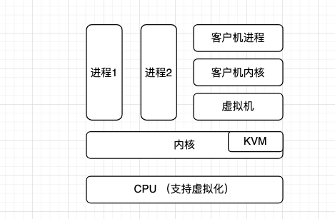

# 虚拟化

本节是关于一种成熟的技术，它允许我们使用一台物理机（如你的笔记本电脑或数据中心的服务器）来模拟多个虚拟机。这产生了一种更灵活和强大的方式来运行不同的工作负载，可能是来自不同租户的强隔离的方式。我们专注于x86架构的硬件辅助虚拟化。

在下图中，你可以看到概念层面上的虚拟化架构。从底部开始：

- CPU 需要支持硬件虚拟化。

- 在Linux内核中，有一个基于内核的虚拟机，我们在 "基于内核的虚拟机（KVM）"中讨论。

- 在用户空间。

  - 你需要一个管理虚拟机和模拟虚拟设备的虚拟机监视器（VMM），如 [QEMU](https://www.qemu.org/) 和 Firecracker。还有一个[libvirt](https://en.wikipedia.org/wiki/Unix_domain_socket)库，它暴露了一个通用的API，旨在使VMM标准化，你可以通过编程使用它（图中没有明确显示，考虑它是VMM块的一部分）。

  - 客户机内核，通常也是一个Linux内核，但也可能是Windows内核。
  - 客户机进程，在客体内核上运行。



在主机内核上本地运行的进程（这里显示的是进程1和进程2）是与客体进程隔离的。一般来说，主机的物理CPU和内存不会受到客体活动的影响。例如，如果虚拟机中正在进行攻击，主机内核和进程就不会受到影响（只要虚拟机没有被赋予对主机系统的特殊访问权）。请注意，在实践中，这可能有例外，比如 [rowhammer](https://en.wikipedia.org/wiki/Row_hammer) 或 [Meltdown 和 Spectre](https://meltdownattack.com/)。

## 1 基于内核的虚拟机（KVM）

基于内核的虚拟机（[Kernel-based Virtual Machine，KVM](https://www.linux-kvm.org/page/Main_Page)）是一个Linux原生的虚拟化解决方案，适用于支持虚拟化扩展的x86硬件，如[AMD-V](https://www.amd.com/en/technologies/virtualization-solutions)或[Intel VT](https://www.intel.com/content/www/us/en/virtualization/virtualization-technology/intel-virtualization-technology.html)的情况。

KVM的内核模块有两个部分：核心模块kvm.ko和CPU架构特定模块（kvm-intel.ko/kvm-amd.ko）。在KVM中，Linux内核是管理程序，负责大部分的繁重工作。此外，还有一些驱动程序，如集成的 [Virtio](https://www.linux-kvm.org/page/Virtio)，可以实现I/O虚拟化。

现在，硬件通常都支持虚拟化，而且KVM已经可用，但是为了检查你的系统是否能够使用KVM，你可以做以下检查（输出已编辑）。

```shell
# 在CPU信息中搜索svm或vmx（注意它是以每个CPU为基础进行报告的，所以如果你有八个核心，那么你会看到这个标志块在这里重复了八次）
$ grep 'svm\|vmx' /proc/cpuinfo 
flags           : fpu vme de pse tsc msr pae mce cx8 apic sep mtrr pge mca cmov
pat pse36 clflush dts acpi mmx fxsr sse sse2 ss ht tm pbe syscall nx pdpe1gb
rdtscp lm constant_tsc art arch_perfmon pebs bts rep_good nopl xtopology
tsc_reliable nonstop_tsc cpuid aperfmperf tsc_known_freq pni pclmulqdq dtes64
# 我们看到vmx被列在这里，表示支持硬件辅助的虚拟化
ds_cpl vmx est tm2 ssse3 sdbg cx16 xtpr pdcm sse4_1 sse4_2 x2apic movbe popcnt 
tsc_deadline_timer aes xsave rdrand lahf_lm 3dnowprefetch cpuid_fault cat_l2
ibrs ibpb stibp tpr_shadow vnmi flexpriority ept vpid ept_ad fsgsbase tsc_adjust
smep erms mpx rdt_a rdseed smap clflushopt intel_pt sha_ni xsaveopt xsavec
xgetbv1 xsaves dtherm ida arat pln pts md_clear arch_capabilities
...

# 这里我们检查KVM内核模块是否可用
$ lsmod | grep kvm 
# 这告诉我们，我们已经加载了kvm_intel内核模块，所以我们在使用KVM方面已经准备好了
kvm_intel             253952  0 
kvm                   659456  1 kvm_intel
```

## 2 Firecracker

[Firecracker](https://www.amazon.science/publications/firecracker-lightweight-virtualization-for-serverless-applications) 是一个虚拟机监控器（VMM），可以管理KVM实例。它是用Rust编写的，由亚马逊开发，主要用于无服务器产品，如AWS Lambda和AWS Fargate。

Firecracker 被[设计](https://github.com/firecracker-microvm/firecracker/blob/main/docs/design.md)用来在同一台物理机器上安全地运行多租户工作负载。Firecracker VMM管理所谓的microVMs，向主机暴露一个HTTP API，允许启动、查询和停止microVMs。它通过使用主机上的 [TUN/TAP](https://www.kernel.org/doc/Documentation/networking/tuntap.txt) 设备模拟网络接口，块设备由主机上的文件支持，支持VirtIO设备。

从安全的角度来看，除了迄今为止讨论的虚拟化，Firecracker默认使用 seccomp 过滤器来限制它可以使用的主机系统调用，也可以选择使用  cgroups。从可观察性的角度来看，你可以通过命名管道从 Firecracker 收集日志和指标。
