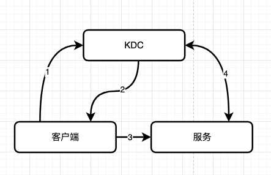

# 安全
在访问控制中，我们讨论了一些访问控制机制。我们讨论了验证（简称 "authn"），它验证了用户的身份，是任何一种授权（简称 "authz"）的前提条件。在本节中，我们简要地讨论了两个广泛使用的 authn工具，你应该知道。

## 1 Kerberos

[Kerberos](https://kerberos.org/)是麻省理工学院(MIT)在20世纪80年代开发的一个认证套件。如今它在 [RFC 4120](https://datatracker.ietf.org/doc/html/rfc4120) 和相关的 IETF 文档中被正式指定。Kerberos的核心思想是，我们通常是在处理不安全的网络，但我们希望有一种安全的方式来让客户和服务相互证明他们的身份。

从概念上讲，Kerberos authn过程，工作方式如下：

1. 客户端 (例如，您的笔记本电脑上的一个程序) 向称为密钥分发中心 (KDC) 的 Kerberos 组件发送请求，要求获得特定服务的凭证，例如打印或目录。
2. KDC 响应请求的凭证，也就是服务的票据和临时加密密钥（会话密钥）。
3. 客户端将票据（其中包含客户的身份和会话密钥的副本）传送给服务。
4. 由客户和服务共享的会话密钥被用来验证客户，也可以选择用来验证服务。

Kerberos 也有一些挑战，比如 KDC 扮演的核心角色（单点故障）和它严格的时间要求（它需要通过 NTP 在客户端和服务器之间进行时钟同步）。总的来说，虽然操作和管理并不简单，但Kerberos在企业和云供应商中被广泛使用和支持。

## 2 可插入式认证模块（PAM）

历史上，一个程序会自己管理用户的认证过程。有了[可插拔认证模块](http://www.linux-pam.org/)(PAM)，一种开发独立于具体认证方案的程序的灵活方式在Linux中出现了（它在20世纪90年代末就已经在更广泛的UNIX生态系统中出现）。PAM使用了一个模块化的架构，为开发者提供了一个强大的库来对接它。它还允许系统管理员插入不同的模块，例如。

- [pam_localuser](https://www.man7.org/linux/man-pages/man8/pam_localuser.8.html)，它要求在`/etc/passwd`中列出一个用户。
- [pam_keyinit](https://www.man7.org/linux/man-pages/man8/pam_keyinit.8.html) 用于会话密钥环。
- [pam_krb5](https://linux.die.net/man/8/pam_krb5)用于基于密码的 Kerberos 5 检查。

就这样，我们达到了高级安全主题的终点，现在转向更有追求的主题。

## 