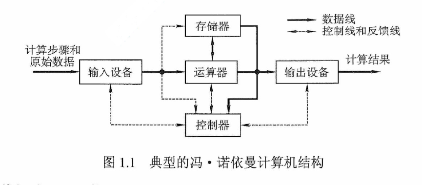
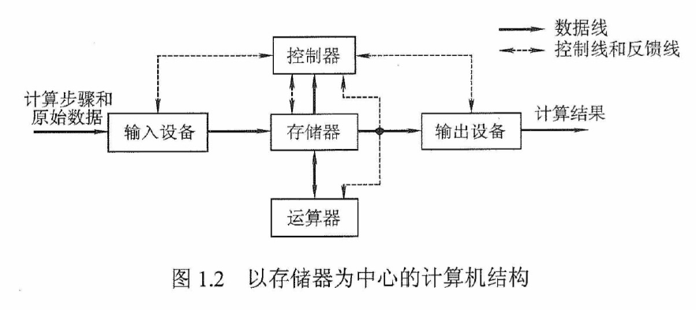

# 计算机组成概述

硬件系统和软件系统共同构成一个完成的计算机系统。

- 硬件系统：有形的物理设备，是计算机系统实际的物理装置的总称
- 软件系统：在硬件上运行的程序和相关的数据资料文档

## 1 早期的冯诺依曼机

计算机硬件系统由运算器、存储器、控制器、输入、输出设备5个部分组成。指令和数据以同等地位存储在存储器中，均以二进制代码表示。

在微处理器诞生之前，运算器和控制器分离，并且存储器的容量非常小，因此设计成以运算器为中心的结构，其他部件都是通过运算器完成信息传递。

## 2 现代计算机的组织结构

随着微电子技术的进步，计算机需要处理、加工的信息也与日俱增。大量的输入输出设备(I/O设备)的速度和 CPU 的速度差距悬殊，因此以运算器为中心的结构已然不能满足计算机的发展要求。现代计算机已经发展成为以存储器为中心，使 I/O 操作尽可能绕过 CPU ，直接在 I/O 和存储器之间完成，以提高系统的运行效率。

当前计算机体系结构和以内存为中心的体系结构之间的区别。自其概念以来，计算机 - 一个[通用图灵机 - 维基百科，自由的百科全书](https://en.wikipedia.org/wiki/Universal_Turing_machine)— 被设想为一台做计算的机器。从一开始[差分引擎 - 维基百科，自由的百科全书](https://en.wikipedia.org/wiki/Difference_engine)转到[ENIAC - 维基百科，自由的百科全书](https://en.wikipedia.org/wiki/ENIAC)，它们被用作进行大量计算（即算法）的手段。这些机器是不可编程的。为了执行一系列不同的计算，人们手工连接内部组件以更换机器。在这一点上，“内存”只是意味着你提供给计算机的打孔卡上的数据—— 除了一些用于保存中间数据的存储位。后来又来了[EDVAC - 维基百科，自由的百科全书](https://en.wikipedia.org/wiki/EDVAC)。这引入了**存储程序**的概念。也就是说，该算法没有内置到机器中。相反，机器将计算的算法存储在打孔卡上。机器读取该打孔卡，然后根据上面的内容使用打孔卡上的数据执行算法。从那时起，计算机的想法一直是关于拥有一台可以执行更快计算的机器。内存只是存储提供给机器的程序和数据的一种手段。然而，在过去的几十年里，这台计算机器——我们称之为https://en.wikipedia.org/wiki/Central_processing_unit— 变得如此之快，以至于它执行计算的能力受到从内存中获取数据（和程序）的速度的瓶颈。**但计算模型并没有改变。**从编译器编译程序的方式到在计算机上花钱的方式（CPU仍然是最昂贵的组件），再到计算机架构师和程序员从编程语言的角度来看待计算机的方式，“计算机”仍然呈现为一台机器，它一次接受一条指令，并按照指令进入的顺序执行指令告诉它执行的计算。它在指令显示的位置使用数据。但这种模式与我们在现实中使用计算机的方式并不相符。实际上，我们运行的工作负载涉及许多不同的任务，这些任务彼此半独立。这些任务涉及大量不同存储程序的大量不同系列的独特数据。计算本身只是程序实际执行的一小部分。所谓的“以内存为中心”的计算提案将焦点从CPU上移开。它没有问“我们如何更快地将数据从各种不同的存储位置传输到CPU”——这就是现代计算机架构的工作方式——而是问“我们如何使计算更接近内存”。为此，有许多新颖的想法。包括摆脱闪存驱动器或硬盘等慢速存储系统。相反，大量的非易失性存储器，如[忆阻器 - 维基百科，自由的百科全书](https://en.wikipedia.org/wiki/Memristor)基于设备或[3D XPoint - 维基百科，自由的百科全书](https://en.wikipedia.org/wiki/3D_XPoint)可以使用。不再有“加载到内存”的概念。在编程语言中，您不会“打开”或“写入”文件。相反，您只需使用内存地址访问文件即可。使用相同的编程语言，您不会再将程序编写为一长串指令。您可以编写可以独立处理的代码段。线程已经提供此功能，但由于它们涉及单CPU类型系统中的上下文切换，因此程序员不会真正使用它们，除非有大量独立工作。对于以内存为中心的计算机，程序（和操作系统）看起来像大量的小程序片段。该系统将包含大量（相对）简单的CPU，这些CPU非常接近内存口袋。每个 CPU 将仅对靠近它的内存中的数据执行计算。关键是：记忆是节目的明星。我们不再（非常）关心CPU执行计算的速度。相反，我们关心的是*我们可以读取和写入大量数据和程序*的速度有多快。”我们适当地重组了编程语言、操作系统和算法。我们超越了[冯·诺依曼建筑 - 维基百科，自由的百科全书](https://en.wikipedia.org/wiki/Von_Neumann_architecture).

## 3 计算机功能部件

### 输入设备

- 功能：将程序和数据以计算机能识别的方式输入计算机。
- 设备：键盘、鼠标、摄像头、麦克风、扫描仪等等。

### 输出设备

- 功能：将计算机处理的结果以人们能够接受的方式或者其他系统要求的形式输出与。
- 设备：显示器、打印机等。

### 存储器

存储器分为主存储器和辅助存储器，CPU可以直接访问主存储器，如果要访问辅助存储器，需要将辅助存储器中的内容转存到主存储中才可以实现。

主存储的存储量小，读写速度快；辅助存储的存储量大，但是读写速度相对较慢。

- 功能：存放程序和数据的设备

- 设备：

  - 主存储：CPU 缓存、内存、显存
  - 辅助存储：硬盘、U盘等

### 运算器

- 功能：运算器是计算机的执行部件，用于进行算术运算和逻辑运算
- 设备：CPU、GPU

### 控制器

- 功能：指挥计算机各个组件协作，控制器由程序计数器、指令寄存器和控制单元组成。

## 4 计算机工作过程

计算机工作过程分为一下三个步骤：

1. 把程序和数据装入主存储器
2. 将源程序转换为可执行的文件
3. 从可执行文件的首地址开始逐条执行指令

## 小结

计算机的组成原理是一门单独的课程，涉及到很多重要且复杂的知识，这里只是简述。

[计算机组成原理 (豆瓣) (douban.com)](https://book.douban.com/subject/27051076/)

[计算机原理_中国大学MOOC(慕课) (icourse163.org)](https://www.icourse163.org/learn/NUDT-359002?tid=418002#/learn/content)]

[Memory-centric Computing Systems: What’s Old Is New Again (sigarch.org)](https://www.sigarch.org/memory-centric-computing-systems-whats-old-is-new-again/)

