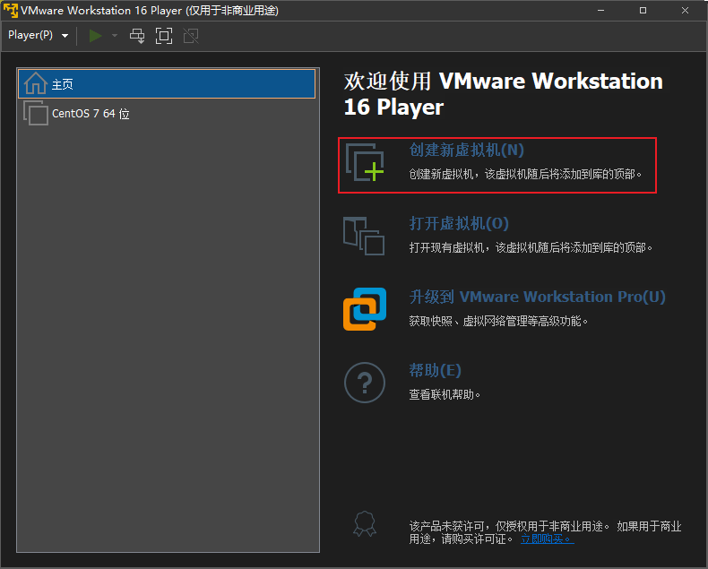
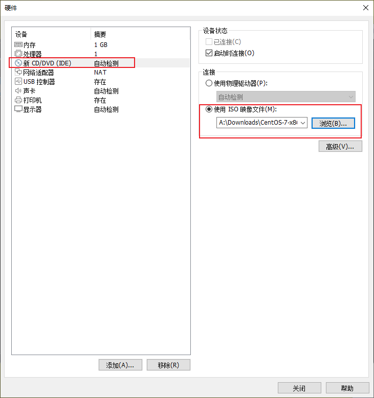
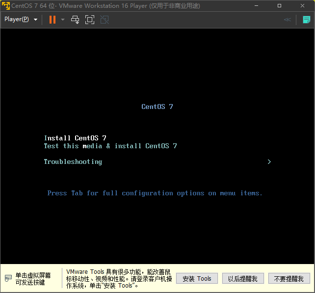
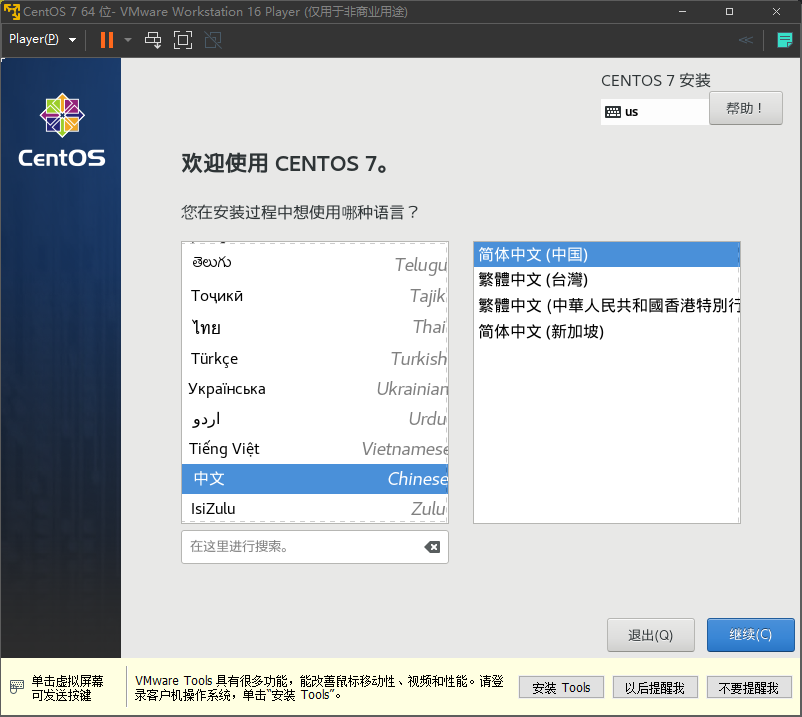
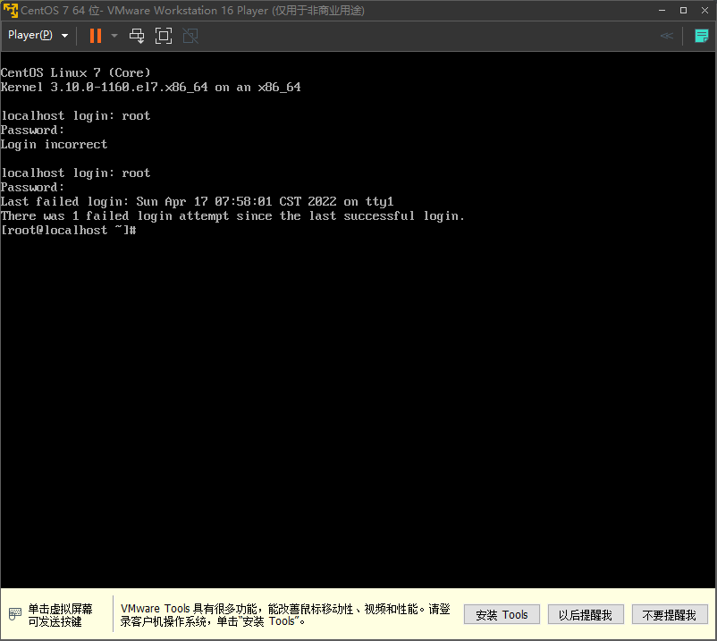

# 环境准备

本章节我们需要在电脑安装虚拟化软件 VMware Workstation,创建一个虚拟机，并安装操作系统。

## 1 下载系统镜像

### 1.1 CentOS 镜像下载

[CentOS  官网](https://www.centos.org/)

-  :+1:[清华CentOS-7-x86_64-DVD-2009.iso (tsinghua.edu.cn)](https://mirrors.tuna.tsinghua.edu.cn/centos/7/isos/x86_64/CentOS-7-x86_64-DVD-2009.iso)

- [阿里云 CentOS-7-x86_64-DVD-2009.iso (aliyun.com)](http://mirrors.aliyun.com/centos/7/isos/x86_64/CentOS-7-x86_64-DVD-2009.iso)

- [网易CentOS-7-x86_64-DVD-2009.iso (163.com)](https://mirrors.163.com/centos/7/isos/x86_64/CentOS-7-x86_64-DVD-2009.iso)

推荐使用清华地址下载，没有限速。下载的镜像版本是 CentOS 7.9 也就是 CentOS 2009 版本，下载文件的格式为`iso`更多镜像列表请访问  [CentOS官方镜像列表 (centos.org) ](https://www.centos.org/download/mirrors/)

### 1.2 Rocky Linux 镜像下载

[Rocky Linux 官网](https://rockylinux.org/)

- [Rocky 镜像下载地址 DVD (rockylinux.org)](https://download.rockylinux.org/pub/rocky/8/isos/x86_64/Rocky-8.5-x86_64-dvd1.iso)

### 1.3 镜像说明

CentOS 是基于 [Red Hat Enterprise Linux （RHEL）](https://www.redhat.com/) 源码编译发布的社区版操作系统。RHEL 是一个针对商业市场的Linux发行版，虽然 RHEL 的源代码是免费提供的，但红帽限制了其官方支持的 RHEL 版本的重新分发。要在服务器或工作站上部署 RHEL，必须从红帽购买订阅并每年续订。 因为 CentOS 免费，安全性和稳定性依托 RHEL 得到了保障，被大部分公司所使用。 

2014 年红帽公司收购了 CentOS ，包含 CentOS 项目商标的所有权，以及大量核心开发人。

2020年12月8日CentOS开发团队宣布，传统的CentOS 8将仅维护至2021年底，之后仅维护CentOS Stream[[10\]](https://zh.wikipedia.org/wiki/CentOS#cite_note-10)，使其变为[滚动发行](https://zh.wikipedia.org/wiki/滾動發行)的散布版（CentOS 7仍将持续维护至原本的支持周期结束）。也就是说，CentOS 8 从一个下游稳定版本变成了一个测试版本，官方不推荐使用 CentOS 8 部署到企业环境。

因为这个变动，CentOS 的创始人 Gregory Kurtzer 宣布，他将重新启动一个项目，以实现CentOS的原始目标。这就是 Rocky Linux。目前 Rocky Linux 已经获得很多知名厂商的支持，例如亚马逊、微软、VMware等等。

其实对于学习 Linux 而言，如果你已经了解一个发行版，转移到其它发行版是很容易的，不必太担心。

## 2. 安装桌面虚拟机管理程序

> 你也可以使用闲置的物理机安装操作系统，物理机安装需要自己先制作系统安装盘，需要一个 8G 以上的 U盘。 这里推荐两个启动盘制作工具：
>
> - [Rufus - 轻松创建USB启动盘](https://rufus.ie/zh/)
>
> - [Ventoy - 新一代多系统启动U盘解决方案](https://www.ventoy.net/cn/index.html)
>
> 物理机安装过程本书暂不演示，可自行搜索相关的教程进行安装。

### 2.1 Windows

下载地址

- [VMware Workstation 16 Player](https://www.vmware.com/go/getplayer-win)
- [VMware Workstation 16 Pro](https://www.vmware.com/go/tryworkstation-win)

Player 版本是免费的，Pro 版本是收费的，对于本书而言他们两个在使用上没有太大区别，具体信息请点击[功能对比](https://www.vmware.com/cn/products/workstation-pro.html)。下载好后，双击安装即可。

### 2.2 Mac

待更新......

## 3. 创建虚拟机

 :pushpin:如果你是第一次安装，请仔细查看并操作每一个步骤，我已经

1. 运行 VMware Workstation 16 Player；

2. 点击右侧的创建新的虚拟机；

3. 稍后安装操作系统；

4. 客户机操作系统选择 Linux，版本选择 CentOS 7 64位；

5. 设置虚拟机名称，选择虚拟机的位置，这里需要注意你所选位置对应的磁盘空间大小；

6. 指定磁盘容量 32G，选择将磁盘存储为单个文件；

7. 选择自定义硬件，点击 新 CD/DVD，在 连接选项中，选择使用 ISO 映像文件，点击浏览，选择前面下载的系统镜像;

   

8. 选择好后关闭选项卡，点击完成，虚拟机就已经创建好了，我们下一结开始安装操作系统。

## 4 安装 CentOS 7

本章节内容只是安装学习环境，演示安装过程，解释必要选项的含义。

### 4.1 开机

开机后，虚拟机会自动访问我们挂载的 CD/DVD 镜像,进入镜像操作界面，使用方向键选择对应项

- :point_right:Install CentOS 7：安装 CentOS，选择此项将进入系统安装界面；
- Test this media & install CentOS 7：测试镜像文件并安装，如果你不确定你的镜像文件是否完好，可使用此项；
- Troubleshooting：救援模式，系统恢复使用此项。

### 4.2 语言选择

默认使用英语，为了方便学习，可以选择中文。

### 4.3 安装信息摘要

#### 4.3.1 本地化

- :point_right:日期和时间：选择亚洲/上海，时间不用设置

- ~~键盘: 无需操作~~

- :point_right:语言支持：请在这里请勾选上英文和中文

#### 4.3.2 软件

- ~~安装源：无需操作~~
- :point_right:软件选择：系统安装包内置了多种方案用以安装系统，为了教学，这里我们选择默认选项，最小化安装

#### 4.3.3 系统

- 安装位置：选择系统安装盘，分区等内容
  - :point_right:设备选择：选择安装系统的磁盘，我们只装有一块盘，默认即可
  - :point_right:分区：可选择自动分区和手动分区，选择自动分区
- :point_right:KDUMP：内核崩溃转储机制，当系统崩溃时，会捕获系统信息用于诊断，会消耗一部分系统内存。这里去掉勾选，关闭 KDUMP
- :point_right:网络和主机名：选择打开
- ~~安装策略：安全策略条允许你按照安全内容自动化协议 (SCAP) 标准定义的限制和建议（*合规策略*）配置已安装的系统。不是所有系统都需要应用安全策略。仅当您的组织规则或政府法规强制执行特定策略时，才应使用此屏幕。~~

### 4.4 开始安装

- 用户设置
  - :point_right:设置 root 密码，root 是 Linux 系统的默认管理员用户，密码可以设置简单密码，比如`1`，点击两次完成。
  - ~~创建用户：不创建~~

设置完成后，等待系统安装完毕，重启后即完成系统安装。

### 4.5 登入系统

开机后，输入账户名和密码即可登入系统。密码是隐藏的，没有任何显示，输入密码后，回车就可以。显示 `[root@localhost ~]#`表示你已经进入操作系统了。

Rocky Linux 的安装差异不大，这里暂时不做演示。

## 参考

[CentOS 计划将重点转移到 CentOS Stream – Blog.CentOS.org](https://blog.centos.org/2020/12/future-is-centos-stream/#comment-183642)

