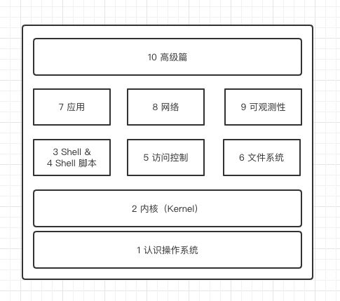

# Linux 概述

Linux 一个自由和开源的、类 UNIX 操作系统。

- 自由和开源：任何人都可以自由的使用、复制、研究和以任何方式来改动软件，并且其源代码是开放和共享的。
- 类UNIX操作系统：指各种[Unix](https://zh.wikipedia.org/wiki/Unix)的派生系统

Linux 和 Windows 一样，都是一个计算机操作系统。他们的本质差别是对自己的用户所做的假设

- 对于 Linux，这个假设是：用户知道自己想要什么，也明白自己在做什么，并且会为自己的行为负责。
- 而 Windows 则恰好相反：户不知道自己想要什么，也不明白自己在做什么，更不打算为自己的行为负责。

在Linux的管理员账户下，你就是最大的，你可以对系统做任何操作，包括自己把自己干掉，但是在Windows下，系统是不允许你那么做的。

当然，这并没有好坏之分，他们都有各自无可替代的优势。

Windows操作系统提供了简单易用的图形化界面，降低了新用户使用计算机的门槛。

Linux提供了更加开放的环境，让用户能够更清楚的了解计算机在做什么。

## 1 Linux 发行版

一般来说 Linux 指的是 [Linux 内核](https://www.kernel.org/)，我们经常听到或者安装的 Linux 操作系统是 [Linux 发行版](https://zh.wikipedia.org/wiki/Linux%E5%8F%91%E8%A1%8C%E7%89%88)。我们

在这本书中，当我指的是一组系统调用或设备驱动程序时，我们将称之为 Linux 内核或内核。当我们提到Linux 发行版时，我指的是内核和相关组件的具体捆绑，包括包管理、文件系统配置、初始化系统和默认 shell。

当然，你可以自己完成这一切：你可以下载并编译内核，选择一个包管理器等等，然后创建你自己的发行版。不过将专业的事情还是留给专家，不管个人还是商用，使用由专业厂商开发的 Linux 发行版是最佳选择。

提示：如果你非常倾向于构建自己的发行版，我建议你仔细看看Arch Linux，它可以让你掌控一切，只需稍加努力，就可以创建一个定制的 Linux 发行版。

## 2 Linux 简史

Linux 在2021年庆祝了它的30岁生日。Linux 项目拥有数十亿用户和数千名开发人员，毫无疑问，它是开源世界非常成功的案例。

- 20 世纪 90 年代
  我们可以将 Linus Torvalds 在1991年8月25日给 comp.os.minix 新闻组的电子邮件视为 Linux 项目的诞生。这个项目很快就起飞了，无论是在代码行（LOC）还是在采用方面。例如，在不到三年的时间里，Linux 1.0.0 发布了超过 176，000 个 LOC，并且能行大多数 Unix/GNU 软件。此外，第一个Linux 商业产品 Red Hat Linux 也发布了。
- 2000 到 2010
  作为一个"青少年"，Linux 不仅在功能和支持的硬件方面日趋成熟，而且还超越了 UNIX 。在这段时间里，谷歌，亚马逊，IBM等大公司也相继采用 Linux 。这也是[发行版战争](https://www.technewsworld.com/story/30-years-of-linux-history-told-via-distros-87239.html)的高峰期，导致业务改变方向。
- 2010年代至今
  Linux 确立了自己在数据中心、云计算 、移动设备以及物联网设备中的核心地位。从某种意义上说发行版的战争已经结束（如今，大多数商业系统都是基于 Red Hat 或 Debian ），另外需要补充的是，容器的兴起（从2014-15年开始）也是原因之一。

## 3 资源可见性

Linux 继承了 UNIX 的良好传统，有一个默认的资源全局视图，你可能听说过这样一句话：在 Unix 以及延伸到 Linux 中，所有东西都是一个文件。在本文中，我们认为资源是指任何可以用来帮助软件执行的东西。这包括硬件及其抽象（如CPU和RAM、文件）、文件系统、硬盘、SSD、进程、网络相关的东西，如设备或路由表，以及代表用户的证书。

虽然“一切都是文件”这句话很多时候都是正确的 ，但事实上，Linux中并非所有的资源都是文件或通过文件接口表示。“一切都是文件” 这句话定义了操作系统的架构。它意味着系统中的一切，从进程、文件、目录、套接字、管道等都由内核中的虚拟文件系统层抽象出来的文件描述符来表示。[虚拟文件系统](https://en.wikipedia.org/wiki/Virtual_file_system)是一个由内核提供的接口。因此，这句话被纠正为 "所有东西都是一个文件描述符"。Linus Torvalds 本人又更准确地纠正了这句话。"一切都是字节流"。

不过，有一些系统做到了 “一切皆文件”，如 [Plan 9](https://9p.io/plan9/)，它将所有本地和远程资源以文件形式组织的[9P](https://zh.wikipedia.org/wiki/9P)协议，[union mounts](https://zh.wikipedia.org/w/index.php?title=Union_mounts&action=edit&redlink=1)，改进的[进程文件系统](https://zh.wikipedia.org/wiki/Procfs)以及本地的[Unicode](https://zh.wikipedia.org/wiki/Unicode)支持。在Plan 9中，所有的系统接口（如网络和用户界面接口），都是作为文件系统的一部分呈现，而不像其他操作系统上一样拥有自己独立的接口。

在 Linux 中，有 [7 种文件类型](http://www.tldp.org/LDP/intro-linux/html/sect_03_01.html)。实用程序（如vim、ls、ps等编辑，查看工具）可以区分文件。例如，命令的完整功能（按下时）仅列出目录，因为系统调用（请参阅）返回一个名为 的字段的结构。POSIX 标准定义了该字段可以包含的内容

## 4  Linux 鸟瞰图

本书的章节安排其实就是一个 Linux 操作系统的高级概述，这也是本教程的全部内容。

从理论上讲，任何 Linux 发行版都有内核，为其他组件提供 API。文件、网络和观察系统三个核心主题也随处可见，你可以将它们视为内核之上最基本的模块。从纯粹的使用角度来看，你很快就会了解到 shell 和 访问控制相关的内容，因为在使用 LInux 时，必须和它们打交道。

- 可移植操作系统接口（PORTABLE OPERATING SYSTEM INTERFACE (POSIX)）

  在本书中，我们将不时遇到术语 POSIX，它是可移植操作系统接口的缩写。正式地说，POSIX 是 IEEE 标准，用于定义 UNIX 操作系统的服务接口。其动机是在不同的实现之间提供可移植性。因此，如果你阅读了 POSIX 兼容之类的东西，需要知道这是一组正式规范，这些规范与官方采用环境特别相关，而与日常使用不太相关。想了解更多信息推荐阅读《 [POSIX Abstractions in Modern Operating Systems: The Old, the New, and the Missing](http://nsl.cs.columbia.edu/papers/2016/posix.eurosys16.pdf)》

## 参考

- [UNIX环境中的高级编程](https://stevens.netmeister.org/631/) 是一门完整的课程，提供了很多入门材料，包括动手练习。

- [UNIX的诞生](https://corecursive.com/brian-kernighan-unix-bell-labs1/) 是了解 Linux 源头的重要资料，并且为许多原始UNIX概念提供了参考。
