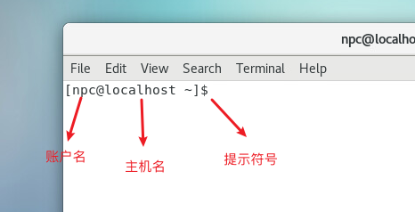
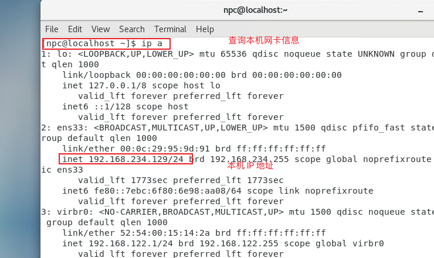

# 前置知识点

在开始之前你必须了解的系统操作和知识

## 1 命令

### 1.1 命令提示

右击桌面->打开终端(Terminal)，你会看到如下界面：



命令提示（command prompts），也被简单地称为提示，是指在命令行界面上，在命令行的开始处有一个简短的文字，后面有提示符号，`$`表示你使用的是普通账户，`#`表示你使用的是管理员账户（root），当你输入命令一直在输出或者卡死，可以使用 `Ctrl+c`返回命令提示页面。

需要记住的重要事项

- Linux 有一个超级管理员账户 "root"
- root "是最强大的账户，可以创建、修改、删除账户并对系统配置文件进行修改。
- Linux 是一个大小写敏感的系统
- 避免使用带有空格的文件名。

### 1.2 命令语法

命令通常语法是：命令 选项 参数

​	选项：修改一个命令的工作方式。通常由一个连字符或破折号和一个字母组成。有些命令接受多个选项，这些选项通常可以在一个连字符之后组合起来。

​	参数：大多数命令与一个或多个参数一起使用。如果没有提供参数，一些命令会假定一个默认参数。

### 1.3 命令帮助

通常你可以使用如下几种方式获取帮助信息：

```shell
whatis command 
command --help
man command
info command
```

### 1.4 命令补全

按TAB键可以完成可用的命令、文件或目录。

```shell
chm TAB
ls j<TAB>
cd s<TAB>
```


## 2 访问系统

除了使用 VMware 直接访问系统外还可以通过 `SSH `远程访问操作系统。

使用 powershell 或者下载 SSH 客户端软件（如 Putty、Xshell、SecureCRT等等）

- 确定虚拟机的`IP`地址



打开 powershell -> 输入 `ssh npc@192.168.234.129`按照提示输入密码即可访问。

## 3 修改密码

命令：`passwd 用户名`

```shell
passwd npc
# 如果是修改登录账户，可以省略用户名，直接回车
passwd 
Changing password for user root.
New password: 
```

## 4 文件编辑

### 文本文件

- 查看内容 `cat 文件名`
- 编辑内容
  - `vi `或者`vim ` 
  - 重定向命令 > 或 >> （请查看 [shell 基础知识](../3_shell/1.shell 基础知识.md/#3%20流（Streams）) ）
  - echo > 或 >>

```
# 编辑文件，如果文件不存在，则会新建一个
# 进入之后，按`i`键进入编辑模式，输入 abc，按`ESC`键,输出`:wq`保存并退出。
vim test

# 查看文件，会看到我们刚刚入的内容。
cat test 
	abc
# 使用 echo 不进入文件编辑视图，添加内容
# > 清空文件，并添加;>>追加
echo def > test
cat test 
	def
echo def >> test
cat test
  def
  def
```


