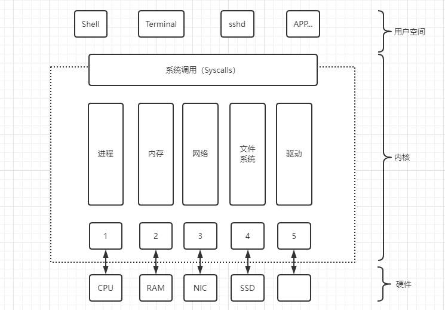

# Linux 架构

操作系统的主要功能是对不同的硬件进行抽象，并为我们提供一个应用编程接口（API）。针对这个 API 的编程允许我们编写应用程序，而不必在意 API 在哪里和如何被执行。简而言之，内核为程序提供了这样一个 API。

在这一章中，我们将讨论什么是 Linux 内核，以及你应该如何把它作为一个整体来考虑，并考虑它的组成部分。你将了解到Linux的整体架构和Linux内核所扮演的重要角色。本章的一个主要收获是，虽然内核提供了所有的核心功能，但它本身并不是操作系统，而只是操作系统的一部分，当然是非常核心的部分。

首先，我们看看内核是如何融入底层硬件并与之互动的。然后，讨论不同的 CPU 架构以及它们与内核的关系。接下来，我们放大各个内核组件，讨论内核为你可以运行的程序提供的 API。最后，我们看一下如何定制和扩展Linux内核。

本章的目的是让你掌握必要的术语，让你了解程序和内核之间的接口，并让你对功能有一个基本的概念。本章的目的不是要把你变成一个内核开发者，甚至是一个配置和编译内核的系统管理员。不过，如果你想深入了解，我在最后整理了一些要点。

现在，让我们跳入深渊：Linux体系结构，以及内核在其中扮演的核心角色。

我们将整个系统分为三层，从下往上是：

- 硬件：CPU、内存、磁盘驱动器、网络接口和外围设备，如键盘和显示器。

- 内核本身：请注意，有许多组件位于内核层和用户层之间，例如初始化系统和系统服务（网络等），但严格来说，它们不是内核的一部分。

- 用户层：大多数应用程序正在运行的地方，包括操作系统组件，如shell（在第3章中讨论），ps 或 ssh 等实用程序，以及图形用户界面，如基于X Window的系统桌面。

不同层之间的接口被很好地定义了，是Linux操作系统包的一部分。在内核和用户地之间的接口被称为系统调用（简称 syscalls），我们将在 "[Syscalls](3.内核组件和扩展.md/##6%20系统调用)"中详细探讨。

与系统调用不同，硬件和内核之间的接口不是单个接口。它由单个接口的集合组成，通常按硬件分组：

1. 此接口由 CPU 架构特定的代码表示，在后面我们会聊到 "CPU 架构"。
2. 主内存的接口，在"内存管理"中介绍。
3. 网络接口和驱动程序（有线和无线），这部分内容会在网络一节中详细解释。
4. 文件系统和块设备驱动程序接口，这部分内容会在文件系统一节中详细解释。
5. 字符设备、硬件中断和设备驱动程序，用于输入设备，如键盘、终端和其他 I/O（"设备驱动程序"）。

正如上图所示， shell 或 grep、find 和 ping 等工具并不是内核的一部分，而是非常像一个应用程序，是用户空间的一部分。

关于 "用户空间 "的话题：你会经常读到或听到关于用户与内核模式。这实际上意味着对硬件的访问有多大的特权，可用的抽象有多大的限制。

一般来说，内核模式（kernel mode）意味着在有限的抽象下快速执行，而用户级空间（user level land）模式意味着相对较慢但更安全和更方便的抽象。除非你是一个内核开发者，否则你几乎总是可以忽略内核模式，因为你所有的应用程序都会在用户级空间运行。另一方面，知道如何与内核交互（"Syscalls"）是至关重要的，也是我们考虑的一部分。

> **关于内核**
>
> 内核指的是一个提供硬件抽象层、磁盘及文件系统控制、多任务等功能的系统软件。内核是一个操作系统的核心，是操作系统最基本的部分。它负责管理系统的进程、内存、设备驱动程序、文件和网络系统等，决定着系统的性能和稳定性。它是为众多应用程序提供对计算机硬件的安全访问的一部分软件，这种访问是有限的，并且内核决定一个程序在什么时候对某部分硬件操作多长时间。直接对硬件操作是非常复杂的，所以内核通常提供一种硬件抽象的方法来完成这些操作。硬件抽象隐藏了复杂性，为应用软件和硬件提供了一套简洁，统一的接口，使程序设计更为简单。 
>
> 一个内核不是一套完整的操作系统。比如一套基于Linux内核的完整操作系统叫作Linux操作系统，或是GNU/Linux。
>
> **功能**
>
> 1. 进程管理：内核负责创建和销毁进程, 并处理它们与外部世界的联系(输入和输出)，不同进程间通讯(通过信号，管道，或者进程间通讯原语)对整个系统功能来说是基本的，也由内核处理。 另外， 调度器， 控制进程如何共享CPU，是进程管理的一部分。更通常地，内核的进程管理活动实现了多个进程在一个单个或者几个CPU 之上的抽象。    
> 2. 内存管理：计算机的内存是主要的资源， 处理它所用的策略对系统性能是至关重要的。内核为所有进程的每一个都在有限的可用资源上建立了一个虚拟地址空间。内核的不同部分与内存管理子系统通过一套函数调用交互，从简单的malloc/free对到更多更复杂的功能。    
> 3. 文件管理：Linux 在很大程度上基于文件系统的概念;几乎Linux中的任何东西都可看作一个文件。内核在非结构化的硬件之上建立了一个结构化的文件系统，结果是文件的抽象非常多地在整个系统中应用。另外，Linux 支持多个文件系统类型，就是说，物理介质上不同的数据组织方式。例如，磁盘可被格式化成标准Linux的ext3文件系统，普遍使用的FAT文件系统，或者其他几个文件系统。    
> 4. 驱动以及字符设备管理：几乎每个系统操作终都映射到一个物理设备上，除了处理器，内存和非常少的别的实体之外，全部中的任何设备控制操作都由特定于要寻址的设备相关的代码来进行。这些代码称为设备驱动。内核中必须嵌入系统中出现的每个外设的驱动，从硬盘驱动到键盘和磁带驱动器。    
> 5. 网络管理：网络必须由操作系统来管理，因为大部分网络操作不是特定于某一个进程： 进入系统的报文是异步事件。报文在某一个进程接手之前必须被收集，识别，分发，系统负责在程序和网络接口之间递送数据报文，它必须根据程序的网络活动来控制程序的执行。另外，所有的路由和地址解析问题都在内核中实现
