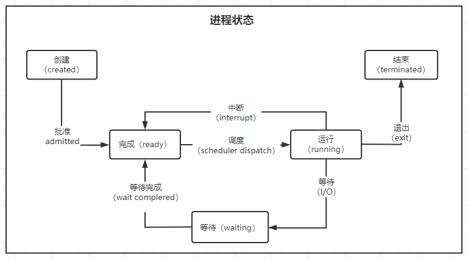
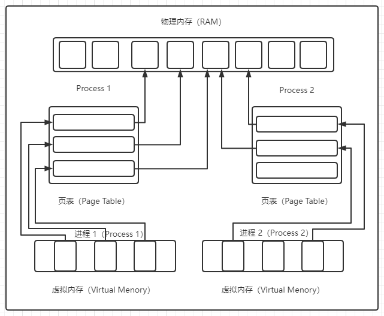
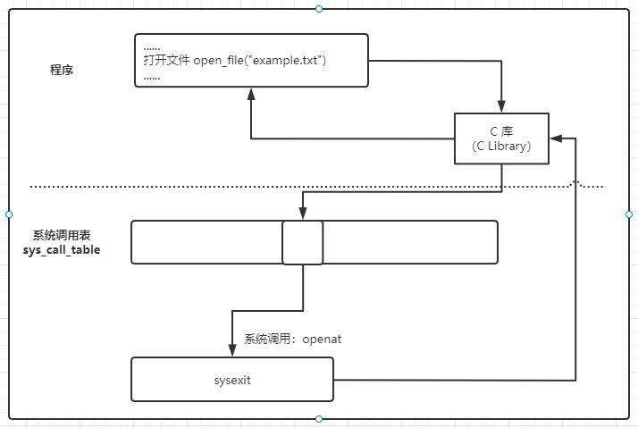
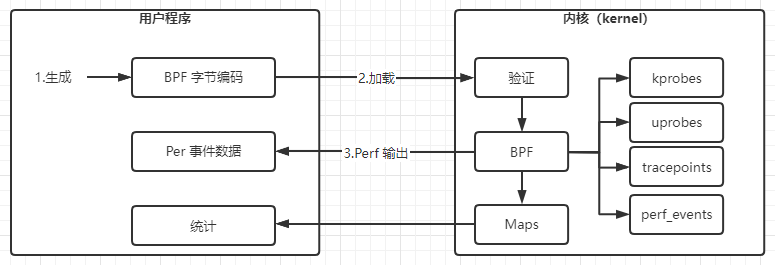

# 内核组件和扩展

Linux 内核是一个整体，换句话说，是一个二进制文件，所有组件都是单个二进制文件的一部分，但代码库中有一些功能区域，我们可以识别并指定专门的任务。

内核位于硬件和要运行的应用程序之间，你在内核代码库中找到的主要功能块，如下所示：

- 进程管理，基于可执行文件启动进程。

- 内存管理，用于为进程分配内存或将文件映射到内存中。

- 网络，管理网络接口或提供网络栈。

- 文件系统，提供文件管理并支持创建和删除文件。

- 管理字符设备（字符设备是指在 I/O 传输过程中以字符为单位进行传输的设备，例如键盘，打印机等。）和设备驱动程序。

这些功能组件通常具有相互依赖性，对于内核开发者来说，要保证[“内核永不破坏用户层”](https://yarchive.net/comp/linux/gcc_vs_kernel_stability.html)是一项有挑战性的任务。

## 1 进程管理

:pushpin: 本节内容请全文背诵

内核中有许多与进程管理相关的部分。其中一些处理特定于 CPU 架构的事情，例如中断（interrupts，中断是改变处理器执行指令顺序的事件），而另一些则专注于程序的启动和调度。

通常，进程是基于可执行程序（或二进制文件）的面向用户的单元。另一方面，线程是进程的执行单元。你可能遇到过多线程这个术语，多线程的意思是进程正在进行并行执行，可能在不同的 CPU 上运行。

现在，让我们看看 Linux 是如何做到这一点的。从最精细到最小的单元，Linux 具有：

### 1.1 会话（sessions）

包含一个或多个进程组，它表示附加了可选 tty 的高级面向用户的单元。内核通过称为会话 ID （SID） 的数字标识会话。

### 1.2 进程组（Processes group）

包含一个或多个进程，会话中最多有一个进程组是前台进程组。内核通过称为进程组 ID （PGID） 的数字来标识进程组。

### 1.3 进程（Processes）

进程是一个抽象概念，它将多种资源（地址空间、一个或多个线程、套接字等）分组，内核通过 `/proc/self` 将当前进程暴露给你，并使用一个进程ID（PID）来识别进程。

### 1.4 线程（Threads）

内核将线程实现为进程。也就是说，没有代表线程的专用数据结构。相反，一个线程是一个与其他进程共享某些资源（如内存或信号处理程序）的进程。内核通过线程ID（TID）和线程组ID（TGID）来识别一个线程，其语义是共享的TGID值，意味着一个多线程进程（在用户空间；也有内核线程，但这不在我们的范围之内）。

### 1.5 任务（Tasks）

在内核中，有一个叫做task_struct的数据结构（定义在[sched.h](https://elixir.bootlin.com/linux/latest/source/include/linux/sched.h#L661)中），它构成了实现进程和线程的基础。这个数据结构捕获了与调度相关的信息（见下文）、标识符（如PID和TGID）、信号处理程序以及其他信息，包括与性能和安全相关的信息。简而言之，上述所有单元都是在任务中派生和（或）锚定的，然而，任务并没有在内核之外公开。

让我们看看上面的一些术语在起作用：

```Shell
# bash shell 进程的 PID、PGID 和 SID 为 6756。用 ls -al /proc/6756/task/6756/ 我们可以收集任务级信息。
# ps 进程具有 PID/PGID 6790 和与 Shll 相同的 SID。
$ ps -j
PID    PGID   SID   TTY     TIME CMD
6756   6756   6756  pts/0   00:00:00 bash 
6790   6790   6756  pts/0   00:00:00 ps 
```

我们之前提到过，在Linux中，任务数据结构已经准备好了一些与调度相关的信息。这意味着进程在任何给定时间都处于某种状态，如图所示。



## 2 内存管理

程序开始执行时，被载入内存并放置在进程中以供执行。

指令和数据与内存的绑定可以在编译时发生，如果内存位置已经知道，因此可以生成代码；也可以在加载时发生，这里生成可重定位的代码，因为位置不知道；还可以在执行时发生，如果进程在执行过程中可以移动，则将绑定推迟到运行时。

### 2.1 虚拟内存

在计算机系统中，物理内存是一种有限的资源，处理它有其复杂性，这就是虚拟内存存在的原因。

虚拟内存负责向应用软件提供物理内存细节的抽象，只在物理内存中存储需要的信息，保护和控制进程之间的数据共享。通过使用虚拟内存，每个内存访问都使用一个虚拟地址，该地址在处理过程中被转换为一个物理地址。

物理内存被分为若干页，可以被映射为虚拟页。映射由分层组织的页表描述，允许从虚拟地址转换到物理地址。最低级的表保存应用程序使用的实际页的物理地址，更高级的表保存低级页的物理地址。

在地址转换过程中，该寄存器被用来访问顶级页表，该页表是由虚拟地址的高位来索引的。这个索引也被用来访问层次结构，虚拟地址的下一个位是下一级页表的索引。

虚拟内存使你的系统看起来好像具有比物理内存更多的内存。实际上，每个进程都会获得大量（虚拟）内存。它的工作方式如下：物理和虚拟内存都分为固定长度的块，我们称之为页面（pages）。

下图中，显示了两个进程的虚拟地址空间，每个进程都有自己的页表（page tables）。这些页表将进程的虚拟页映射到主内存（也称为 RAM）中的物理页。



多个虚拟页面可以通过各自的进程级页面表指向同一物理页面。从某种意义上说，这是内存管理的核心：如何有效地为每个进程提供一种错觉，即它们的页面实际上存在于RAM中，同时以最佳方式使用现有空间。

每次CPU访问进程的虚拟页时，原则上CPU都必须将进程使用的虚拟地址转换为相应的物理地址。为了加速这一过程，现代 CPU 架构支持一种称为[转译后备缓冲器（translation lookaside buffer，TLB）](https://en.wikipedia.org/wiki/Translation_lookaside_buffer) 的片上查找，该过程可以是多层次的，因此速度较慢。TLB实际上是一个小型缓存，在出现未命中的情况下，它会导致CPU通过进程页表来计算页的物理地址，并用它更新TLB。

传统上，Linux的默认页面大小为 4KB，但从内核 v2.6.3 开始。它支持[大页面](https://wiki.debian.org/Hugepages)，以更好地支持现代架构和工作负载。例如，64位Linux允许每个进程使用多达128 TB的虚拟地址空间（虚拟是理论上可寻址的内存地址数），总共大约64 TB的物理内存（物理是机器中的RAM）。

让我们从更实际的角度来看一下。一个非常有用的工具是 `/proc/meminfo`接口，它可以计算与内存相关的信息，例如您可以使用多少 RAM：

```shell
# 列出有关物理内存（RAM）的详细信息;那里是4GB。
$ grep MemTotal /proc/meminfo 
MemTotal:        4014636 kB

# 列出有关虚拟内存的详细信息;这比那里的34 TB多一点。
$ grep VmallocTotal /proc/meminfo 
VmallocTotal:   34359738367 kB

# 列出巨大的页面信息;显然，这里的页面大小是2MB。
$ grep Huge /proc/meminfo 
AnonHugePages:         0 kB
ShmemHugePages:        0 kB
FileHugePages:         0 kB
HugePages_Total:       0
HugePages_Free:        0
HugePages_Rsvd:        0
HugePages_Surp:        0
Hugepagesize:       2048 kB
Hugetlb:               0 kB
```

### 2.2 页面缓存

物理内存存储的数据是不稳定的，因此要将数据放入内存中，必须读取文件。读取文件时，会将这些数据放入缓存中，以避免在后续读取期间进行昂贵的磁盘访问。写入文件时，数据也被放置在缓存中，然后再放入存储设备中。写入的页面被标记为脏页，当它们被重复使用时，它们的文件内容与更新的数据同步。

## 3 网络

内核的一个重要功能是提供网络功能。无论你想浏览网页，还是想将数据复制到远程系统，都依赖于网络。Linux网络堆栈遵循分层体系结构：

- 用于抽象通信的套接字。
- 用于面向连接的通信的传输控制协议（TCP）以及用于无连接通信的用户数据报协议（UDP）。
- 用于寻址机器的互联网协议（IP）。

这三个动作都是内核负责的。HTTP或SSH等应用层协议通常在用户层实现。你可以使用以下方法获得网络接口的概述：

```shell
$ ip link
1: lo: <LOOPBACK,UP,LOWER_UP> mtu 65536 qdisc noqueue state UNKNOWN mode
   DEFAULT group default qlen 1000 link/loopback 00:00:00:00:00:00
   brd 00:00:00:00:00:00
2: enp0s1: <BROADCAST,MULTICAST,UP,LOWER_UP> mtu 1500 qdisc fq_codel state
   UP mode DEFAULT group default qlen 1000 link/ether 52:54:00:12:34:56
   brd ff:ff:ff:ff:ff:ff
```

此外，ip route 为你提供了路由信息。由于我们有专门的网络章节（第7章），在那里我们将深入研究网络堆栈、支持的协议和典型的操作，所以我们保持这个状态，并进入下一个内核组件，块设备和文件系统。

## 4 文件系统

Linux 使用 filesystems 来组织存储设备（如硬盘驱动器 （HDD） 和固态驱动器 （SSD） 或闪存）上的文件和目录。有许多类型的文件系统，例如 ext4 、 btrfs、NTFS，你可以使用同一文件系统的多个实例。

引入虚拟文件系统 （VFS） 最初是为了支持多种文件系统类型和实例而引入的。VFS 中的最高层提供了函数（如打开、关闭、读取和写入）的通用 API 抽象。VFS 的底部是文件系统抽象，称为给定文件系统的插件（plug-ins for the given filesystem）。

文件系统以及文件管理我们会单独做一章讲解。

## 5 设备驱动程序

驱动程序是在内核中运行的一些代码。它的工作是管理设备，该设备可以是实际的硬件（如键盘、鼠标或硬盘驱动器），也可以是伪设备，例如 /dev/pts/ 下的伪终端（它不是物理设备，但可以像物理设备一样对待）。

另一类有趣的硬件是[图形处理单元](https://en.wikipedia.org/wiki/Graphics_processing_unit)（GPU），传统上用于加速图形输出并减轻CPU上的负载。在过去几年中，GPU在机器学习的背景下发现了一个新的用例 ，因此它们并不完全与桌面环境相关。

驱动程序可以静态地构建到内核中，也可以构建为内核模块，以便在需要时可以动态加载。

> 如果你对以交互方式探索设备驱动程序以及内核组件如何交互感兴趣，请查看 [Linux 内核映射](https://makelinux.github.io/kernel/map/)。

内核 [驱动程序模型](https://www.kernel.org/doc/html/latest/driver-api/driver-model/index.html) 很复杂，超出了本书的范围。但是，下面有一些演示如何与它进行交互，足以让你知道在哪里可以找到什么。

要获得有关 Linux 系统上设备的概述，你可以使用：

```shell
$ ls -al /sys/devices/
total 0
drwxr-xr-x 15 root root 0 Aug 17 15:53 .
dr-xr-xr-x 13 root root 0 Aug 17 15:53 ..
drwxr-xr-x  6 root root 0 Aug 17 15:53 LNXSYSTM:00
drwxr-xr-x  3 root root 0 Aug 17 15:53 breakpoint
drwxr-xr-x  3 root root 0 Aug 17 17:41 isa
drwxr-xr-x  4 root root 0 Aug 17 15:53 kprobe
drwxr-xr-x  5 root root 0 Aug 17 15:53 msr
drwxr-xr-x 15 root root 0 Aug 17 15:53 pci0000:00
drwxr-xr-x 14 root root 0 Aug 17 15:53 platform
drwxr-xr-x  8 root root 0 Aug 17 15:53 pnp0
drwxr-xr-x  3 root root 0 Aug 17 15:53 software
drwxr-xr-x 10 root root 0 Aug 17 15:53 system
drwxr-xr-x  3 root root 0 Aug 17 15:53 tracepoint
drwxr-xr-x  4 root root 0 Aug 17 15:53 uprobe
drwxr-xr-x 18 root root 0 Aug 17 15:53 virtual
```

此外，你可以使用以下方法来列出已安装的设备。

```
$ mount
sysfs on /sys type sysfs (rw,nosuid,nodev,noexec,relatime)
proc on /proc type proc (rw,nosuid,nodev,noexec,relatime)
devpts on /dev/pts type devpts (rw,nosuid,noexec,relatime,gid=5,mode=620,ptmxmode=000)
...
tmpfs on /run/snapd/ns type tmpfs (rw,nosuid,nodev,noexec,relatime,size=401464k,mode=755,inode64)
nsfs on /run/snapd/ns/lxd.mnt type nsfs (rw)
```

有了这个，我们已经涵盖了Linux内核组件，并转移到内核和用户之间的界面。

## 6 系统调用

无论你是坐在终端前输入touch test.txt，还是你的一个应用程序想从远程系统下载一个文件的内容，到最后，你都要求 Linux 把 "创建一个文件 "或 "从某个地址读取所有字节 "这样的高级指令变成一组具体的、与架构相关的步骤。换句话说，内核公开的服务接口，以及用户层实体调用是一组系统调用，简称 [syscalls](https://man7.org/linux/man-pages/man2/syscalls.2.html)。

Linux有数百个系统调用，根据 CPU 系列的不同，有 300 多个。但是，你和你的程序通常不会直接调用这些系统调用，而是通过我们所说的 C 标准库调用。标准库提供包装器函数，可用于各种实现，如 [glibc](https://www.gnu.org/software/libc/) 或 [musl](https://musl.libc.org/)。

这些包装库执行一项重要的任务。它们负责处理系统调用执行过程中的重复性低层次处理。由于系统调用用软件中断来实现的，引起一个异常，将控制权转移到一个异常处理程序。如下图所示，每次调用系统调用时都有许多步骤需要处理。



图 2-4 Linux 中的系统调用执行步骤

- 内核在 syscall.h 和依赖于架构的文件中定义了一个所谓的 syscall 表，实际上是内存中的一个函数指针数组（存储在一个叫做sys_call_table的变量中），用于跟踪syscall和它们相应的处理程序。
- system_call()函数就像一个系统调用复用器，它首先在堆栈中保存硬件上下文，然后进行检查（比如是否进行跟踪），然后跳转到sys_call_table中各自的系统调用编号索引所指向的函数。
- 在用sysexit完成syscall后，包装库恢复硬件上下文，程序的执行在用户区恢复。

值得注意的是，在前面的步骤中是在内核模式和用户登录模式之间切换，这是一项耗时的操作。

好吧，这有点枯燥和理论，所以为了更好地理解系统调用在实践中的外观和感觉，让我们看一个具体的例子。我们将使用 [strace](https://strace.io/) 来查看幕后，这是一个可用于故障排除的工具，例如，如果你没有应用程序的源代码，但想了解它的功能。

假设你想知道执行 `ls` 命令时涉及哪些系统调用。以下是使用`strace`找到它的方法：

```shell
$ strace ls 
execve("/usr/bin/ls", ["ls"], 0x7ffe29254910 /* 24 vars */) = 0 
brk(NULL)                           = 0x5596e5a3c000 
...
access("/etc/ld.so.preload", R_OK)  = -1 ENOENT (No such file or directory) 
openat(AT_FDCWD, "/etc/ld.so.cache", O_RDONLY|O_CLOEXEC) = 3 
...
read(3, "\177ELF\2\1\1\0\0\0\0\0\0\0\0\0\3\0>\0\1\0\0\0 p\0\0\0\0\0\0"..., 832) = 832 
...
# 使用`strace ls`，我们要求 strace 捕获 ls 使用的系统调用。请注意，我编辑了输出，因为`strace`在我的系统上生成了大约162行（这个数字因不同发行版、体系结构和其他因素而异）。此外，您看到的输出是通过 STDERR 实现的，因此如果您想重定向它，必须在这里使用 2> 。重定向的详细内容我们会在 Shell 一章中详细描述。

# syscall execve 执行 /usr/bin/ls，导致 shell 进程被替换。

# brk syscall 是一种过时的内存分配方式，使用 malloc 更安全、更便捷。请注意，malloc 不是一个系统调用，而是一个函数，它反过来使用 mallocopt 来决定是否需要根据访问的内存量使用 brk syscall 或 mmap syscall 。

# access syscall 检查进程是否被允许访问某个文件。

# 系统调用 openat 打开文件 /etc/ld.so.cache，对应一个目录文件描述符（这里的第一个参数是AT_FDCWD，代表当前目录），并使用标志 O_RDONLY|O_CLOEXEC（最后一个参数）。

# read 系统调用从文件描述符（第1个参数，3）读取832字节（最后一个参数）到一个缓冲区（第2个参数）。
```

strace 对于查看系统调用的内容（以何种顺序和参数调用）非常有用，可以有效地连接到用户空间和内核之间的事件实时流中。它也适用于性能诊断。让我们看看 curl 命令花费了大部分时间（缩短了输出）：

```shell
# 使用 `-c `选项生成所用系统调用的概览统计信息。
$ strace -c \ 
# curl 是用于通过URL传输数据的命令行工具和库,-s 静默或静音模式。不显示进度表/条或错误消息。
# /dev/null 丢弃卷曲的所有输出。
         curl -s https://m24y.com > /dev/null 
% time     seconds  usecs/call     calls    errors syscall
------ ----------- ----------- --------- --------- ----------------
 26.75    0.031965         148       215           mmap
 17.52    0.020935         136       153         3 read
 10.15    0.012124         175        69           rt_sigaction
  8.00    0.009561         147        65         1 openat
  7.61    0.009098         126        72           close
  ...
  0.00    0.000000           0         1           prlimit64
------ ----------- ----------- --------- --------- ----------------
100.00    0.119476         141       843        11 total
```

有趣的是：这里的 curl 命令几乎有一半的时间花在 mmap 和读取系统调用上，连接系统调用需要0.3毫秒，还不错。

为了了解覆盖范围，我整理了一个表，其中列出了跨内核组件以及系统范围的广泛使用的系统调用的示例。你可以通过[手册页的第 2 节](https://www.man7.org/linux/man-pages/dir_section_2.html)查找 sycall 的详细信息，包括它们的参数和返回值。

| 类别     | 系统调用示例                                                 |
| :------- | ------------------------------------------------------------ |
| 进程管理 | clone, fork, execve,  wait, exit, getpid, setuid,  setns, getrusage, capset, ptrace |
| 内存管理 | brk, mmap, munmap,  mremap, mlock, mincore                   |
| 网络     | socket, setsockop, getsockopt, bind, listen, accept, connect,  shutdown, recvfrom, recvmsg, sendto,  sethostname, bpf |
| 文件系统 | open, openat, close, mknod, rename, truncate,  mkdir, rmdir, getcwd, chdir, chroot, getdents, link, symlink, unlink, umask, stat, chmod, utime, access, ioctl, flock, read, write, lseek, sync, select, poll, mount, |
| 时间     | time, clock_settime, timer_create, alarm, nanosleep          |
| 信号     | kill, pause, signalfd,  eventfd,                             |
| 全局     | uname, sysinfo, syslog,  acct, _sysctl, iopl, reboot         |

:bulb:网上有一个不错的  [syscall 交互式页面](https://filippo.io/linux-syscall-table/) ，其中包含源代码参考。

现在你已经对Linux内核，其主要组件和界面有了基本了解，让我们继续讨论如何扩展它的问题。

## 7 内核扩展

在本节中，我们将重点介绍如何扩展内核。这里的内容是可选的高级内容。一般来说，你的日常工作不需要它。

**注意**

配置和编译你自己的 Linux 内核超出了本书的范围。有关如何执行此操作的信息，我推荐由 Greg Kroah-Hartman 编写的《Linux Kernel in a Nutshell》，他是Linux的主要维护者和项目负责人之一。这本书涵盖了整个任务内容，从下载源代码到配置和安装步骤，再到运行时的内核选项。

让我们从简单的事情开始：你怎么知道你正在使用的内核版本？你可以使用以下命令来确定这一点：

```
$ uname -srm
Linux 5.11.0-25-generic x86_64 
```

从这里的 uname 输出中可以看出，在撰写本文时，我在x86_64机上使用的是 [5.11 内核](https://www.kernel.org/releases.html) ，另请参阅 "[x86 体系架构](https://ctzbup6bku.feishu.cn/wiki/wikcnY7G6zKWrvZU7Lxo91qrxYf#eb3vUw)"。

现在我们知道了内核版本，解决如何扩展内核树外的问题，也就是说，不必向内核源代码添加功能，然后构建它。对于此扩展，我们可以使用模块，因此让我们看一下。

### 6.1 模块

简而言之，模块是一个可以按需加载到内核中的程序。也就是说，你不必重新编译内核或重新启动计算机。如今，Linux 会自动检测大多数硬件，并随之自动加载其模块。但在某些情况下，你希望手动加载模块。请考虑以下情况：内核检测到显卡并加载通用模块。但是，显卡制造商提供了更好的第三方模块（在 Linux 内核中不可用），你可以选择改用该模块。

要列出可用的模块（输出已被编辑下来，因为在我的系统上有超过1000行）：

```
$ find /lib/modules/$(uname -r) -type f -name '*.ko*'
/lib/modules/5.11.0-25-generic/kernel/ubuntu/ubuntu-host/ubuntu-host.ko
/lib/modules/5.11.0-25-generic/kernel/fs/nls/nls_iso8859-1.ko
/lib/modules/5.11.0-25-generic/kernel/fs/ceph/ceph.ko
/lib/modules/5.11.0-25-generic/kernel/fs/nfsd/nfsd.ko
...
/lib/modules/5.11.0-25-generic/kernel/net/ipv6/esp6.ko
/lib/modules/5.11.0-25-generic/kernel/net/ipv6/ip6_vti.ko
/lib/modules/5.11.0-25-generic/kernel/net/sctp/sctp_diag.ko
/lib/modules/5.11.0-25-generic/kernel/net/sctp/sctp.ko
/lib/modules/5.11.0-25-generic/kernel/net/netrom/netrom.ko
```

真棒！但是内核实际加载了哪些模块？让我们看看（输出缩短）：

```
$ lsmod
Module                  Size  Used by
...
linear                 20480  0
crct10dif_pclmul       16384  1
crc32_pclmul           16384  0
ghash_clmulni_intel    16384  0
virtio_net             57344  0
net_failover           20480  1 virtio_net
ahci                   40960  0
aesni_intel           372736  0
crypto_simd            16384  1 aesni_intel
cryptd                 24576  2 crypto_simd,ghash_clmulni_intel
glue_helper            16384  1 aesni_intel
```

请注意，以上信息可通过 `/proc/modules` 获得。这要归功于内核通过伪文件系统接口公开了这些信息，在文件系统一章中将详细介绍此主题。

想要了解有关模块的更多信息或有一种操作内核模块的好方法吗？那么 `modprobe` 是一个很好的选择。例如，要列出依赖项：

```
$ modprobe --show-depends async_memcpy
insmod /lib/modules/5.11.0-25-generic/kernel/crypto/async_tx/async_tx.ko
insmod /lib/modules/5.11.0-25-generic/kernel/crypto/async_tx/async_memcpy.ko
```

接下来：我将演示用一个更现代的替代方式来扩展内核。

### 6.2 扩展内核的现代方法：eBPF

扩展内核功能的一种流行的方法是 eBPF。最初，被称为伯克利分组过滤器（Berkeley Packet Filter 简称 BPF），如今，内核项目和技术通常称为 eBPF（只是一个术语）。

从技术上讲，eBPF 是 Linux 内核的一项功能，你需要 Linux 内核版本 3.15 或更高版本才能使用。它使你能够通过使用 [bpf syscall](https://man7.org/linux/man-pages/man2/bpf.2.html)  安全高效地扩展 Linux 内核功能。eBPF 是使用定制的 64 位 RISC 指令集作为内核中的虚拟机实现的。

:bulb:提示：如果你想了解更多关于 eBPF 在哪个内核版本中启用的情况，你可以阅读GitHub上的 [iovisor/ bcc ](https://github.com/iovisor/bcc/blob/master/docs/kernel-versions.md)文档。

在下图中，你可以看到 Brendan Gregg 的书《[Linux Extended BPF （eBPF） Trace Tools》](http://www.brendangregg.com/ebpf.html)中的高级概述：



- kprobes：内核动态跟踪。
- uprobes: 用户级动态跟踪。
- tracepoints: 内核静态跟踪。
- perf_events: 定时采样和PMCs。

eBPF已经在许多地方和用例中使用，例如：

- 在Kubernetes中，作为CNI插件启用 Pod网络，例如在 [Cilium](https://github.com/cilium/cilium) 和 Project Calico 中以及服务可扩展性。

- 对于可观察性，就像 Linux 内核跟踪一样，例如使用[iovisor/ bpftrace](https://github.com/iovisor/bpftrace)以及使用 [Hubble](https://github.com/cilium/hubble) 的集群设置 （参见第8章）。

- 作为安全控件，例如执行容器运行时扫描，因为你可以与 [CNCF Falco](https://falco.org/) 等项目一起使用。

- 网络负载平衡，如 Facebook 的 L4 [katran](https://github.com/facebookincubator/katran) 库。

2021年年中，Linux基金会宣布Facebook，Google，Isovalent，Microsoft和Netflix联合 [创建了eBPF基金会](https://thenewstack.io/ebpf-finds-a-home-with-a-new-foundation/)。

如果你想了解更多，可以看看 [ebpf.io](https://ebpf.io/)。

## 参考

核是Linux操作系统的核心，无论你使用什么发行版，或在哪个环境下使用Linux，无论是在桌面上还是在云端，你都应该对其组件和功能有一个基本概念。

在本章中，我们回顾了整个Linux体系结构、内核的角色及其接口。最重要的是，内核抽象了硬件CPU架构和外围设备的差异，使Linux非常容易移植。最重要的接口是syscall接口，内核通过该接口公开其功能，无论是打开文件、分配内存还是列出网络接口。

我们还研究了内核的内部工作，包括模块和eBPF。如果您想扩展内核功能或在内核中实现性能任务（从用户层控制），那么eBPF绝对值得仔细研究。

如果您想了解有关某些内核方面的更多信息，以下资源应该为您提供一些起点：

1. 常规：

- [The Linux Programming Interface](https://man7.org/tlpi/) Michael Kerrisk（No Starch Press）。

- [Linux Kernel Teaching](https://linux-kernel-labs.github.io/refs/heads/master/lectures/intro.html) 提供了一个很好的介绍，全面深入。

- [Linux内核剖析](https://developer.ibm.com/articles/l-linux-kernel/) 提供了快速的高级介绍。

- [操作系统内核](https://www.cs.cornell.edu/courses/cs614/2007fa/Slides/kernel architectures.pdf) 对内核设计方法有很好的概述和比较。

- [KernelNewbies](https://kernelnewbies.org/) 是一个很好的资源，如果你想更深入地了解动手主题。

- [kernelstats](https://github.com/udoprog/kernelstats) 显示了一些随时间变化的有趣分布。

- [Linux 内核映射](https://makelinux.github.io/kernel/map/) 是内核组件和依赖项的可视化表示形式。

- [github repo](https://github.com/torvalds/linux)

2. 内存管理：

- [了解 Linux 虚拟内存管理器](https://www.kernel.org/doc/gorman/pdf/understand.pdf)

- [Linux 内核中的 Slab 分配器](https://hammertux.github.io/slab-allocator)

- [内核文档](https://www.kernel.org/doc/html/latest/admin-guide/mm/index.html)

3. 设备驱动程序：

- [Linux Device Drivers](https://lwn.net/Kernel/LDD3/) by Jonathan Corbet

- [如何在 Linux 上安装设备驱动程序](https://opensource.com/article/18/11/how-install-device-driver-linux)

- [字符设备驱动程序](https://linux-kernel-labs.github.io/refs/heads/master/labs/device_drivers.html)

- [Linux 设备驱动程序：Linux 驱动程序开发教程](https://www.apriorit.com/dev-blog/195-simple-driver-for-linux-os)

4. 系统调用：

- [Linux 中断：基本概念](https://www.cs.montana.edu/courses/spring2005/518/Hypertextbook/jim/media/interrupts_on_linux.pdf)
- [Linux 内核：系统调用](https://linux-kernel-labs.github.io/refs/heads/master/lectures/syscalls.html)
- [Linux 系统调用表](http://faculty.nps.edu/cseagle/assembly/sys_call.html)
- [syscalls.h](https://elixir.bootlin.com/linux/latest/source/include/linux/syscalls.h)
- [系统调用查找](https://filippo.io/linux-syscall-table/) x86 和 x86_64
- [curl 示例](https://curl.se/docs/manual.html)

5. eBPF：

- [eBPF 简介](https://oswalt.dev/2021/01/introduction-to-ebpf/) by Matt Oswalt

- [eBPF maps](https://prototype-kernel.readthedocs.io/en/latest/bpf/ebpf_maps.html)

有了这些知识，我们现在准备爬上抽象阶梯，向我们在本书中考虑的主要用户界面迈进：shell，无论是在手动使用中，还是在通过脚本实现自动化方面。