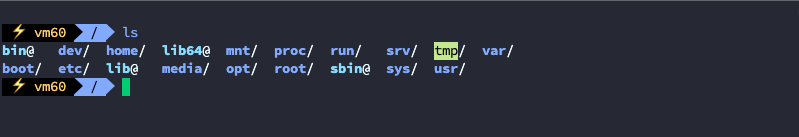

# 人性化 Shell

虽然 Bash Shell 是目前使用最广泛的 Shell，但它对人类不是最友好的。它从20世纪80年代末就开始存在了。在个人使用范围内，我强烈建议你使用一些现代的、对人友好的shell来替代Bash。不知道读者有没有使用过智能ABC等早期输入法，现代 Shell 就好像把智能ABC输入法替换成现在的搜狗输入法。

## 1 Fish Shell

[Fish Shell](https://fishshell.com/) 将自己描述为一个智能的、用户友好的命令行 Shell。让我们先看看一些基本的用法，然后再进入配置主题。

[Ubuntu 安装 Fish Shell](https://www.geeksforgeeks.org/how-to-install-and-configure-fish-shell-in-ubuntu/)

### 1.1 安装

```shell
wget https://download.opensuse.org/repositories/shells:/fish:/release:/3/CentOS_7/x86_64/fish-3.4.1-1.1.x86_64.rpm
yum install fish-3.4.1-1.1.x86_64.rpm
```

### 1.2 设为默认 Shell

- 将外壳添加到`/etc/shells`：

```shell
> echo /usr/local/bin/fish | sudo tee -a /etc/shells
```

- 使用以下命令更改默认 Shell：

```shell
> chsh -s /usr/local/bin/fish
```

警告：将 fish 设置为您的登录 shell 可能会有问题，因为某些操作系统（包括一堆 linux 发行版）仅在 shell 启动中进行某些配置，如 /etc/profile. 因此，你可能会遇到，$PATH 错误，您将不得不重新设置 $PATH。

### 1.3 基本用法

装fish后，打开终端。如果 fish 不是默认 shell：

- 键入**fish**以启动 shell：

  ```shell
  > fish
  ```

- 键入**exit**结束会话：

  ```shell
  > exit
  ```

对于许多日常工作来说，你不会注意到与Bash在输入方面有什么大的区别，表3-2中提供的大多数命令都是有效的。然而，有两个方面fish是不同的，而且比bash要方便得多。

- 没有明确的历史管理。你只需简单地输入，就能得到一个命令的先前执行情况。你可以用上下键来选择一个。

- 对许多命令有自动提示功能。此外，当你按下Tab键时，Fish shell会尝试完成命令、参数或路径，给你视觉上的提示，如在不能识别命令时将你的输入涂成红色。

在下表中，列出了一些常见的 fish 命令，在这种情况下，要特别注意对环境变量的处理。

| 任务                           | 命令                                  |
| ------------------------------ | ------------------------------------- |
| 导出环境变量 KEY 的值 VAL      | `set -x KEY VAL`                      |
| 删除环境变量 KEY               | `set -e KEY`                          |
| 内联环境变量 KEY，用于命令 cmd | `env KEY=VAL cmd`                     |
| 将路径长度改为1                | `set -g fish_prompt_pwd_dir_length 1` |
| 管理缩略语                     | `abbr`                                |
| 管理功能                       | `functions and funcd`                 |

与其他 Shell 不同，fish 将最后一个命令的退出状态存储在名为 $status 的变量中，而不是存储在 $？中。
如果你更熟悉 Bash，你可能还想查阅 [Fish FAQ](https://fishshell.com/docs/current/faq.html)，它解决了大多数问题。

### 1.4 配置

要[配置 Fish shell](https://fishshell.com/docs/current/index.html#configuration)，你只需输入`fish_config` 命令，更多信息请参考官方的配置信息。

提示 ：为了在命令行导航的 vi 和 Emacs（默认）键绑定之间进行切换，使用`fish_vi_key_bindings`来启动vi模式，并使用`fish_default_key_bindings`将其重置为Emacs。注意，这些变化将立即在所有活动的shell会话中发生。

这里推荐再安装一个 Fish 框架——[oh-my-fish](https://github.com/oh-my-fish/oh-my-fish)，可以非方便的安装扩展、修改外观。

```shell
# 使用脚本安装
curl https://raw.githubusercontent.com/oh-my-fish/oh-my-fish/master/bin/install | fish

# 离线安装
git clone https://github.com/oh-my-fish/oh-my-fish
cd oh-my-fish
bin/install --offline
```

安装主题

[浏览主题](https://github.com/oh-my-fish/oh-my-fish/blob/master/docs/Themes.md)

```shell
omf install agnoster
```

安装效果



## 2 Z-Shell

[Z-Shell](http://zsh.sourceforge.net/Doc/) 或 zsh 是一个类似 Bourne 的 Shell，具有强大的 [完成](http://bewatermyfriend.org/p/2012/003/) 系统和丰富的主题支持。使用 [Oh My Zsh](https://ohmyz.sh/) ，你几乎可以像之前在fish上看到的那样配置和使用zsh，同时保留与Bash的广泛向后兼容性。

有关更多 zsh 插件，另请参阅 GitHub 上的 [awesome-zsh 插件](https://github.com/unixorn/awesome-zsh-plugins)存储库，如果你想学习 zsh，请考虑阅读 Paul Falstad 和 Bas de Bakker 的[《Z Shell 简介》](https://www.ee.ryerson.ca/guides/zsh-intro.pdf)

## 3 其他现代 Shell

除了 fish 和 zsh 之外，还有许多其他有趣的，但不一定总是有 Bash 兼容的 Shell。

我遇到的一些适用于Linux的现代Shell的例子，可以建议你看看，包括：

- [Oil Shell](https://www.oilshell.org/) 的目标是Python和JavaScript用户。换句话说：重点不在于交互式使用，而在于脚本编写。

- [murex](https://murex.rocks/)，一个 POSIX Shell，具有有趣的功能，如集成的测试框架，类型化管道和事件驱动的编程。

- [NuShell](https://www.nushell.sh/) 是一种实验性的新 Shell 范例，具有具有强大查询语言的表格输出。通过详细的[Nu Book](https://www.nushell.sh/book/)了解更多信息。

- [PowerShell](https://github.com/powershell/powershell)是一个跨平台的Shell，最初是Windows PowerShell的一个分支，提供了一组与POSIX Shell不同的语义和交互。

还有很多其他的东西，继续寻找并尝试最适合你的方法，尝试超越Bash的思维并针对你的用例进行优化。

## 4 我该选择哪个？

在这个时间点上，除了Bash之外，从以人为中心的角度来看，每个现代 Shell 似乎都是一个不错的选择。流畅的自动完成，轻松的配置和智能环境现在并不奢侈，考虑到你通常在命令行上花费的时间，你应该尝试不同的 Shell 并选择你最喜欢的 Shell。我个人使用 Fish Shell，但我的许多人对 Z-Shell 非常满意。

你可能有一些问题让你犹豫是否要离开 Bash，特别是：

- 远程系统/无法安装自己的 Shell，不得不使用Bash。

- 兼容性，肌肉记忆。摆脱某些习惯可能很困难。

- 几乎所有指令都假设使用 Bash，例如，你会看到像`export FOO=BAR`这样的指令，它是Bash特定的。

事实证明，上述问题基本上与大多数用户无关。虽然你可能必须在远程系统中临时使用 Bash，但大多数时候你将在你控制的环境中工作。有一个学习曲线，但从长远来看，投资是有回报的。

## 参考

Shell：

- [Unix Shells： Bash， Fish， Ksh， Tcsh， Zsh](https://hyperpolyglot.org/unix-shells)

- [Shell 命令的比较](https://en.wikipedia.org/wiki/Comparison_of_command_shells)

- [Bash vs Zsh](https://www.reddit.com/r/linux/comments/1csl7c/bash_vs_zsh/)

- [Shell 中的 Ghost – 第 7 部分 – ZSH 设置](https://vermaden.wordpress.com/2021/09/19/ghost-in-the-shell-part-7-zsh-setup/)

