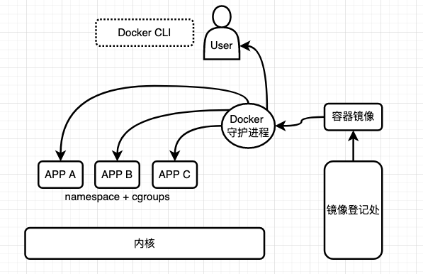

# 容器
在本书中，我们将容器理解为一个 Linux 进程组，它使用Linux命名空间（Linux namespaces），cgroups和可选的 CoW 文件系统来提供应用级的依赖管理。容器的用例包括从[本地测试和开发](https://mhausenblas.medium.com/container-assisted-testing-b76ee74278b7)到与分布式系统一起工

作（例如与[Kubernetes](https://kubernetes.io/)中的容器化微服务一起工作）。

> 如果我有容器就好了
> 在以前的工作中，我曾经不得不把一个概念验证放在一起，其中涉及一个名为 InfluxDB 的时间序列数据库。整个设置需要一些先决条件（创建目录，复制数据），以及安装依赖性。当需要交给同事向客户演示时，我最后写了一份详细的文件，列举了所有的步骤和检查，以确保一切按计划进行。
>
> 如果当时有 Docker 这样的容器解决方案，我就可以通过简单地将所有东西打包成一个容器，为自己和我的同事节省大量的时间。这不仅使我的同事容易使用，而且我可以保证它在他们的环境中的运行方式与在我的笔记本电脑上的完全一样。

容器本身在 Linux 中并不新鲜。然而，它们只是由于 Docker 而被主流采用，大约在2014年开始。在这之前，我们有许多尝试引入容器，通常是针对系统管理员而不是开发人员，包括。

[Linux VServer](https://en.wikipedia.org/wiki/Linux-VServer) (2001)

[OpenVZ](https://openvz.org/)（2005年）

[LXC](https://linuxcontainers.org/) (2008)

[Let Me Contain That For You (lmctfy)](https://github.com/google/lmctfy) (2013)

所有这些方法的共同点是，它们使用 Linux 内核提供的基本构件，如 Linux namespaces 或 cgroups，以允许用户运行应用程序。

Docker对这一概念进行了创新，并引入了两个突破性的东西：一种通过容器镜像定义打包的标准化方式和一个人性化的用户界面（例如docker run）。容器镜像的定义和分发方式以及容器的执行方式形成了现在被称为[开放容器倡议（OCI）](https://opencontainers.org/)核心规范的基础。当我们在这里谈论容器时，我们专注于符合OCI的实现。

OCI的三个核心容器规范是：

- [运行时规范](https://github.com/opencontainers/runtime-spec)，定义了运行时需要支持的内容，包括操作和生命周期阶段。

- [镜像格式规范](https://github.com/opencontainers/image-spec)，定义了容器镜像是如何构建的，基于元数据和层。

- [分发规范](https://github.com/opencontainers/distribution-spec)，定义了容器镜像的运输方式，有效地定义了存储库在容器中的工作方式。

容器一旦运行是不可改变的。你不能在使用期间改变容器的配置。换句话说，改变需要一个新的（静态）配置，并且用它来创建一个新的资源（比如一个进程）。

现在你已经知道了什么是概念层面上的容器，让我们仔细看看符合OCI标准的容器的构建块。

## 1 Linux 命名空间

Linux 最初对资源有一个全局观，即所有资源都是一个文件。为了允许进程在局部查看资源（例如文件系统、网络，甚至用户），Linux引入了名称空间。

换句话说。[Linux的命名空间](https://man7.org/linux/man-pages/man7/namespaces.7.html)都是关于资源的可见性，可以用来隔离操作系统资源的不同方面。这里的隔离主要是指进程看到的东西，不一定是硬边界（从安全角度看）。

为了创建命名空间，你有三个相关的系统调用供你使用。根据不同的使用情况，你可以。

1. 使用[clone](https://man7.org/linux/man-pages/man2/clone.2.html)来创建一个可以与父进程共享部分执行环境的子进程。
2. 对于一个现有的进程，添加/删除命名空间。
   - 使用 [unshare](https://man7.org/linux/man-pages/man2/unshare.2.html) 来删除共享的执行上下文。
   - 使用 [setns](https://man7.org/linux/man-pages/man2/setns.2.html) 来加入一个现有的命名空间。

上述系统调用采用一系列标签作为参数，使你能够精细地控制你想要创建、加入或离开的命名空间。

- 对于 Linux 2.4.19 以来支持的[文件系统装载点](http://man7.org/linux/man-pages/man7/mount_namespaces.7.html)，请使用`CLONE_NEWNS`标签。在 /proc/$PID/mounts 可见。

- [Hostname 和（NIS）domain name](https://lwn.net/Articles/179345/) 隔离，从 Linux 2.6.19 开始，可以用`CLONE_NEWUTS`创建。通过`uname -n`和`hostname -f`可以看到。 
- 要进行[进程间通信（ Interprocess communication，IPC）](https://lwn.net/Articles/187274/)资源隔离，如System V IPC对象或POSIX消息队列，请使用CLONE_NEWIPC，从Linux 2.6.19开始。通过/proc/sys/fs/mqueue、/proc/sys/kernel和/proc/sysvipc可以看到。
- 对于[PID number space isolation](https://lwn.net/Articles/259217/)（PID在命名空间内/PID在名字空间外），使用`CLONE_NEWPID`标志，自Linux 2.6.24起。通过`/proc/$PID/status`，你可以收集关于它的细节。
- 为了控制[网络系统资源 network system resources](https://lwn.net/Articles/219794/)的可见性，如网络设备、IP地址、IP路由表和端口号，使用`CLONE_NEWNET`标志。在 Linux 2.6.29 中已经完成了支持，你可以通过`ip netns`列表、/proc/net 和 /sys/class/net 查看。
- 要将[UID+GIDs](https://lwn.net/Articles/528078/)映射到命名空间内部/外部，使用 `CLONE_NEWUSER` 标志，在 Linux 3.8 中完成了支持。通过`id`命令和 /proc/$PID/uid_map 和 /proc/$PID/gid_map 你可以查询 UID 和 GID 及其映射。
- 要管理[cgroups in a namespace](http://man7.org/linux/man-pages/man7/cgroup_namespaces.7.html)请使用`CLONE_NEWCGROUP`标志（从Linux 4.6开始）。你可以通过 /sys/fs/cgroup/，/proc/cgroups，和 /proc/$PID/cgroup 看到它。

查看你的系统中使用的命名空间的一种方法如下（编辑了输出）:

```shell
$ sudo lsns
        NS TYPE   NPROCS   PID USER             COMMAND
4026531835 cgroup    251     1 root             /sbin/init splash
4026531836 pid       245     1 root             /sbin/init splash
4026531837 user      245     1 root             /sbin/init splash
4026531838 uts       251     1 root             /sbin/init splash
4026531839 ipc       251     1 root             /sbin/init splash
4026531840 mnt       241     1 root             /sbin/init splash
4026531860 mnt         1    33 root             kdevtmpfs
4026531992 net       244     1 root             /sbin/init splash
4026532233 mnt         1   432 root             /lib/systemd/systemd-udevd
4026532250 user        1  5319 mh9              /opt/google/chrome/nacl_helper
4026532316 mnt         1   684 systemd-timesync /lib/systemd/systemd-timesyncd
4026532491 mnt         1   688 systemd-resolve  /lib/systemd/systemd-resolved
...
```

下一个容器构件的重点是资源消耗限制和资源使用报告。

## 2 Linux cgroups

命名空间是关于资源可见性，而 [cgroups](https://www.man7.org/linux/man-pages/man7/cgroups.7.html) 提供了一种不同的功能：它们是一种组织进程组的机制。除了分层组织外，你还可以使用 cgroups 来控制系统资源的使用。此外，cgroups 还提供资源使用跟踪，例如，它们显示一个进程（组）正在使用多少内存或 CPU 时钟周期。把 cgroups 看作是声明性单元，把控制器看作是一段内核代码，用来执行某种资源限制或报告其使用情况。

在撰写本文时，内核中有两个版本的 cgroups 可用：cgroups v1和v2。cgroups v1 仍被广泛使用，但 v2 最终将取代 v1，你应该关注 v2。

### 2.1 cgroups v1

在cgroups v1中，社区采用了一种特别的方法，根据需要添加新的cgroups和控制器。以下是 v1 版的 cgroups （从最早的到最新的排序，请注意，文档中的内容都是不一致的）。

- 对于 CFS带宽控制（ [CFS Bandwidth Control](https://www.kernel.org/doc/html/latest/scheduler/sched-bwc.html?highlight=cfs%20bandwidth%20control)），使用cpu cgroup，从Linux 2.6.24开始。

- 从Linux 2.6.24开始，你可以通过 cpuacct 进行[CPU计费控制](https://www.kernel.org/doc/html/latest/admin-guide/cgroup-v1/cpuacct.html)（[CPU Accounting Controller](https://www.kernel.org/doc/Documentation/cgroup-v1/cpuacct.txt)）。
- 从Linux 2.6.24开始，[Cpusets](https://www.kernel.org/doc/Documentation/cgroup-v1/cpusets.txt) 允许为任务分配 CPU 和内存。
- 通过内存资源控制器（[Memory Resource Controller](https://www.kernel.org/doc/Documentation/cgroup-v1/memory.txt)），你可以隔离任务的内存行为，自Linux 2.6.25起。
- 设备白名单控制器（[Device Whitelist Controller](https://www.kernel.org/doc/Documentation/cgroup-v1/devices.txt)）允许控制设备文件的使用，自Linux 2.6.26起。
- 对于批处理任务的管理，你可以使用[freezer](https://www.kernel.org/doc/Documentation/cgroup-v1/freezer-subsystem.txt) cgroup，自Linux 2.6.28起。
- 网络分类器 cgroup（[Network classifier cgroup](https://www.kernel.org/doc/Documentation/cgroup-v1/net_cls.txt)），自Linux 2.6.29以来，可以用来给数据包分配不同的优先级。
- 通过块IO控制器（[Block IO Controller](https://www.kernel.org/doc/Documentation/cgroup-v1/blkio-controller.txt)），你可以对块状I/D进行节流。从Linux 2.6.33开始。
- [perf_event](https://git.kernel.org/pub/scm/linux/kernel/git/torvalds/linux.git/plain/tools/perf/Documentation/perf-record.txt)允许收集性能数据，自Linux 2.6.39起。
- 从Linux 3.3开始，网络优先级cgroup（[Network priority cgroup](https://www.kernel.org/doc/Documentation/cgroup-v1/net_prio.txt) ）允许动态地设置网络流量的优先级。
- 从Linux 3.5开始，HugeTLB控制器（[HugeTLB controller](https://www.kernel.org/doc/Documentation/cgroup-v1/hugetlb.txt)）允许限制HugeTLB的使用。
- 从Linux 4.3开始，你可以使用进程号控制器（[Process Number Controller](https://www.kernel.org/doc/Documentation/cgroup-v1/pids.txt)）来允许一个cgroup层次在达到一定限度后创建新的进程。

你还可以直接访问[Linux 内核文档](https://www.kernel.org/doc/html/latest/index.html )，阅读全部内容。

### 2.2 cgroups v2

[cgroups v2](https://www.kernel.org/doc/html/latest/admin-guide/cgroup-v2.html) 是对 cgroups 的全面重写，吸取了 v1 的经验教训。这在 cgroups 的一致配置和使用以及（集中和统一）文档方面都是如此。与每个进程的 cgroup v1 设计不同，cgroup v2 只有一个层次，所有控制器的管理方式都一样。下面是v2的控制器。

- CPU 控制器调节CPU周期的分配，支持不同的模式（重量、最大），并包括使用报告。
- 内存控制器通过一系列的控制参数来调节内存的分配，支持用户空间内存、内核数据结构，如dentries和inodes，以及TCP套接字缓冲区。
- I/O控制器通过基于权重和绝对带宽或IOPS限制来调节I/O资源的分配，报告字节和I/O操作的读/写。
- 进程编号（PID）控制器与V1版本类似。
- cpuset控制器与v1版类似。
- 设备控制器管理对设备文件的访问，在eBPF之上实现。
- rdma控制器调节远程直接内存访问（RDMA）资源的分配和计算。
- HugeTLB控制器与V1版本类似。
- 然后，v2版还有一个杂七杂八的cgroup，允许资源限制和标量资源的跟踪机制（不能像其他cgroup资源那样被抽象化）和一些传统的控制器，如perf_event。

你可以通过 systemctl 命令查看 Linux 系统中所有的 v2 cgroup，如下面所示（由于篇幅原因，输出被编辑了），以一种漂亮的树状呈现。

```shell
$ systemctl status 
starlite
    State: degraded
     Jobs: 0 queued
   Failed: 1 units
    Since: Tue 2021-09-07 11:49:08 IST; 1 weeks 1 days ago
   CGroup: /
           ├─22160 bpfilter_umh
           ├─user.slice
           │ └─user-1000.slice 
           │   ├─user@1000.service
           │   │ ├─gvfs-goa-volume-monitor.service
           │   │ │ └─14497 /usr/lib/gvfs/gvfs-goa-volume-monitor
   ...
```


关于 cgroups 还可以使用交互式查看资源使用情况，如下所示（输出经过编辑以适应）。

```shell
$ systemd-cgtop
Control Group                        Tasks   %CPU   Memory  Input/s Output/s
/                                      623   15.7     5.8G        -        -
/docker                                  -      -    48.3M        -        -
/system.slice                          122    6.2     1.6G        -        -
/system.slice/ModemManager.service       3      -   748.0K        -        -
...
/system.slice/rsyslog.service            4      -   420.0K        -        -
/system.slice/snapd.service             17      -     5.1M        -        -
```

随着现代内核版本被更广泛地使用，cgroups v2将成为标准。确实有一些发行版，如Arch、Fedora 31+ 或 Ubuntu 21.10，已经默认使用v2。

## 3 CoW 文件系统

容器的第三个构件是写时复制文件系统 ([Copy-on-write Filesystems](../filesystem/4.常规文件.md##7 写入时复制文件系统))。它们将应用程序及其所有的依赖关系打包成一个单一的、独立的文件，你可以分发。通常 CoW 文件系统与绑定挂载([bind mounts](https://docs.docker.com/storage/bind-mounts/))结合使用，以一种有效的方式将不同的依赖内容分层打包在一起。

## 4 Docker

Docker 是由 Docker 公司从 2014 年开始开发并推广的一种对人类用户友好的容器实现方法。有了Docker，就可以很容易地将程序和它们的依赖关系打包，并在一系列环境中启动它们，从桌面到云。Docker 的独特之处不是构建块（命名空间、cgroups、CoW文件系统和绑定挂载）。在Docker出现之前，这些已经存在了一段时间。最特别的是，Docker 将这些构件组合在一起，通过隐藏命名空间和 cgroups 等低级别的管理复杂性，使其易于使用。

如图下图所示，Docker中有两个主要概念，即镜像和运行中的容器。



- 容器镜像是一个压缩的归档文件，其中包含JSON文件中的元数据和层，这实际上就是目录。Docker守护进程会根据需要从容器注册表中提取容器镜像。

- 容器作为运行时工件（例如，应用程序A/B/C）：你可以启动、停止、杀死和删除它。你使用客户端CLI工具（docker）与Docker守护进程互动。这个 CLI 工具向守护进程发送命令，而守护进程则执行相应的操作，如构建或运行一个容器。

Docker CLI 命令请参考[Docker 快速操作手册](../addendum/Docker快速操作手册.md)，要获得包括使用案例在内的完整参考，请参考[Docker 文档](https://docs.docker.com/engine/reference/commandline/docker/)。

## 5 其它容器工具

不是只有 Docker 可以处理 OCI 容器，还有一个由红帽领导和赞助的组合，你可以用它作为替代：[podman](https://podman.io/)和[buildah](https://buildah.io/)。这些无守护程序的工具允许你构建 OCI 容器镜像（buildah）并运行它们（podman）。

此外，还有一些工具可以使 OCI容器、命名空间和 cgroups 的工作更容易，包括但不限于。

- [containerd](https://containerd.io/) 是一个管理OCI容器生命周期的守护程序，从镜像传输和存储到容器运行时的监督。
- [skopeo](https://github.com/containers/skopeo) 用于容器镜像操作（复制、检查清单等）。
- [systemd-cgtop](https://www.man7.org/linux/man-pages/man1/systemd-cgtop.1.html) 是 top 的一种 cgroups 感知变体，可以交互式地显示资源使用情况。
- [nsenter](https://man7.org/linux/man-pages/man1/nsenter.1.html) 允许你在指定的现有命名空间中执行一个程序。
- [unshare](https://linux.die.net/man/1/unshare) 允许你在特定的命名空间中运行程序（通过标志选择）。
- [lsns](https://www.man7.org/linux/man-pages/man8/lsns.8.html) 列出关于 Linux 名称空间的信息。
- [cinf](https://github.com/mhausenblas/cinf) 列出了与进程ID相关的Linux命名空间和c组的信息。

至此，我们的容器之旅结束了。现在让我们来看看现代的软件包管理器，以及它们是如何利用容器将应用程序相互隔离的。

