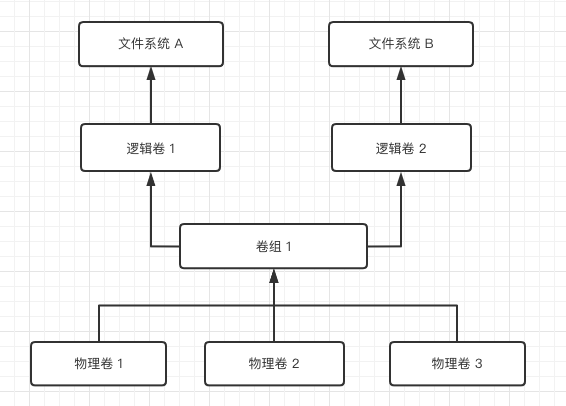

# 虚拟文件系统 （VFS）

Linux通过[虚拟文件系统（VFS）](https://elixir.bootlin.com/linux/latest/source/Documentation/filesystems/vfs.rst)来提供对多种资源（内存、磁盘或网络存储）的类似文件的访问。其基本思想是在客户端（syscall,系统调用）和为具体设备或其他资源执行操作的各个文件系统之间引入一个间接层。这意味着，VFS 将通用操作（打开、读取、查找）与实际的实现细节分开。

VFS 是内核中的一个抽象层，基于文件范式，为客户提供访问资源的通用方式。在Linux中，一个文件没有任何规定的结构，它只是一个字节流。由客户端来决定这些字节的含义。如下图所示，VFS 抽象了对不同类型文件系统的访问。   

- 本地文件系统，如 ext3、XFS、FAT 或 NTFS。这些文件系统使用驱动程序来访问本地块设备，如 HDD 或 SSD。

- 内存中文件系统，如 tmpfs，它们不受长期存储设备支持，而是位于主内存 （RAM） 中。我们将在"常规文件"中介绍此类别和上一个类别。

- 伪文件系统，如 "伪文件系统"中讨论的 procfs。这些文件系统本质上也是内存中的，它们用于内核接口和设备抽象。

- 网络文件系统，如 NFS、Samba、Netware （nee Novell） 等。这种文件系统也使用驱动程序，但是，实际数据所在的存储设备不是本地连接的，而是远程的。这意味着驱动程序涉及网络操作，这就是我们将在第7章中介绍它的原因。


VFS的组成是一个很复杂的问题。有 100 多个与文件相关的系统调用，然而，在其核心中，操作可以分为下表中列出的几个类别。。

| 组成 VFS 接口的系统调用 |                                              |
| ----------------------- | -------------------------------------------- |
| 类别                    | 示例系统调用                                 |
| inodes                  | chmod， chown， stat                         |
| 文件                    | open, close, seek, truncate, read, write     |
| 目录                    | chdir, getcwd, link, unlink, rename, symlink |
| 文件系统                | mount, flush, chroot                         |
| 其他                    | mmap, poll, sync, flock                      |

许多 VFS 系统调用会分派到特定于文件系统的实现中。对于其他系统调用，有 VFS 默认实现。此外，Linux 内核定义了相关的VFS数据结构（参见 [include/linux/fs.h](https://elixir.bootlin.com/linux/latest/source/include/linux/fs.h)），例如：

- inode，核心文件系统对象，捕获类型，所有权，权限，链接，指向包含文件数据的块的指针，有关创建和访问的统计信息等。

- 文件，表示打开的文件（包括路径、当前位置、inode）。

- dentry（目录条目），用于存储其父项和子项。

- super_block，表示包含挂载信息的文件系统。

- 其他如vfsmount或file_system_type。

完成 VFS 概述后，让我们仔细看看详细信息，包括卷管理、文件系统操作和常见文件系统布局。

## 1 逻辑卷管理器 （LVM）

我们之前讨论过使用分区划分驱动器。这么做是没有问题，但分区很难使用，特别是当需要调整大小（更改存储空间量）时。物理磁盘存在的弊端：扩展和压缩空间有数据风险并且管理困难。LVM 是一个管理软件，将物理磁盘池化，这个概念类似 RAID，优点是可弹性伸缩，易于管理。但在云计算时代，

逻辑卷管理器 （LVM） 使用物理实体（如驱动器或分区）和文件系统之间的间接层。这产生了一种设置，允许通过资源池进行无风险的零停机时间扩展和自动存储扩展。LVM 的工作方式如下图所示：



- 物理卷 （PV） 可以是磁盘分区、整个磁盘驱动器和其他设备。

- 逻辑卷 （LV） 是从 VG 创建的块储存设备。这些在概念上与分区相当。你必须先在 LV 上创建文件系统，然后才能使用它。你可以在使用中轻松调整LV的大小。

- 卷组 （VG） 是一组 PV 和 LV 之间的中间人。可以将其视为共同提供资源的 PV 池。

要使用 LVM 管理卷，需要许多工具，但它们的名称一致且相对易于使用：

- PV 管理：`lvmdiskscan`， `pvdisplay`， `pvcreate`， `pvscan`，

- VG 管理：`vgs`， `vgdisplay`， `vgcreate`， `vgextend`

- LV 管理：`lvs`，`lvscan`， `lvcreate`

让我们看看一些 LVM 命令的实际操作，使用具体设置：

```shell
# 列出逻辑卷，我们这里有两个（根和swap_1）使用卷组 elementary-vg。
$ sudo lvscan 
  ACTIVE            '/dev/elementary-vg/root' [<222.10 GiB] inherit
  ACTIVE            '/dev/elementary-vg/swap_1' [976.00 MiB] inherit
# 显示音量组，我们这里有一个称为 elementary-vg 的组。
$ sudo vgs 
  VG            #PV #LV #SN Attr   VSize    VFree
  elementary-vg   1   2   0 wz--n- <223.07g 16.00m
# 显示物理卷，我们这里有一个 （/dev/sda2） 分配给 volumne 组 elementary-vg。
$ sudo pvdisplay 
  --- Physical volume ---
  PV Name               /dev/sda2
  VG Name               elementary-vg
  PV Size               <223.07 GiB / not usable 3.00 MiB
  Allocatable           yes
  PE Size               4.00 MiB
  Total PE              57105
  Free PE               4
  Allocated PE          57101
  PV UUID               2OrEfB-77zU-jun3-a0XC-QiJH-erDP-1ujfAM
```


无论你使用的是分区还是 LV，使用文件系统都需要另外两个步骤（我们接下来将介绍）。

## 2 文件系统操作

在给定分区或逻辑卷（使用 LVM 创建）的情况下创建文件系统。涉及两个步骤：创建文件系统（在 Windos 操作系统中，此步骤称为格式化），然后挂载它，即将其插入文件系统树中。

### 2.1 创建文件系统

设置构成文件系统管理部分，并将分区或卷作为输入。 使用 [mkfs](https://www.man7.org/linux/man-pages/man8/mkfs.8.html) 创建文件系统。 

`mkfs` 需要两个主要输入：要创建的文件系统类型，以及要在其上创建文件系统的设备，例如一个逻辑卷：

```shell
# 创建 ext4 的类型
# 在 `/dev/some_vg/some_lv ` 上创建文件系统
mkfs -t ext4 /dev/some_vg/some_lv 
```

从前面的命令中可以看出，创建文件系统的命令并不复杂，你的主要工作是确定要使用的文件系统类型。

使用 mkfs 创建文件系统后，可以在文件系统树中挂载它。

### 2.2 挂载文件系统

挂载文件系统是将其附加到文件系统树（从 / 开始）。使用 [`mount`](https://man7.org/linux/man-pages/man8/mount.8.html) 来挂载文件系统。挂载需两个主要参数：要挂载的设备和文件系统树中的位置。此外，你还可以提供的其他参数，例如：

- 挂载选项（通过 -o），表示只读

- 指定一个 [绑定挂载](https://lwn.net/Articles/281157/) （--bind） 以将目录挂载到文件系统树中，我们将在容器的上下文中重新访问这一点。 

你也可以单独使用 `mount`。下面列出现有的挂载情况：

```shell
# 列出挂载，但仅显示某些文件系统类型（此处为 ext4 和 tmpfs）。
$ mount -t ext4,tmpfs 
tmpfs on /run type tmpfs (rw,nosuid,noexec,relatime,size=797596k,mode=755)
# ext4 类型的 LVM VG /dev/mapper/elementary--vg-root 挂载在根目录下
/dev/mapper/elementary--vg-root on / type ext4 (rw,relatime,errors=remount-ro) 
tmpfs on /dev/shm type tmpfs (rw,nosuid,nodev)
tmpfs on /run/lock type tmpfs (rw,nosuid,nodev,noexec,relatime,size=5120k)
tmpfs on /sys/fs/cgroup type tmpfs (ro,nosuid,nodev,noexec,mode=755)
```

请注意，必须使用创建时的文件系统类型来挂载。例如，`mount-t vfat/dev/sdX2 /media`挂载 SD 卡，SD 卡是使用 vfat 类型格式化。还可以使用 mount -a 尝试挂载所有文件系统。

另外，挂载只在系统运行时有效，因此为了使其永久化，需要使用 fstab（/etc/fstab）。例如：

```shell
$ cat /etc/fstab
# /etc/fstab：静态文件系统信息。

# 使用"blkid"打印一个通用的唯一标识符
# 设备:这可以与UUID=一起使用，作为命名设备的更可靠的方式
# 即使添加和删除磁盘也有效。参见 fstab（5）。

# <文件系统><挂载点> <类型> <选项> <转储> <传递>
/dev/mapper/elementary--vg-root / ext4 errors=remount-ro 0 1
# /boot/efi 在安装过程中处于 /dev/sda1 上
UUID=2A11-27C0 /boot/efi vfat umask=0077 0 1
/dev/mapper/elementary--vg-swap_1 none swap sw 0 0
```

## 3 常见文件系统布局

文件系统布局的意思组织程序的存储位置、配置数据、系统数据和用户数据等内容。正式的说法是 [文件系统层次结构标准（FHS）](https://refspecs.linuxfoundation.org/FHS_3.0/fhs/index.html) 。它定义目录，包括其结构和推荐的内容。Linux 基金会负责维护 FHS。

但是，在实践中，你会发现文件系统布局在不同的 Linux 发行版上有差别。你可以使用 `man hier` 命令来了解具体设置。

下表列出了一些常见目录：

| 表 5-3.常见顶级目录 |                                                    |
| ------------------- | -------------------------------------------------- |
| 目录                | 含义                                               |
| bin， sbin          | 系统程序和命令（通常链接到 /usr/bin 和 /usr/sbin） |
| boot                | 内核映像和相关组件                                 |
| dev                 | 设备（终端、驱动器等）                             |
| etc                 | 系统配置文件                                       |
| home                | 用户主目录                                         |
| lib                 | 共享系统库                                         |
| mnt, media          | 可移动媒体（例如 U 盘）的安装点                    |
| opt                 | 特定于发行版，可以托管包管理器文件                 |
| proc， sys          | 内核接口，另请参见 "伪文件系统"                    |
| tmp                 | 对于临时文件                                       |
| usr                 | 用户程序（通常为只读）                             |
| var                 | 用户程序（日志、备份、网络缓存等）                 |

[文件系统结构和维护 红帽企业版 Linux 7](https://access.redhat.com/documentation/en-us/red_hat_enterprise_linux/7/html/storage_administration_guide/ch-filesystem)

