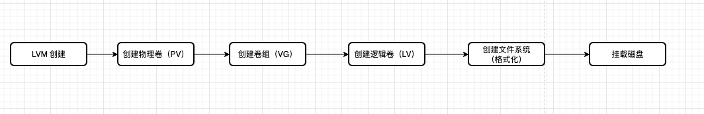
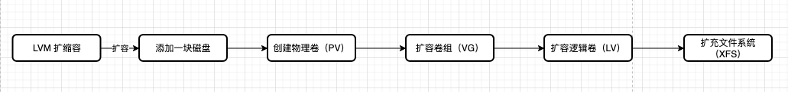

# LVM 操作

[逻辑卷管理器管理 Red Hat Enterprise Linux 7 | Red Hat Customer Portal](https://access.redhat.com/documentation/zh-cn/red_hat_enterprise_linux/7/html/logical_volume_manager_administration/index)

## 1 新建



1. 物理磁盘池化:`pvcreat  /dev/sdb` 
2. 创建卷组:`vgcreat  <vg-name> /dev/PVPATH` 
3. 创建逻辑卷:`lv -n lv0 -L  100G  <vg-name>`

4. 格式化:`mkfs.xfs /dev/vg0/lv0`

5. 挂载`mkdir /data`->`mount /dev/vg0/lv0 /data`
6. 开机挂载 `vim /etc/fstab`或者`vim /etc/rc.local`

## 2 查看

### 物理卷

```shell
# 查看 pv 信息
pvs
# 查看 pv 相信信息
pvdisplay
 --- Physical volume ---
  PV Name               /dev/sda2
  VG Name               centos
  PV Size               <59.00 GiB / not usable 3.00 MiB
  Allocatable           yes 
  PE Size               4.00 MiB
  Total PE              15103
  Free PE               1
  Allocated PE          15102
  PV UUID               wsE55I-OCFK-0gAP-X9pP-gnvh-nbrE-HkK0lI
```

### 卷组

```shell
vgs
  VG     #PV #LV #SN Attr   VSize   VFree
  centos   1   3   0 wz--n- <59.00g 4.00m
  
vgdisplay
  --- Volume group ---
  VG Name               centos
  System ID             
  Format                lvm2
  Metadata Areas        1
  Metadata Sequence No  4
  VG Access             read/write
  VG Status             resizable
  MAX LV                0
  Cur LV                3
  Open LV               3
  Max PV                0
  Cur PV                1
  Act PV                1
  VG Size               <59.00 GiB
  PE Size               4.00 MiB
  Total PE              15103
  Alloc PE / Size       15102 / 58.99 GiB
  Free  PE / Size       1 / 4.00 MiB
  VG UUID               o4MqzJ-tXf5-8dyJ-I6dW-fC86-1xAt-69mTmC
```

### 逻辑卷

```shell
lvs
  LV   VG     Attr       LSize   Pool Origin Data%  Meta%  Move Log Cpy%Sync Convert
  home centos -wi-ao----  18.08g                                                    
  root centos -wi-ao---- <37.04g                                                    
  swap centos -wi-ao----  <3.88g   

lvdisplay 
  --- Logical volume ---
  LV Path                /dev/centos/swap
  LV Name                swap
  VG Name                centos
  LV UUID                tFhgbE-nXbR-DLaH-B8Bq-j6JM-fMYG-Izf10o
  LV Write Access        read/write
  LV Creation host, time localhost, 2022-04-25 16:33:55 +0800
  LV Status              available
  # open                 2
  LV Size                <3.88 GiB
  Current LE             992
  Segments               1
  Allocation             inherit
  Read ahead sectors     auto
  - currently set to     8192
  Block device           253:1
```

## 3 伸缩



```shell
yum install "sg3*" -y # 用于支持 scsi 硬盘
/usr/bin/rescan-scsi-bus.sh
```

```shell
# 创建 PV
pvcreate /dev/sdb
# 查看卷组
vgdisplay
# 扩容卷组
vgextend rhel /dev/sdb
vgdisplay
# 查看逻辑卷
lvdisplay
# 扩容逻辑卷，+100%FREE 意思是使用所有空间
lvextend -l +100%free /dev/rhel/root
lvdisplay
# 手动扩展xfs
xfs_growfs /dev/rhel/root
```

一些参数

- lvextend --size +2G --resizefs /dev/vg0/lv0
  			--size 4G  指定扩展后的大小
  			--size +2G  增加2G
  			--resizefs 扩展卷的同时扩充文件系统
  			resize2fs /dev/vg0/lv0 手动扩展ext4
  			xfs_growfs  手动扩展xfs