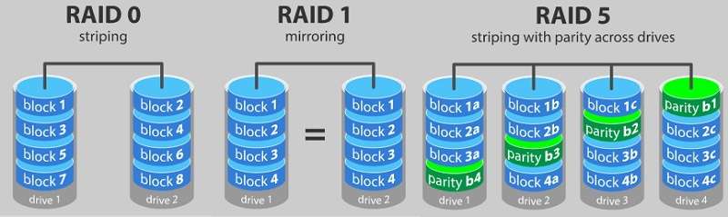

# 磁盘阵列

RAID （ Redundant Array of Independent Disks ）即独立磁盘冗余阵列，简称为「磁盘阵列」，其实就是用多个独立的磁盘组成在一起形成一个大的磁盘系统，从而实现比单块磁盘更好的存储性能和更高的可靠性。

:loudspeaker:大部分场景下，物理服务器使用两块磁盘做 RAID 1，用于安装操作系统，其余盘做一个 RAID 5。

| 等级    | 条带化             | 镜像               | 奇偶校验           | 允许故障磁盘数  | 最小磁盘数 | 细节                    |
| ------- | ------------------ | ------------------ | ------------------ | --------------- | ---------- | ----------------------- |
| RAID 0  | :heavy_check_mark: |                    |                    | 0               | 2          |                         |
| RAID 1  |                    | :heavy_check_mark: |                    | 1               | 2          |                         |
| RAID 5  | :heavy_check_mark: |                    | :heavy_check_mark: | 1               | 3          |                         |
| RAID 6  | :heavy_check_mark: |                    | :heavy_check_mark: | 2               | 4          | RAID 5 + 附加奇偶校验块 |
| RAID 10 | :heavy_check_mark: | :heavy_check_mark: |                    | 每个镜像组 1 块 | 4          | RAID 0 + RAID 1         |
| RAID 50 | :heavy_check_mark: |                    | :heavy_check_mark: |                 | 6          | RAID 0 + RAID 5         |
| RAID 60 | :heavy_check_mark: |                    | :heavy_check_mark: |                 | 8          | RAID 0 + RAID 6         |

## RAID 0

允许多个物理磁盘写入数据。RAID 0 将每个物理磁盘存储空间划分为 64 KB 条带。这些条带以重复的顺序方式交错。单个物理磁盘上的条带部分称为条带元素。
例如，在仅使用 RAID 0 的四磁盘系统中，分段 1 写入磁盘 1，分段 2 写入磁盘 2，依此类推。RAID 0 提高了性能，因为同时访问了多个物理磁盘，但它不提供数据冗余

- **容错** – 无
- **优势** - 改进性能、额外的存储空间
- **缺点** - 不应用于关键数据，一个驱动器故障都会导致数据丢失。

## RAID 1

使用 RAID 1，写入一个磁盘的数据会同时写入另一个磁盘。如果一个磁盘发生故障，另一个磁盘的内容可用于运行系统并重建发生故障的物理磁盘。 
RAID 1 的主要优点是它提供 100% 的数据冗余。因为磁盘的内容完全写入第二个磁盘，系统可以承受一个磁盘的故障。两个磁盘始终包含相同的数据。任一物理磁盘都可以作为可操作的物理磁盘。

- **容错** ——磁盘错误、单磁盘故障
- **优势** – 高读取性能、驱动器故障后快速恢复、数据冗余
- **缺点** ——磁盘开销高，容量有限

## RAID 5 和 6

RAID 5 和 6 通过一种称为奇偶检验的技术保持数据的冗余。在驱动器故障的情况下，控制器可以使用奇偶校验数据来重新生成用户数据。
RAID 5、6、50 和 60 存在奇偶校验数据。奇偶校验数据分布在系统中的所有物理磁盘上。如果单个物理磁盘发生故障，可以根据奇偶校验和剩余物理磁盘上的数据对其进行重建。

- RAID 级别 5 将分布式奇偶校验与磁盘条带化相结合。奇偶校验为一个物理磁盘故障提供冗余，而不复制整个物理磁盘的内容。
- RAID 6 将双分布式奇偶校验与磁盘条带化相结合。这种奇偶校验级别允许两个磁盘故障，而不会复制整个物理磁盘的内容。

RAID 5

- **容错** ——磁盘错误、单磁盘故障
- **优势** – 高效利用驱动器容量、高读取性能、中到高写入性能
- **缺点** - 磁盘故障中等影响，由于奇偶校验重新计算而需要更长的重建时间

RAID 6

- **容错** ——磁盘错误、双磁盘故障
- **优势** ——数据冗余，读取性能高
- **缺点** – 由于双奇偶校验计算导致写入性能下降，由于 2 个磁盘等效用于奇偶校验而导致额外成本

## RAID 10 

需要两个或更多镜像集一起工作。多个 RAID 1 集组合在一起形成一个阵列。数据跨所有镜像驱动器进行条带化。 
由于每个驱动器都在 RAID 10 中进行镜像，因此不会遇到延迟，因为没有进行奇偶校验计算。 
只要同一镜像对的两个驱动器不发生故障，此 RAID 策略就可以容忍多个驱动器的丢失。RAID 10 卷提供高数据吞吐量和完整的数据冗余

RAID 10

- **容错** – 磁盘错误，每个镜像集一个磁盘故障
- **优势** – 高读取性能，支持最大 192 个驱动器的 RAID 组
- **缺点** ——最贵