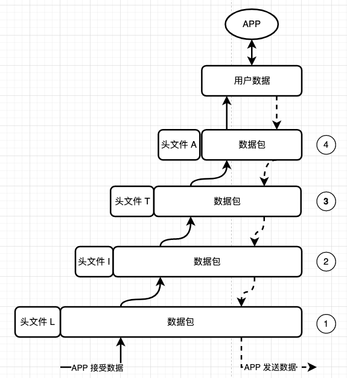
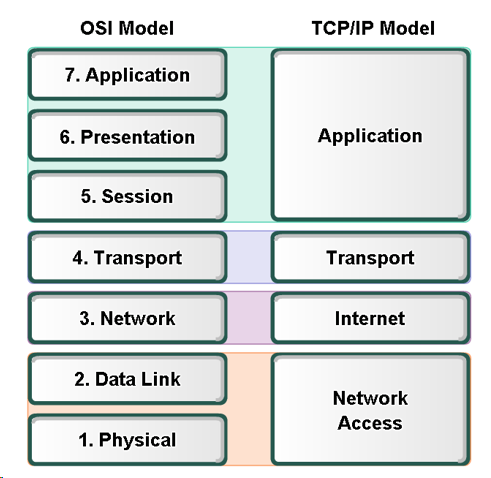
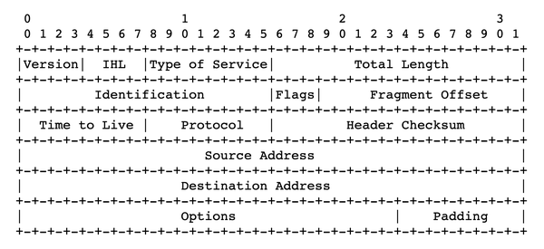
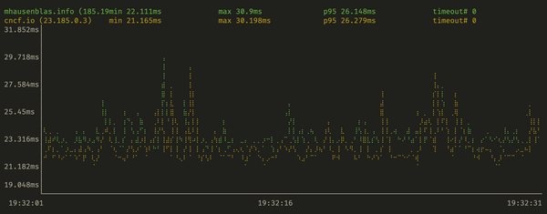
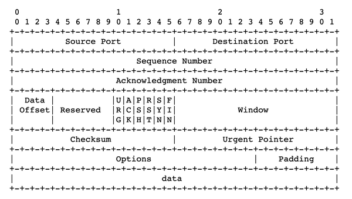
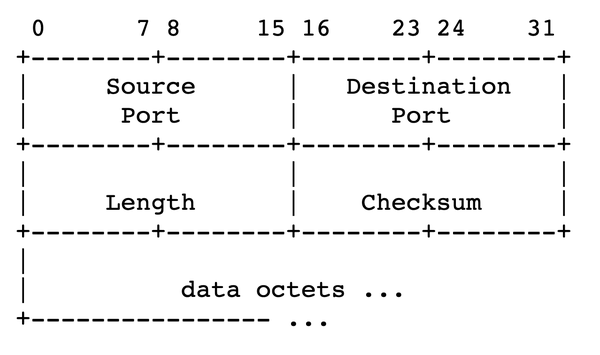
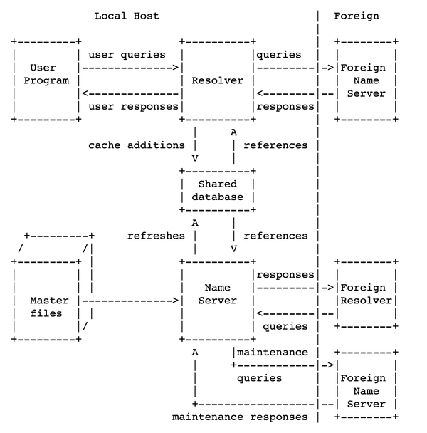
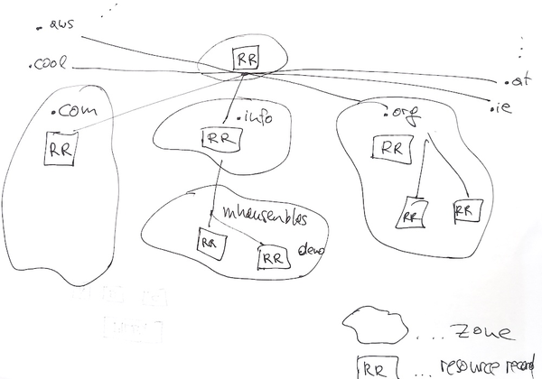

# TCP/IP 协议栈

如下图所示，TCP/IP 协议栈是一个由许多协议和工具组成的分层网络模型，大多由 IETF 规范定义。

- 每一层只需要知道如何跟自己的上下层进行通信。
- 数据被封装在数据包中，每一层都将数据包裹在一个包含与其功能有关的信息的头中。

如果一个应用程序想发送数据，它将直接与最高层互动，该层会添加一个头，然后沿着协议栈（发送路径）继续下去。相反，如果一个应用程序想要接收数据，它将从最低层开始，每一层将根据它发现的头信息依次处理，并将有效数据传递给上面的层（接收路径）。



从底部开始，TCP/IP 协议栈的四层依次是：

1. 链路层（Link layer）是协议栈中最低的一层，它涵盖了硬件（以太网、WiFi）和内核驱动，重点是物理设备之间如何发送数据包。详见 "链路层"。
2. 网络层（Internet layer）包括互联网协议（IP），侧重于路由，也就是说，支持在网络上的机器之间发送数据包。我们在 "互联网层 "中讨论。
3. 传输层（Transport layer）控制（虚拟或物理）主机之间的端到端通信，传输控制协议（TCP）用于基于会话的可靠通信，用户数据报协议（UDP）用于无连接的通信。它主要处理数据包如何传输的问题，包括通过端口寻址机器上的各个服务以及数据完整性。此外，Linux支持套接字作为通信端点。参见 "传输层"。
4. 应用层（Application layer），涉及面向用户的工具和应用程序，如 Web、SSH 和邮件。

## 1 互联网 和 OSI

互联网起源于 20 世纪 60 年代开始的一个国防部项目，其目标是创造一个不容易被破坏的通信网络。它是一个网络的网络，也就是说，许多本地网络与后端基础设施相连，允许不同系统之间进行通信。

你可能会接触到开放系统互连（Open Systems Interconnection，OSI）模型，这是一个使用七层的网络理论模型，其中第七层，最顶层是应用层。TCP/IP 模型只有四层，但在实践中，使用更多的是 TCP/IP 协议模型。

不要被层的编号所迷惑。通常，由于硬件算作第1层，链接层是第 2 层，网络层是第3层，传输层是第4层，（由于历史原因，为了与 OSI 模型保持一致），应用层是第 7 层。



分层意味着一个层的头和有效数据载荷（数据包的大小是固定的）构成了下一个层的有效载荷。网络层的有效载荷是传输层的头HT和它的有效载荷。换句话说：互联网层从传输层得到的数据包，把它当作一个不透明的字节块，并可以专注于它的功能，即把数据包路由到目标机器上。

现在从最低的一层，即链路层。

## 2 链路层（Link layer）

链路层包含所有关于硬件或接近硬件的东西，如字节、电线、电磁波、设备驱动程序和网络接口。在这一层中，你会遇到如下术语：

- 以太网（Ethernet）：使用电线连接机器的网络技术系列，通常用于局域网（LAN）。
- 无线（Wireless）：也被称为WiFi，是一类通信协议和方法，不使用电线，而是使用电磁波来传输数据。
- MAC 地址：MAC 是媒体访问控制（media access control）的简称，是硬件的唯一48位标识符，用于识别你的机器（准确地说，是识别网络接口，见下文）。MAC地址通过组织上唯一的标识符（OUI）对制造商（的接口）进行编码，通常占据前24比特
- 接口（Interface）：一个网络连接。可以是一个物理接口，如网络接口控制器（Network Interface Controller，NIC）或一个虚拟（软件）接口，如环回接口 lo。

### 2.1 网络接口控制器（NIC）

网络接口控制器（NIC）是一个非常重要的硬件设备，有时也称为网络接口卡。NIC 通过有线标准（例如用于以太网的IEEE 802.3-2018标准）或IEEE 802.11 系列的无线标准，提供与主机外的网络物理连接。当加入到一个网络时，NIC 会将要发送的字节的数字信号转换为电信号或电磁信号。接收路径则相反，NIC 将接收到的任何物理信号转换为软件可以处理的位（bits）和字节（bytes ）。

让我们看看NIC的实际应用。传统上，人们会使用（现在普遍认为不推荐使用的）`ifconfig` 命令来查询系统上可用NIC的信息（出于教育原因，我们首先在这里展示它，更好的方式是，使用`ip`命令）：

```shell
$ ifconfig
lo: flags=73<UP,LOOPBACK,RUNNING>  mtu 65536 
        inet 127.0.0.1  netmask 255.0.0.0
        inet6 ::1  prefixlen 128  scopeid 0x10<host>
        loop  txqueuelen 1000  (Local Loopback)
        RX packets 7218  bytes 677714 (677.7 KB)
        RX errors 0  dropped 0  overruns 0  frame 0
        TX packets 7218  bytes 677714 (677.7 KB)
        TX errors 0  dropped 0 overruns 0  carrier 0  collisions 0

wlp1s0: flags=4163<UP,BROADCAST,RUNNING,MULTICAST>  mtu 1500 
        inet 192.168.178.40  netmask 255.255.255.0  broadcast 192.168.178.255
        inet6 fe80::be87:e600:7de7:e08f  prefixlen 64  scopeid 0x20<link>
        ether 38:de:ad:37:32:0f  txqueuelen 1000  (Ethernet)
        RX packets 2398756  bytes 3003287387 (3.0 GB)
        RX errors 0  dropped 7  overruns 0  frame 0
        TX packets 504087  bytes 85467550 (85.4 MB)
        TX errors 0  dropped 0 overruns 0  carrier 0  collisions 0
```

 第一个接口是`lo`，环回接口(loopback interface)，IP 地址为 127.0.0.1。最大传输单元（MTU）是指数据包的大小，这里是65536字节（数值越大意味着更高的吞吐量)；由于历史原因，以太网的默认值是1500字节，但你可以使用大小为9000字节的巨型帧。

 报告的第二个接口是wlp1s0，分配的IPv4地址是 192.168.178.40。这个接口是一个网卡，有一个MAC地址（以太网是`38:de:ad:37:32:0f`）。当查看标志（<UP,BROADCAST,RUNNING,MULTICAST>)时，它似乎正在运行。

### 2.2 地址解析协议（ARP）

ARP（Address Resolution Protocol）将MAC地址映射到IP地址。从某种意义上说，它在链路层和网络层之间架起了桥梁。

```shell
$ arp 
Address                  HWtype  HWaddress           Flags Mask            Iface
mh9-imac.fritz.box       ether   00:25:4b:9b:64:49   C                     wlp1s0
fritz.box              
```

*使用`arp`命令来显示:将MAC地址映射到主机名或IP地址的缓存。注意，你可以使用arp -n来阻止主机名解析，并显示IP地址而不是DNS名称。*

或者，使用更现代的方法，用ip。

```shell
$ ip neigh 
192.168.178.34 dev wlp1s0 lladdr 00:25:4b:9b:64:49 STALE
192.168.178.1 dev wlp1s0 lladdr 3c:a6:2f:8e:66:b3 REACHABLE
```

* 使用ip命令显示MAC到IP地址映射的缓存。*

要显示、配置和排除无线设备的故障，你要使用[iw](https://wireless.wiki.kernel.org/en/users/documentation/iw)命令。例如，我知道我的无线网卡叫 wlp1s0，所以我可以查询它。

```shell
$ iw dev wlp1s0 info 
Interface wlp1s0
        ifindex 2
        wdev 0x1
        addr 38:de:ad:37:32:0f
        ssid FRITZ!Box 7530 QJ 
        type managed
        wiphy 0
        channel 5 (2432 MHz), width: 20 MHz, center1: 2432 MHz 
        txpower 20.00 dBm
```

* `iw dev wlp1s0 info`显示无线接口wlp1s0的基本信息。*

* `ssid FRITZ!Box 7530 QJ`接口所连接的路由器（另见下例）。*

* `channel 5 (2432 MHz), width: 20 MHz, center1: 2432 MHz`该接口使用的 WiFi 频段。*

此外，我可以这样收集路由器和流量相关的信息:

```shell
$ iw dev wlp1s0 link 
Connected to 74:42:7f:67:ca:b5 (on wlp1s0)
        SSID: FRITZ!Box 7530 QJ
        freq: 2432
        RX: 28003606 bytes (45821 packets) 
        TX: 4993401 bytes (15605 packets)
        signal: -67 dBm
        tx bitrate: 65.0 MBit/s MCS 6 short GI

        bss flags:      short-preamble short-slot-time
        dtim period:    1
        beacon int:     100
```

* `iw dev wlp1s0 link`显示无线接口wlp1s0的连接信息。*

* `RX` 和 `TX`：发送（TX代表传输）和接收（RX）的统计数据，也就是通过这个接口发送和接收的字节和数据包。*

现在我们已经很好地掌握了TCP/IP协议栈的最低层--（数据）链路层的情况，让我们往上走。

## 3 网络层（Internet Layer）

互联网层关注的是网络上一台机器到另一台机器的数据包的路由（路由是一个动态过程，routing，通俗一点解释：  数据包从源头到目的地的路径规划）。互联网层的设计假定可用的网络基础设施是不可靠的，参与者（如网络中的节点或它们之间的连接）经常变化。

互联网层提供尽力而为的交付（也就是说，不保证性能），并将每个数据包视为独立的。因此，更高层，通常是传输层，负责解决可靠性问题，包括包的顺序、重试或交付保证。

> **路由就像寄快递**
>
> 把网络层的地址想象成你的邮政地址。这个邮政地址是由许多部分组成的，从最粗略的（国家）到街道级信息，包括门牌号等等。
>
> 这个邮政地址是我需要知道的所有信息，我不需要知道运输的细节（比如我的快递何时通过轮船或飞机运输，或者采取什么确切的路径，到哪中转）。我和快递公司之间的合同很简单：写上正确的地址，并支付了相应的快递费，那么快递公司就承诺配送。

同样，你的机器也是由网络层通过一个逻辑地址识别的。

在这一层中，主导协议是互联网协议（Internet Protocol，IP），它的作用是，在全球范围内为机器提供唯一的逻辑地址（也就是说，世界上不可能有两个同样的IP，注意，是说同一网络环境下），它有两种类型，即IP版本4（IPv4）和IP版本6（IPv6）。

### 3.1 IPv4

IPv4 定义了一个唯一的32位数字（也就是 32 比特，等价4个字节），全部 IP 地址也就是 2^32（每一位的数字有两种可能 1或者0，总共32位，所以是2^32） 个，大约40亿个，用于识别主机或进程作为TCP/IP通信的一个终端。

将32位分成4个8位段，用句号隔开，每个段在0到255的范围内，在书写 IP 地址的时候我们通常按照点分十进制记法，也就说地址中的每个字节都转化成十进制形式书写，请看下面的例子

```shell
 63.32.106.149
\_/\_/ \_/ \_/
 |  |   |   └─  10010101
 |  |   └─────  01101010
 |  └─────────  00100000
 └──────────── 对应的二进制数字是 00111111
```

在[RFC 791](https://datatracker.ietf.org/doc/html/rfc791)和相关的IETF规范中定义的IP头（图7-3）有许多字段，但下面是最重要的，你应该知道：

- 源地址（32位）：发送方的IP地址。
- 目的地地址（32位）：接收者的IP地址。
- 协议（8位）：有效载荷类型（次高层类型），根据RFC 790，例如TCP、UDP或ICMP。
- 存活时间又称TTL（8位）：允许数据包存在的最大时间。
- 服务类型（8位）：可用于服务质量（QoS）目的。

*图 7-3 根据RFC 791的IP头格式*


鉴于互联网是一个网络的网络，似乎很自然地要区分网络和网络中的单个机器（主机）。将IP地址划分相应的范围分配给网络，并在这些网络中分配给单个主机。

如今，[无类别域间路由（ Classless Inter-Domain Routing，CIDR）](https://en.wikipedia.org/wiki/Classless_Inter-Domain_Routing)是分配IP地址的唯一相关方法。CIDR格式由两部分组成。

- 第一部分代表网络地址。这看起来像一个正常的IP地址，例如，10.0.0.0。
- 第二部分定义了多少位和该IP地址所属地址范围。例如，像/24这样的东西。

因此，一个完整的CIDR范围的例子看起来像。

```shell
10.0.0.0/24
```

在上面的例子中，前24位（或：三个八位数）代表网络，最后8位（总体32位减去网络的24位）是256个主机（2^8）可用的IP地址。这个CIDR范围内的第一个IP地址是10.0.0.0，最后一个IP地址是10.0.0.255。严格地说，只有10.0.0.1到10.0.0.254的地址可以分配给主机，因为.0和.255的地址是为特殊目的保留的。此外，我们可以说网络掩码是255.255.255.0，因为那是代表网络的前24位。

在实践中，你不需要记住这里的所有数学知识。如果你每天都在和它打交道，那么你只需要知道，或者如果你是一个临时用户，你可能想使用一些工具。所以，如果你想进行CIDR范围的计算，比如一个范围内有多少个IP，请看。

- 在线工具 [CIDR.xyz](https://cidr.xyz/) 或者 [ipaddressguide.com/cidr](https://www.ipaddressguide.com/cidr) 或者[ipjisuanqi](https://ipjisuanqi.com/)

- 命令行工具[mapcidr](https://github.com/projectdiscovery/mapcidr) 或者[cidrchk](https://github.com/mhausenblas/cidrchk)

你还需要注意，有一些[保留 IP 地址 (reservedIPv4)](https://en.wikipedia.org/wiki/Reserved_IP_addresses)
，你不可以使用

- 127.0.0.0子网是为本地地址保留的，其中最常见的是环回地址127.0.0.1。
- 169.254.0.0/16，即169.254.0.0到169.254.255.255是链接本地地址，意味着在那里发送的数据包不应该被转发到网络的其他部分。一些云提供商，如亚马逊网络服务，将其用于特殊服务（元数据）。
- 224.0.0.0/24即224.0.0.0到239.255.255.255是保留给组播的。

[RFC 1918](https://datatracker.ietf.org/doc/html/rfc1918) 定义了私有IP范围。一个私有的IP范围意味着其中的IP地址在公共互联网上不能被路由，因此在内部分配这些地址是安全的（例如在你的公司范围内）。

- 10.0.0.0到10.255.255.255，10/8前缀
- 172.16.0.0到172.31.255.255，172.16/12前缀
- 192.168.0.0到192.168.255.255，192.168/16前缀

另一个有趣的IPv4地址是`0.0.0.0`。它是一个不可路由的地址，有不同的使用情况和不同的含义，取决于上下文，但最重要的是，从服务器的角度来看，`0.0.0.0`是指机器中存在的所有IPv4地址。这是一个很好的方式来表达 "监听所有可用的IP地址"，直到它变成一个已知的IP。

现在，那是很多干巴巴的理论，让我们看看它的操作。让我们在机器上查询与IP有关的东西（输出已编辑）。

```shell
$ ip addr show 
1: lo: <LOOPBACK,UP,LOWER_UP> mtu 65536 qdisc noqueue
    state UNKNOWN group default qlen 1000
    link/loopback 00:00:00:00:00:00 brd 00:00:00:00:00:00
    inet 127.0.0.1/8 scope host lo 
       valid_lft forever preferred_lft forever
    inet6 ::1/128 scope host
       valid_lft forever preferred_lft forever
2: wlp1s0: <BROADCAST,MULTICAST,UP,LOWER_UP> mtu 1500 qdisc
    noqueue state UP group default qlen 1000
    link/ether 38:de:ad:37:32:0f brd ff:ff:ff:ff:ff:ff
    inet 192.168.178.40/24 brd 192.168.178.255 scope global dynamic 
    noprefixroute wlp1s0
       valid_lft 863625sec preferred_lft 863625sec
    inet6 fe80::be87:e600:7de7:e08f/64 scope link noprefixroute
       valid_lft forever preferred_lft forever
```

 `ip addr show`列出所有接口的地址。

 环回接口的IP地址，如预期的`127.0.0.1`。

无线网卡的（私有）IP地址。请注意，这是机器的局域网本地IP地址，不属于公共路由，因为它属于192.168/16范围。

IPv4地址空间已经耗尽，鉴于现在的终端比互联网设计者想象的要多得多（例如由于移动设备和物联网），需要一个可持续的解决方案。

幸运的是，有了IPv6，地址耗尽的问题就有了解决方案。不幸的是，在撰写本报告时，整个生态系统仍未迁移到IPv6，部分原因是由于基础设施的原因，也有工具方面的原因。这意味着，目前你仍然必须处理IPv4及其限制和[变通](https://networkengineering.stackexchange.com/questions/53935/why-are-ipv4-addresses-running-out).
方法。

### 3.2 IPv6

[互联网协议版本6](https://en.wikipedia.org/wiki/IPv6)（IPv6）是一个128位的数字，用于识别TCP/IP通信中的一个端点。这意味着，使用IPv6，我们可以分配10^38个单独的机器（设备）的顺序。与IPv4相比，IPv6使用十六进制表示，八组，每组16位，用冒号（:）隔开各组。

有一些规则可以缩短IPv6地址，如去掉前导零或用两个冒号（::）来压缩连续的零段。例如，IPv6[环回](https://datatracker.ietf.org/doc/html/rfc5156)地址可以写成::1（IPv4的变体是127.0.0.1）。

就像IPv4一样，IPv6也有一些特殊的和保留的地址，例子见APNIC的[IPv6地址类型](https://www.apnic.net/get-ip/faqs/what-is-an-ip-address/ipv6-address-types/)。

值得注意的是，IPv4和IPv6是不兼容的。这意味着每一个网络参与者，从边缘设备（如你的手机）到路由器到服务器软件，都需要建立对IPv6的支持。这种对IPv6的支持，至少在Linux的背景下，已经表现得相当广泛。例如，我们在 IPv4 部分看到的 ip addr 命令，默认情况下也会显示 IPv6 地址。

### 3.3 ICMP

[RFC 792](https://datatracker.ietf.org/doc/html/rfc792)定义了互联网控制消息协议（Internet Control Message Protocol,ICMP），它用于下级组件发送错误信息和可用性等操作信息。

让我们看看ICMP的运行情况：用ping测试一个网站的可达性。

```shell
$ ping mhausenblas.info
PING mhausenblas.info (185.199.109.153): 56 data bytes
64 bytes from 185.199.109.153: icmp_seq=0 ttl=38 time=23.140 ms
64 bytes from 185.199.109.153: icmp_seq=1 ttl=38 time=23.237 ms
64 bytes from 185.199.109.153: icmp_seq=2 ttl=38 time=23.989 ms
64 bytes from 185.199.109.153: icmp_seq=3 ttl=38 time=24.028 ms
64 bytes from 185.199.109.153: icmp_seq=4 ttl=38 time=24.826 ms
64 bytes from 185.199.109.153: icmp_seq=5 ttl=38 time=23.579 ms
64 bytes from 185.199.109.153: icmp_seq=6 ttl=38 time=22.984 ms
^C
--- mhausenblas.info ping statistics ---
7 packets transmitted, 7 packets received, 0.0% packet loss
round-trip min/avg/max/stddev = 22.984/23.683/24.826/0.599 ms
```

另外，你可以使用[gping](https://github.com/orf/gping)，它可以同时ping多个目标，并在命令行上绘制图表，见

请注意，对于IPv6来说，存在一个相当的工具，被恰当地命名为[ping6](https://linux.die.net/man/8/ping6)。

### 3.4 Routing

Linux中网络堆栈的一部分是关于路由的，也就是说，在每个包的基础上决定将一个包发送到哪里。目的地可以是同一台机器上的一个进程，也可以是另一台机器上的一个IP地址。

虽然路由的具体实现细节超出了本章的范围，但我们将提供一个高层次的概述：[iptables](https://jvns.ca/blog/2017/06/07/iptables-basics/)是一个广泛使用的工具，它允许你操纵路由表，例如在某些条件下重新路由数据或实现防火墙，它使用[nefilter](https://www.netfilter.org/)来拦截和操纵数据包。

你应该知道的是如何查询和显示路由信息。

```shell
$ sudo route -n 
Kernel IP routing table
Destination     Gateway         Genmask         Flags Metric Ref    Use Iface
0.0.0.0         192.168.178.1   0.0.0.0         UG    600    0        0 wlp1s0
169.254.0.0     0.0.0.0         255.255.0.0     U     1000   0        0 wlp1s0
192.168.178.0   0.0.0.0         255.255.255.0   U     600    0        0 wlp1s0
```

使用带有-n 的route命令，强制使用数字的IP地址。

前面route命令中的表格输出的详细含义是。

- Destination ... 目的地的IP地址，其中0.0.0.0表示未指定或未知，有可能将其发送到网关。
- Gateway ... 对于不在同一网络的数据包，是网关地址。
- Genmask ... 使用的子网掩码。
- Flags ......用UG表示网络是向上的，是一个网关。
- Iface ... 数据包要使用的网络接口。

一个现代的方法是像这样使用`ip`。

```shell
$ sudo ip route
default via 192.168.178.1 dev wlp1s0 proto dhcp metric 600
169.254.0.0/16 dev wlp1s0 scope link metric 1000
192.168.178.0/24 dev wlp1s0 proto kernel scope link src 192.168.178.40 metric 600
```

它是否停机？你怎么知道连接的情况。

```shell
$ traceroute mhausenblas.info
traceroute to mhausenblas.info (185.199.108.153), 30 hops max, 60 byte packets
 1  _gateway (192.168.5.2)  1.350 ms  1.306 ms  1.293 ms
```

注意，我们将在 "监控 "一节中讨论一些与TCP/IP有关的故障排除和性能工具。

作为总结，我还将简要地提到[RFC 4271](https://datatracker.ietf.org/doc/html/rfc4271)和其他IETF规范中定义的[边界网关协议](https://en.wikipedia.org/wiki/Border_Gateway_Protocol)（ Border Gateway Protocol ,BGP）。虽然你不太可能直接与BGP互动（除非你在网络供应商工作或管理一个网络），但意识到它的存在并了解它的作用是至关重要的。

在2021年末，我们已经看到了BGP错误配置可能产生的影响。请阅读[《了解Facebook是如何从互联网上消失的》](https://blog.cloudflare.com/october-2021-facebook-outage/)]中的背景故事和经验教训。

我们在前面说过，互联网实际上是一个网络的网络。在BGP术语中，一个网络被称为一个自治系统（AS）。为了使IP路由工作，这些AS需要共享它们的路由和可达性数据，宣布在互联网上传送数据包的路由。

现在你知道了互联网层的基本工作原理，知道了地址和路由是如何工作的，让我们再往上走。

## 4 传输层（Transport Layer）

在这一层中，所有内容都与端点之间通信的性质有关。有面向连接的协议和无连接的协议。可靠性、QoS和有序交付可能是一个问题。

在现代协议设计（[HTTP/3](https://www.fastly.com/blog/state-of-quic-and-http3-2020)就是一个例子）中，有人尝试将功能结合起来，例如将TCP的一部分移动到更高级别的协议中。

### 4.1 端口（Ports）

这一层的一个核心概念是端口。无论该层使用哪种协议，每种协议都需要端口。端口是一个唯一的16位数字，用于标识IP地址上可用的服务。可以这样想：一台（虚拟）机器可能运行着多个服务（“应用层网络”），您需要能够在机器的IP上下文中识别每个服务。

端口分类：

- 常见端口：范围从0到1023，适用于SSH服务器或Web服务器等守护程序。要使用（绑定）到其中一个，需要提升权限（root或CAP_NET_BIND_SERVICE 功能，详细内容我们在进程管理一节中有描述）。
- 注册端口：范围从1024到49151，由互联网分配号码管理局（IANA）通过公开记录的流程进行管理。
- 临时端口：范围从49152到65535：这些端口无法注册，可以用于自动分配临时端口（例如，如果你的应用程序连接到Web服务器，它本身需要一个端口作为通信的另一个端点），也可以用于私人服务，例如公司内部。
  您可以在/etc/services中看到端口和映射，此外，如果您不确定，您可能需要参考一个全面的[TCP和UDP端口号列表](https://en.wikipedia.org/wiki/List_of_TCP_and_UDP_port_numbers)。

如果要查看本地计算机上正在使用的内容（不要在其他人的计算机上/针对非本地IP执行此操作）：

```shell
# 扫描本地计算机上的端口。
$ nmap -A localhost 

Starting Nmap 7.60 ( https://nmap.org ) at 2021-09-19 14:53 IST
Nmap scan report for localhost (127.0.0.1)
Host is up (0.00025s latency).
Not shown: 999 closed ports
PORT    STATE SERVICE VERSION
# 找到一个开放端口631，即Internet打印协议（Internet Printing Protocol,IPP）
631/tcp open  ipp     CUPS 2.2 
| http-methods:
|_  Potentially risky methods: PUT
| http-robots.txt: 1 disallowed entry
|_/
|_http-server-header: CUPS/2.2 IPP/2.1
|_http-title: Home - CUPS 2.2.7

Service detection performed. Please report any incorrect results
at https://nmap.org/submit/ .
Nmap done: 1 IP address (1 host up) scanned in 6.93 seconds
```

在解释了端口的一般概念之后，现在让我们看看这些端口是如何在不同的传输层协议中使用的。

### 4.2 传输控制协议（TCP）

传输控制协议（Transmission Control Protocol，TCP）是一种面向连接的传输层协议，包括 HTTP和SSH 在内的许多更高级别的协议使用。它是一种基于会话的协议，可以保证数据包的有序传输，并在出现错误时重新传输。

[RFC 793](https://datatracker.ietf.org/doc/html/rfc793)和相关IETF规范中定义的TCP头（图7-5）有以下最重要的字段：

- 源端口（Source Port (16 bits)）：发送方使用的端口。
- 目标端口（Destination Port (16 bits)）：接收器使用的端口。
- 序列号（Sequence Number (32 bits)）：用于管理订单交付。
- 确认号码（Acknowledgment Number (32 bits)）：这个号码连同SYN和ACK标志是所谓的[TCP/IP 3-way  handshake](https://en.wikipedia.org/wiki/Transmission_Control_Protocol#Connection_establishment)的核心。
- 标志（Flags (9 bits)）：最重要的是SYN（同步）和ACK（确认）位。
- 窗口（Window (16 bits)）：接收窗口的大小。
- 校验和（Checksum (16 bits)）：TCP报头的校验和，用于错误检查。
- 数据（Data）：要运输的有效载荷。



TCP跟踪连接的状态，从建立到终止，发送方和接收方都必须对某些事情进行协商，从发送多少数据（TCP窗口大小）到QoS。

从安全角度来看，TCP没有任何防御机制。换句话说，有效载荷是以明文形式发送的，在发送方和接收方之间的任何人（设计上有很多跳）都可以检查数据包，关于如何进行检查，请参见 "Wireshark和tshark"。为了实现信息的加密，你需要使用传输层安全（TLS）协议，最好是[RFC 8446](https://datatracker.ietf.org/doc/html/rfc8446)规定的1.3版本。

有了这些，让我们继续讨论无状态传输层协议，最重要的一个。UDP。

### 4.3 用户数据协议（UDP）

用户数据报协议（User Datagram Protocol，UDP）是一种无连接的传输层协议，允许您发送消息，在UDP中称为数据报，而无需通信设置（例如TCP通过握手）。不过，它确实支持数据报校验和，以确保完整性。有许多应用层协议，如NTP和DHCP（“应用层网络”）以及使用UDP的DNS（“域名系统（DNS）”。

[RFC 768](https://datatracker.ietf.org/doc/html/rfc768)定义了UDP报头格式，如图7-6所示。其最重要的领域是：

- 源端口（16位）：发送方使用的端口；可选，如果不是，则使用0。
- 目标端口（16位）：接收器使用的端口。
- 长度（16位）：UDP报头和数据的总长度。
- 校验和（16位）：可以选择用于错误检查。
- 数据：数据报的有效载荷。


UDP是一个非常简单的协议，需要在它上面运行更高级别的协议来处理许多TCP自己会处理的事情。另一方面，UDP开销很小，可以实现高吞吐量。它的使用非常简单，另请参见[udp](https://linux.die.net/man/7/udp)。

### 4.4 套接字（Sockets）

Linux提供的高级通信接口是[sockets](https://www.man7.org/linux/man-pages/man7/socket.7.html)。把它们想象成通信中的端点，具有不同的身份，一个由TCP或UDP端口和IP地址组成的元组。
如果你想开发与网络相关的工具或应用程序，你可能只会使用套接字，但你至少应该知道如何查询它们。例如，在[Docker守护进程，Docker daemon](https://docs.docker.com/engine/security/protect-access/)的上下文中，您至少需要知道套接字所需的权限。

让我们看看如何使用[ss](https://www.man7.org/linux/man-pages/man8/ss.8.html)命令来显示套接字相关的信息。

假设我们想了解系统中使用的TCP套接字的概况。

```shell
# 使用 ss 命令来查询端口（用 -s 我们要求提供摘要）。
$ ss -s 
Total: 913 (kernel 0)

# TCP统计，总体上有10个套接字在使用。
TCP:   10 (estab 4, closed 1, orphaned 0, synrecv 0, timewait 1/0), ports 0 

# 更详细的概述，按类型和IP版本进行细分。
Transport Total     IP        IPv6 
*         0         -         -
RAW       1         0         1
UDP       10        8         2
TCP       9         8         1
INET      20        16        4
FRAG      0         0         0
```

现在，UDP的情况如何？我们能不能得到这些信息，也许再加上一些细节，比如端口的IP地址，原来这也可以用ss来实现（输出已编辑）。

```shell
# 使用ss：-u参数限制了UDP套接字，-l用于选择监听套接字，而-p也显示进程信息（在我们的例子中没有）。   
$ ss -ulp 
State    Recv-Q  Send-Q   Local Address:Port     Peer Address:Port
UNCONN   0       0              0.0.0.0:60360         0.0.0.0:*
UNCONN   0       0        127.0.0.53%lo:domain        0.0.0.0:*
UNCONN   0       0              0.0.0.0:bootpc        0.0.0.0:*
UNCONN   0       0              0.0.0.0:ipp           0.0.0.0:*
UNCONN   0       0              0.0.0.0:mdns          0.0.0.0:*
UNCONN   0       0                 [::]:mdns             [::]:*
UNCONN   0       0                 [::]:38359            [::]:*
```

在这种情况下，你可能会发现另一个方便的工具（套接字和进程）是lsof。例如，让我们看看Chrome在我的机器上使用了哪些UDP套接字（输出已编辑）。

```shell
# 使用lsof -c指定具体地按名称选择一个进程，并使用-i限制为UDP。请注意，总体输出将是几十行，这就是为什么我在管道中使用head-5命令将其减少到五行。
 $ lsof -c chrome -i udp | head -5 
COMMAND   PID USER   FD  TYPE   DEVICE  SIZE/OFF     NODE NAME
chrome   3131  mh9  cwd   DIR      0,5         0   265463 /proc/5321/fdinfo
chrome   3131  mh9  rtd   DIR      0,5         0   265463 /proc/5321/fdinfo
chrome   3131  mh9  txt   REG    253,0 179093936  3673554 /opt/google/chrome/chrome
chrome   3131  mh9  mem   REG    253,0  10215904  3673563 /opt/google/chrome/icudtl.dat
chrome   3131  mh9  mem   REG    253,0  29241328 12986737 /usr/lib/locale/locale-archive
```

至此，我们已经介绍了TCP/IP协议栈的三个低层。由于应用层的内容非常多，我们将有两个专门的章节来介绍：首先我们要研究域名系统(The Domain Name System ，DNS)，然后再研究一些应用层（或：第7层）的协议和应用，如 Web。

## 5 域名系统（The Domain Name System ，DNS）

我们了解到，TCP/IP 协议栈的网络层定义了所谓的IP地址，其主要功能是识别虚拟或物理机器。在容器中，我们甚至将 IP 地址分配给各个容器。无论是IPv4 还是 IPv6，数字IP地址都面临两个挑战：

- 作为人类，我们通常更容易记住名字而不是（长）数字。例如，如果你想和朋友分享一个网站，你可以说它是ietf.org，而不是4.31.198.44。
- 由于互联网及其应用程序的构建方式，IP地址经常发生变化。在更传统的设置中，您可能会得到一个具有新IP地址的新服务器。或者，在容器的上下文中，您可能会被重新安排到不同的主机上，在这种情况下，容器会自动获得分配的新IP地址。

简而言之，IP地址很难记住，而且可以更改，而名称（服务器或服务）保持不变。自从互联网诞生以来，UNIX支持TCP/IP协议栈以来，这种挑战就一直存在。

解决这个问题的方法是在本地（在一台机器的范围内）通过/etc/hosts维护名称和IP地址之间的映射。网络信息中心（NIC）将通过FTP与所有参与的主机共享一个名为HOSTS.TXT的文件。

很快，集中式的方法显然无法跟上不断增长的互联网，在20世纪80年代初，一个分布式系统被设计出来。Paul Mockapetris是主要的工程师。

域名系统（DNS）是一个世界性的、分层次的命名系统，用于互联网上的主机和服务。虽然有许多相关的RFC，但最初的 [RFC1034](https://datatracker.ietf.org/doc/html/rfc1034)及其通过[RFC 1035](https://datatracker.ietf.org/doc/html/rfc1035)的实现指导仍然有效，如果你想了解更多的动机和设计，我强烈建议阅读它们。

DNS有许多术语，但主要的概念有：

- 域名空间(Domain name space)：是一个树状结构，以`.`为根，每个树状节点和叶子都包含关于某个空间的信息。从叶到根的路径上的标签（最大长度为63字节）就是我们所说的完全合格域名（FQDN）。例如，demo.mhausenblas.info.，是一个带有所谓的顶级域名.info的FQDN。请注意，最右边的点，即根，经常被遗漏。
- 资源记录(Resource records):域名空间的节点或叶子中的有效载荷是所谓的资源记录，见 "DNS记录"。
- 名称服务器(Name servers):是持有关于域名树结构的信息的服务器程序。如果一个名称服务器拥有关于一个空间的完整信息，它就被称为权威性名称服务器。权威信息被组织成区域。
- 解析器(Resolvers):是响应客户请求从名称服务器提取信息的程序。它们是机器本地的，没有为解析器和客户之间的互动定义明确的协议。通常情况下，有一些库调用支持DNS解析。

图7-7显示了一个DNS系统的完整设置，包括RFC 1035中描述的用户程序、解析器和名称服务器（s）。在查询过程中，解析器将迭代查询权威名称服务器（NS），从根开始，或者，如果支持的话，使用递归查询，其中NS代表解析器查询其他服务器。

Figure 7-7. A complete DNS example setup


尽管它们仍然存在，但在现代系统中，我们通常不使用/etc/resolv.conf中的DNS[解析器配置](https://www.man7.org/linux/man-pages/man5/resolv.conf.5.html)，特别是在部署了DHCP（"动态主机配置协议（Dynamic Host Configuration Protocol,DHCP）"）之后。

DNS是一个分层的命名系统，在它的根部有13个根服务器( [Root Servers](https://www.iana.org/domains/root/servers))，管理顶级域的记录。在根服务器的正下方是[顶级域（TLD）](https://en.wikipedia.org/wiki/Top-level_domain)。

- 基础设施顶级域由IANA代表IETF管理，包括例如example或localhost。
- 有三个或更多字符的通用顶级域（gTLD），如.org或.com。
- 国家代码顶级域名（ccTLD），为国家或地区分配[两个字母的ISO国家代码](https://en.wikipedia.org/wiki/ISO_3166-1_alpha-2)。
- 赞助顶级域名（sTLD）：为私营机构或组织设立并执行限制使用该顶级域名资格的规则，例如.aero或.gov。

让我们仔细看看DNS的一些活动部分以及如何在实践中使用它。

### 5.1 DNS 记录（DNS Records)

名称服务器管理记录，捕获类型、有效载荷和其他字段，包括像生存时间（TTL）这样的东西，即记录应该被丢弃的时间段。你可以把FQDN看作是节点的地址，把资源记录（RR）看作是有效载荷，即节点中的数据。

DNS有许多记录类型，最重要的是（按字母顺序）：

- IPv4地址的A记录（RFC 1035）和IPv6的AAAA记录（RFC 3596）是地址记录，通常用于将主机名映射到主机的IP地址
- PTR记录（RFC 1035）是指针记录，用于执行反向DNS查询，与A记录相反。
- CNAME记录（RFC 1035）是典型的名称记录，提供一个名称到另一个名称的别名。
- NS记录（RFC 1035）是名称服务器记录，委托DNS区域使用权威的名称服务器。
- SRV记录（RFC 2782）是服务定位器记录。它们是一种通用的发现机制，而不是硬编码（如传统上用于邮件交换的MX记录类型）。
- TXT记录（RFC 1035）是文本记录。这些记录最初是用于任意的人类可读文本，但随着时间的推移，发现了一个新的使用情况。现在，在与安全有关的DNS扩展的背景下，这种记录经常有机器可读的数据。

还有一些以星号标签`*`开头的[通配符记录](https://en.wikipedia.org/wiki/Wildcard_DNS_record)，例如 *.mhausenblas.info，作为一个全面的记录，以匹配不存在的名字的请求。

让我们看看这些记录在实践中是怎样的。DNS记录以文本形式表示在一个[区域文件](https://en.wikipedia.org/wiki/Zone_file) 中，名称服务器（如[bind](https://gitlab.isc.org/isc-projects/bind9)）读入该文件并使其成为其数据库的一部分。

```txt
$ORIGIN example.com.        :本区文件在命名空间中的开始。
$TTL 3600                   :所有不定义自己的 TTL 的 RR 的默认过期时间（秒）
@    SOA nse.example.com. nsmaster.example.com. (
        1234567890 ; serial number
        21600      ; refresh after 6 hours
        3600       ; retry after 1 hour           
        604800     ; expire after 1 week
        3600 )     ; minimum TTL of 1 hour
example.com.  IN  NS    nse                       :此域的名称服务器
example.com.  IN  MX    10 mail.example.com.      :此域的邮件服务器
example.com.  IN  A     1.2.3.4                   :此域名的IPv4地址
nse           IN  A     5.6.7.8                   :域名服务器的IPv4地址
www           IN  CNAME example.com.              :使 www.example.com 成为该域名的别名，即 example.com
mail          IN  A     9.0.0.9                   :邮件服务器的IPv4地址
```

把所有讨论过的概念放在一起，我们现在可以理解图7-8中的例子。这显示了全球域名空间的一部分和一个具体的例子FQDN demo.mhausenblas.info。

- .info是一个通用顶级域名，由一家名为Afilias的公司管理。
- mhausenblas.info 是我买的一个域名。在这个区域内，我可以随心所欲地分配子域名。
- demo.mhausenblas.info是我为演示目的分配的子域名。

Figure 7-8. The domain name space and an example path (FQDN)


考虑到在前面的例子中，每个实体（Afilias，我自己）只照顾自己的部分，不需要协调。例如，为了创建演示子域，我只需要改变我的DNS设置，而不需要向Afilias的任何人寻求支持或权限。这个看似简单的事实是DNS去中心化的核心，也是它的可扩展性所在。

现在我们知道了域名空间的结构和节点中的信息是如何表示的，让我们看看你如何查询它们。

### 5.2 DNS 查询（DNS Lookups）

有了所有的基础设施，主要是命名服务器和解析器，我们现在看看执行DNS查询。在评估和构建解析方面有很多逻辑（主要在RFC 1034和1035中涉及），但这已经超出了本书的范围。让我们看看你如何在不了解内部结构的情况下进行查询。

你可以使用host命令来查询本地（和全局）名称，将其解析为IP地址，反之亦然。

```shell
# 查询本地IP地址。
$ host -a localhost 
Trying "localhost.fritz.box"
Trying "localhost"
;; ->>HEADER<<- opcode: QUERY, status: NOERROR, id: 49150
;; flags: qr rd ra; QUERY: 1, ANSWER: 2, AUTHORITY: 0, ADDITIONAL: 0

;; QUESTION SECTION:
;localhost.                     IN      ANY

;; ANSWER SECTION:
localhost.              0       IN      A       127.0.0.1
localhost.              0       IN      AAAA    ::1

Received 71 bytes from 127.0.0.53#53 in 0 ms

# 查询完整域名
$ host mhausenblas.info 
mhausenblas.info has address 185.199.110.153
mhausenblas.info has address 185.199.109.153
mhausenblas.info has address 185.199.111.153
mhausenblas.info has address 185.199.108.153

# 反向查找IP地址以找到FQDN；看起来像GitHub CDN。
$ host 185.199.110.153 
153.110.199.185.in-addr.arpa domain name pointer cdn-185-199-110-153.github.com.
```

一个更强大的查询DNS记录的方法是使用dig命令：

```shell
#  使用 dig 查找 FQDN mhausenblas.info 的 DNS 记录
$ dig mhausenblas.info 
; <<>> DiG 9.10.6 <<>> mhausenblas.info
;; global options: +cmd
;; Got answer:
;; ->>HEADER<<- opcode: QUERY, status: NOERROR, id: 43159
;; flags: qr rd ra; QUERY: 1, ANSWER: 4, AUTHORITY: 2, ADDITIONAL: 5

;; OPT PSEUDOSECTION:
; EDNS: version: 0, flags:; udp: 1232
;; QUESTION SECTION:
;mhausenblas.info.              IN      A

# DNS的A记录
;; ANSWER SECTION: 
mhausenblas.info.       1799    IN      A       185.199.111.153
mhausenblas.info.       1799    IN      A       185.199.108.153
mhausenblas.info.       1799    IN      A       185.199.109.153
mhausenblas.info.       1799    IN      A       185.199.110.153

# 权威名称服务器
;; AUTHORITY SECTION: 
mhausenblas.info.       1800    IN      NS      dns1.registrar-servers.com.
mhausenblas.info.       1800    IN      NS      dns2.registrar-servers.com.

;; ADDITIONAL SECTION:
dns1.registrar-servers.com. 47950 IN    A       156.154.132.200
dns2.registrar-servers.com. 47950 IN    A       156.154.133.200
dns1.registrar-servers.com. 28066 IN    AAAA    2610:a1:1024::200
dns2.registrar-servers.com. 28066 IN    AAAA    2610:a1:1025::200

;; Query time: 58 msec
;; SERVER: 172.16.173.64#53(172.16.173.64)
;; WHEN: Wed Sep 15 19:22:26 IST 2021
;; MSG SIZE  rcvd: 256
```

有一些可以替代dig命令的方法，特别是dog和nslookup，见附录B。

> 提示
>
> 你会经常遇到的一句话是："It’s always DNS"。但这是什么意思呢？这是关于故障排除和理解DNS是一个有许多移动部件的分布式数据库。在调试与DNS有关的问题时，要考虑记录的TTL和有许多缓存，从你的应用程序中的本地缓存到解析器，再到你和名字服务器之间的任何东西。

在 "DNS记录 "中，我们提到了SRV记录类型，它是一种通用的发现机制。因此，与其在RFC中为一个新的服务定义一个新的记录类型，社区想出了一个通用的方法，以解决任何即将到来的服务类型。RFC 2782中描述的这种机制解释了SRV记录如何被用来通过DNS传达一个服务的IP地址和端口。

让我们在实践中看看：比如说，我们想知道有哪些聊天服务，更确切地说，是[可扩展消息和存在协议](https://xmpp.org/about/technology-overview/) （ Extensible Messaging and Presence Protocol,XMPP）服务，如果有的话。

```shell
# 使用带有+short选项的dig命令，只显示相关的应答部分
# _xmpp-client._tcp部分是RFC 2782规定的格式
# 该命令末尾的SRV指定了我们所感兴趣的记录类型。
$ dig +short _xmpp-client._tcp.gmail.com. SRV 
20 0 5222 alt3.xmpp.l.google.com.

# 总共有五个答案。有一个服务实例在xmpp.l.google.com:5222，TTL为5秒。
# 如果你有一个XMPP，如Jabber，你可以使用这个地址进行配置输入。
5 0 5222 xmpp.l.google.com. 
20 0 5222 alt4.xmpp.l.google.com.
20 0 5222 alt2.xmpp.l.google.com.
20 0 5222 alt1.xmpp.l.google.com.
```

至此，我们已经达到了DNS部分的终点，现在我们将看看其他应用层协议和工具。

## 6 应用层网络（Application Layer Networking）

在这一节中，我们重点讨论用户空间或应用层网络协议、工具和应用程序。作为一个终端用户，这可能是你花费大部分时间的地方，使用诸如Web浏览器或邮件客户端来完成你的日常任务。

### 6.1 Web 应用

Web 最初由 Tim Berners-Lee 在20世纪90年代初开发，有三个核心组成部分：

- 统一资源定位器（Uniform Resource Locators，URL）

  按照RFC 1738最初的规定以及一些更新和相关的RFC。它定义了网络上一个资源的身份和位置。一个资源可以是一个静态页面，也可以是一个动态生成内容的过程。

- 超文本传输协议（Hypertext Transfer Protocol ，HTTP）

  HTTP定义了一个应用层协议，以及如何与通过URL提供的内容互动。按照RFC 2616的v1.1版本，但也有更现代的版本，如RFC 7540中定义的HTTP/2，以及[HTTP/3](https://quicwg.org/base-drafts/draft-ietf-quic-http.html)草案（在撰写本文时，该草案仍在进行中）。HTTP的核心概念是：

  - [HTTP方法](https://www.restapitutorial.com/lessons/httpmethods.html)（如用于读取操作的GET和用于写入操作的POST），定义了一个类似于CRUD的接口。
  - [资源命名](https://www.restapitutorial.com/lessons/restfulresourcenaming.html)，主要是如何形成URLs。
  - [HTTP状态代码](https://www.restapitutorial.com/httpstatuscodes.html)，2xx范围代表成功，3xx代表重定向，4xx代表客户端错误，5xx代表服务器错误。

- 超文本标记语言（HTML）
  最初是W3C规范，现在是WHATWG提供的标准。一种超文本标记，允许您定义页眉或输入等页面元素。

W3C和标准

技术上讲，IETF和W3C（万维网联盟）都不做标准。他们通过正式的程序创建规范，并被社区接受为事实上的标准。我强烈建议你阅读这些规范，并尝试理解其中的内容。对我来说，在2006年，在使用和建设了近十年的网站和应用程序之后，我开始认真对待这个问题（当我参与到W3C的工作中时），回报是巨大的。

让我们仔细看看URI（URL的通用版本）是如何构造的（根据RFC 3986），以及它是如何映射到HTTP URL的：

```txt
michaelh:12345678@http://example.com:4242/this/is/the/way?orisit=really#another
\______/ \______/ \__/   \_____________/\______________/ \___________/ \_____/
   |        |       |          |                |              |          |
   v        v       v          v                v              v          v
user   password  scheme  authority             path          query   fragment
```

- user 和 password 组件是可选的。这些组件最初用于基本身份验证，不应再使用。相反，对于HTTP，您应该使用适当的[身份验证机制](https://developer.mozilla.org/en-US/docs/Web/HTTP/Authentication)和[HTTPS](https://en.wikipedia.org/wiki/HTTPS)进行加密。
- scheme 指的是URL方案，是IETF定义其含义的规范。对于HTTP，该方案称为HTTP，它实际上是一系列HTTP规范，例如RFC2616。
- authority 是等级命名部分。对于HTTP：
  - 作为DNS FQDN或IP地址的主机名，以及
  - 默认值为80的端口（因此example.com:80和example.com是相同的）。
- path组件是特定于方案的部分，用于进一步了解资源详细信息。
- 对于非层次的数据（例如表达标签或表单数据），在"? "后面有查询组件，对于二级资源（在HTML的背景下，可以是一个部分），在 "#"后面有片段。

如今，网络已经远远超越了它在20世纪90年代的卑微根基，一些技术，如[JavaScript/ECMAScript](https://en.wikipedia.org/wiki/ECMAScript)和[层叠样式表](https://www.w3.org/Style/CSS/Overview.en.html)（CSS）被认为是核心。这些新增的技术，用于动态客户端内容的JavaScript和用于造型的CSS，最终产生了单页网络应用。虽然这个话题超出了本书的范围，但重要的是要记住，充分了解基础知识（URL/HTTP/HTML），对理解事物的工作原理和排除可能出现的问题有很大帮助。

现在让我们从HTTP服务器端开始，通过模拟端到端的流程来看看Web规范的运作。

你可以相当容易地运行一个简单的HTTP服务器，它只提供一个目录的内容，有两种方法。

- 使用 [Python](https://developer.mozilla.org/en-US/docs/Learn/Common_questions/set_up_a_local_testing_server)
- 使用 [netcat](https://jameshfisher.com/2018/12/31/how-to-make-a-webserver-with-netcat-nc/)（nc）

使用Python，为一个目录的内容提供服务，你要做以下工作。

```shell
# 使用内置的Python模块http.server来提供当前目录的内容（也就是你启动这个命令的目录）
$ python3 -m http.server 
# 它确认它已经准备好通过8000端口提供服务。这意味着你可以在浏览器中输入 http://localhost:8000，
# 你会在那里看到你的目录的内容
Serving HTTP on :: port 8000 (http://[::]:8000/) ... 
# 这表明针对根目录（/）的HTTP请求已经发出并成功提供了服务（200 HTTP响应代码）
::ffff:127.0.0.1 - - [21/Sep/2021 08:53:53] "GET / HTTP/1.1" 200 - 
```

> 提示
>
> 如果你想做更高级的事情，除了为静态目录提供服务之外，可以考虑使用一个适当的Web服务器，如[NGINX](https://docs.nginx.com/)。例如，你可以使用Docker "Docker "运行NGINX，命令如下。

```shell
$ docker run --name mywebserver \
             --rm -d \  
             –v  "$PWD":/usr/share/nginx/html:ro \ 
             -p 8042:80 \  
             nginx:1.21  
# 运行容器 mywebserver
# --rm 表示在退出时删除容器，-d表示将容器变成一个守护进程（从终端分离，在后台运行）。
# 将当前目录（$PWD）挂载到容器中，作为NGINX源内容目录。注意，$PWD是一种Bash方式来寻址当前目录，在Fish中使用（pwd）来代替。
# 通过8042使容器内部的80端口在主机上可用。这意味着你将能够通过你的机器上的http://localhost:8042 来访问Web服务器。
# 要使用的容器映像（nginx:1.21）并隐式使用Docker Hub，因为我们没有指定注册表部分。
```

现在让我们看看如何使用[curl](https://curl.se/)，一个强大而流行的与任何类型的URL交互的工具，来获取我们在前面的例子中启动的Web服务器的内容（确保它仍然在运行，如果你已经终止了它，就在另一个会话中再次启动它）。

```shell
$ curl localhost:8000
<!DOCTYPE HTML PUBLIC "-//W3C//DTD HTML 4.01//EN"
                      "http://www.w3.org/TR/html4/strict.dtd">
<html>
<head>
<meta http-equiv="Content-Type" content="text/html; charset=utf-8">
<title>Directory listing for /</title>
</head>
<body>
<h1>Directory listing for /</h1>
<hr>
<ul>
<li><a href="app.yaml">app.yaml</a></li>
<li><a href="Dockerfile">Dockerfile</a></li>
<li><a href="example.json">example.json</a></li>
<li><a href="gh-user-info.sh">gh-user-info.sh</a></li>
<li><a href="main.go">main.go</a></li>
<li><a href="script.sh">script.sh</a></li>
<li><a href="test">test</a></li>
</ul>
<hr>
</body>
```

下面是curl的一些常用选项，你可能会发现它们很有用。这些选择是基于我在一系列任务中的使用历史，从开发到系统管理。

- `-v` `--verbose` 输出详细信息，用于调试。
- `-s` `--silent` 静音模式：不显示进度表和错误信息。
- `-L` `--location` 跟随页面重定向（`3XX`HTTP响应代码）。
- `-o` `--output`  默认情况下，内容会进入`stdout'，如果你想直接存储在一个文件中，可以通过这个选项指定它。
- `-m` `--max-time` 等待操作的最长时间（以秒为单位）。
- `-I` `--head` 只获取头文件（注意：不是每个HTTP服务器都支持路径的`HEAD`方法）。
- `-k` `--insecure`  默认情况下，HTTPS调用是经过验证的。在不可能的情况下，使用这个选项可以忽略错误。

如果curl不可用，您可以回到[wget](https://www.gnu.org/software/wget/) ，wget虽然没有curl功能多，但对于简单的HTTP交互已经足够了。

### 6.2 SSH（Secure Shell）

安全外壳（[Secure Shell](https://en.wikipedia.org/wiki/Secure_Shell)，SSH）是一个加密的网络协议，用于在不安全的网络上安全地提供网络服务。例如，作为telnet的替代品，你可以使用ssh登录到远程机器，也可以在（虚拟）机器之间安全地移动数据。

让我们看看SSH的操作。我在云端有一台虚拟机，它的IP地址是63.32.106.149，默认提供的用户名是ec2-user。为了登录该机器，我可以做如下操作（注意，输出是经过编辑的，并假设你或其他人事先在`~/.ssh/lml.pem`中创建了凭证）。
[]{#ch07.xhtml#idm45698781038288 data-type="indexterm" primary="SSH"}

```shell
$ ssh \ 
    -i ~/.ssh/lml.pem \ 
    ec2-user@63.32.106.149 
...

https://aws.amazon.com/amazon-linux-2/
11 package(s) needed for security, out of 35 available
Run "sudo yum update" to apply all updates.
[ec2-user@ip-172-26-8-138 ~]$ 

# 使用ssh命令登录到远程机器
# 使用身份文件 ~/.ssh/lml.pem 而不是密码。明确提供该文件是一个很好的做法，但在我们的例子中，严格来说没有必要，因为它驻留在默认位置~/.ssh。
# 格式为username@host的SSH目标机。
# 一旦登录过程完成，我可以从提示中得知我在目标机上，并且可以像在本地一样使用它。
```

一些 SSH 使用技巧：

- 如果你运行一个SSH服务器，也就是说，允许其他人进入你的机器，那么你绝对应该禁用密码验证。这将迫使用户创建一个密钥对并与你分享公钥，然后你将其添加到 ~/.ssh/authorized_keys 并允许通过这一机制登录。

- 使用ssh -tt来强制分配伪tty。

- 当你ssh进入一台机器时，执行 export TERM=xterm ，以防你遇到显示问题。

- 在你的客户端配置ssh会话的超时。在每个用户的基础上，通过~/.ssh/config，你可以设置ServerAliveInterval和ServerAliveCountMax选项来保持你的连接。

- 如果你有问题，而且你已经排除了钥匙的本地权限问题，那么你可以尝试用-v选项启动ssh，给你关于引擎下发生的细节（也可以尝试多个，比如-vvv，以获得更细的调试信息）。

SSH 不仅被人类直接使用，而且它也被用作构建模块，例如在文件传输工具中。

### 6.3 文件传输

涉及网络的一个非常常见的任务是传输文件。你可以从你的本地机器到云端的服务器，或者从本地网络中的另一台机器做这个。

要在远程系统中进行复制，你可以使用一个基本工具。 [scp](https://linux.die.net/man/1/scp)（安全复制 "secure copy"的简称）在SSH之上工作。鉴于scp默认的是ssh，我们需要确保我们有密码（更好的方法是基于钥匙的认证），以便它能够工作。

让我们假设我们有一台IPv4地址为63.32.106.149的远程机器，我们想从本地机器复制一个文件到那里：

```Shell
$ scp copyme \ 
      ec2-user@63.32.106.149:/home/ec2-user/ 
copyme                       100%    0     0.0KB/s   00:00

# 来源是当前目录下的文件copyme。
# 目的地是63.32.106.149机器上的/home/ec2-user/目录。
```

用[rsync](https://www.man7.org/linux/man-pages/man1/rsync.1.html)同步文件要比scp更方便、更快捷。在底层，rsync默认使用SSH。

现在让我们看看如何使用rsync从本地机器的~/data/中传输文件到63.32.106.149的主机。

```shell
$ rsync -avz \ 
        ~/data/ \ 
        mh9@:63.32.106.149: 
building file list ... done
./
example.txt

sent 155 bytes  received 48 bytes  135.33 bytes/sec
total size is 10  speedup is 0.05

$ ssh ec2-user@63.32.106.149 -- ls 
example.txt

# 选项的意思是：-a表示归档（增量，保留），-v表示详细说明，以便我们看到一些东西，-z表示使用压缩。
# 源目录（因为-a包括-r，它是递归的）。
# 目的地，user@host格式。
# 通过在远程机器上执行ls来验证数据是否已经到达。下一行显示它确实起作用了，数据排列整齐。
```

如果不确定rsync将做什么，除了其他选项外，还可以使用--dry run选项。它会告诉你在没有实际操作的情况下它会做什么，因此它是安全的。
rsync也是执行目录备份的好工具，因为它可以设置为只复制已添加或更改的文件。

> 警告
>
> 别忘了：在主机之后！如果没有，rsync会很乐意地将源或目标解释为本地目录。也就是说，该命令可以正常工作，但它不会将文件复制到远程计算机，而是会在本地计算机上结束。例如：user@example.com因为目的地是当前目录的一个子目录，名为user@example.com/.

最后但并非最不重要的是，您经常遇到的一个用例是，有人在Amazon S3存储桶中提供文件。要下载这些文件，可以使用[AWS CLI](https://aws.amazon.com/cli/) 和s3子命令，如下所示。我们在公共S3存储桶中使用[开放数据](https://registry.opendata.aws/commoncrawl/)注册表中的数据集（oputput经过编辑以适应）：

```shell
$ aws s3 sync \ 
      s3://commoncrawl/contrib/c4corpus/CC-MAIN-2016-07/ \ 
      .\ 
      --no-sign-request 
download: s3://commoncrawl/contrib/c4corpus/CC-MAIN-2016-07/
Lic_by-nc-nd_Lang_af_NoBoilerplate_true_MinHtml_true-r-00009.seg-00000.warc.gz to
./Lic_by-nc-nd_Lang_af_NoBoilerplate_true_MinHtml_true-r-00009.seg-00000.warc.gz
download: s3://commoncrawl/contrib/c4corpus/CC-MAIN-2016-07/
Lic_by-nc-nd_Lang_bn_NoBoilerplate_true_MinHtml_true-r-00017.seg-00000.warc.gz to
./Lic_by-nc-nd_Lang_bn_NoBoilerplate_true_MinHtml_true-r-00017.seg-00000.warc.gz
download: s3://commoncrawl/contrib/c4corpus/CC-MAIN-2016-07/
Lic_by-nc-nd_Lang_da_NoBoilerplate_true_MinHtml_true-r-00004.seg-00000.warc.gz to
./Lic_by-nc-nd_Lang_da_NoBoilerplate_true_MinHtml_true-r-00004.seg-00000.warc.gz
...

# 使用AWS S3命令同步公共存储桶中的文件。
# 这是源bucket、s3://commoncrawl和我们想要同步的源的确切路径。警告：该目录中有超过8GB的数据，因此只有在不介意带宽的情况下才可以尝试此方法。
# 目的地是当前目录，由单个句点（.）表示。
# 忽略/跳过身份验证，因为这是一个公开可用的bucket（以及其中的数据）。
```

按照RFC 959的文件传输协议（FTP）仍在使用，但我们不鼓励再使用它。因为它并不安全，而且还有许多更好的替代品，例如我们在本节讨论的那些。所以，现在已经没有实际需要使用FTP了。

### 6.4 网络文件系统（NFS）

网络文件系统（NFS）是一种被广泛支持和使用的通过网络从中心位置共享文件的方式，最初由Sun Microsystems公司在20世纪80年代初开发。根据RFC 7530和其他相关的IETF规范，它经历了多次迭代，非常稳定并得到广泛支持。

你通常会有一个NFS服务器，由云提供商或专业设置中的中央IT部门维护。你所需要做的就是安装客户端（通常是通过一个叫做nfs-common的软件包）。然后，你可以从NFS服务器挂载一个源目录，如下所示。

```shell
sudo mount nfs.example.com:/source_dir /opt/target_mount_dir
```

现在，许多云提供商，如AWS和Azure，都提供NFS作为一种服务。这是一个很好的方法，可以为你的存储饥渴的应用程序提供大量的空间，其外观和感觉几乎与本地附加存储一样。然而，对于媒体应用来说，网络附加存储（NAS）设置可能是更好的选择。

### 6.5 与Windows共享

如果你的本地网络中有Windows机器，并想共享它，你可以使用服务器信息块（[Server MessageBlock](https://en.wikipedia.org/wiki/Server_Message_Block) ,SMB），这是一个最初在20世纪80年代由IBM开发的协议，或其微软拥有的后继者通用互联网文件系统（[Common Internet File System](https://docs.microsoft.com/en-us/openspecs/windows_protocols/ms-cifs/d416ff7c-c536-406e-a951-4f04b2fd1d2b)，CIFS）。

你通常会使用[Samba](https://www.samba.org/)，Linux的标准Windows互操作性程序套件来实现文件共享。

## 7 高级网络主题

在本节中，我们将讨论一些高级网络协议和跨TCP/IP协议栈的工具。它们的使用通常超出了一个普通用户的范围。然而，如果你是一个开发人员或系统管理员，你可能会想至少了解一下它们。

### 7.1 whois

[whois](https://linux.die.net/man/1/whois)是whois目录服务的一个客户端，你可以用它来查询注册和用户信息。例如，如果我想知道谁在ietf.org域名后面（注意，你可以付钱给你的域名注册商以保持该信息的隐私）。

```shell
$ whois ietf.org 
% IANA WHOIS server
% for more information on IANA, visit http://www.iana.org
% This query returned 1 object

refer:        whois.pir.org

domain:       ORG

organisation: Public Interest Registry (PIR)
address:      11911 Freedom Drive 10th Floor,
address:      Suite 1000
address:      Reston, VA 20190
address:      United States

contact:      administrative
name:         Director of Operations, Compliance and Customer Support
organisation: Public Interest Registry (PIR)
address:      11911 Freedom Drive 10th Floor,
address:      Suite 1000
address:      Reston, VA 20190
address:      United States
phone:        +1 703 889 5778
fax-no:       +1 703 889 5779
e-mail:       ops@pir.org
...
```

### 7.2 动态主机配置协议(DHCP)

动态主机配置协议（[Dynamic Host Configuration Protocol](https://en.wikipedia.org/wiki/Dynamic_Host_Configuration_Protocol) ，DHCP）是一种网络协议，可以自动将IP地址分配给主机。这是一种客户机/服务器设置，无需手动配置网络设备。

### 7.3 网络时间协议 (NTP)

网络时间协议（ [Network Time Protocol](http://www.ntp.org/)）是用于在网络上同步计算机的时钟。例如，使用[ntpq](https://linux.die.net/man/8/ntpq)命令，一个标准的NTP查询程序，你可以这样做一个明确的时间服务器查询。

| RedHat/CentOS 7 版本安装 ntp服务后可以使用 ntpq，在 8 之后使用 [chronyc](https://www.mankier.com/1/chronyc)，包含 Roky Linux。

```shell
 $ ntpq -p 
     remote           refid      st t when poll reach   delay   offset  jitter
==============================================================================
 0.ubuntu.pool.n .POOL.          16 p    -   64    0    0.000    0.000   0.000
 1.ubuntu.pool.n .POOL.          16 p    -   64    0    0.000    0.000   0.000
 2.ubuntu.pool.n .POOL.          16 p    -   64    0    0.000    0.000   0.000
 3.ubuntu.pool.n .POOL.          16 p    -   64    0    0.000    0.000   0.000
 ntp.ubuntu.com  .POOL.          16 p    -   64    0    0.000    0.000   0.000
 ...
 ntp17.kashra-se 90.187.148.77    2 u    7   64    1   27.482   -3.451   2.285
 golem.canonical 17.253.34.123    2 u   13   64    1   20.338    0.057   0.000
 chilipepper.can 17.253.34.123    2 u   12   64    1   19.117   -0.439   0.000
 alphyn.canonica 140.203.204.77   2 u   14   64    1   91.462   -0.356   0.000
 pugot.canonical 145.238.203.14   2 u   13   64    1   20.788    0.226   0.000
```

```shell
 chronyc  sources
MS Name/IP address         Stratum Poll Reach LastRx Last sample               
===============================================================================
^+ 139.199.214.202               2  10   377   750  -2284us[-2284us] +/-   28ms
^* dns1.synet.edu.cn             2  10   377   812   +339us[ +124us] +/-   19ms
^+ 119.28.183.184                2  10   377   963  +3494us[+3284us] +/-   28ms
^+ 139.199.215.251               2  10   127   480   -705us[ -705us] +/-   22ms
```

### 7.3 Wireshark and tshark

如果你想做低层次的网络流量分析，也就是说，你想确切地看到堆栈中的数据包，你可以使用命令行工具[tshark](https://www.wireshark.org/docs/man-pages/tshark.html) 或其基于GUI的版本[wireshark](https://www.wireshark.org/docs/man-pages/wireshark.html)。

例如，在通过ip link发现我有一个叫做wlp1s0的网络接口后，我在那里捕获了流量（输出经过编辑以适应）。

```shell
$ sudo tshark -i wlp1s0 tcp 
Running as user "root" and group "root". This could be dangerous.
Capturing on 'wlp1s0'
    1 0.000000000 192.168.178.40 → 34.196.251.55 TCP 66 47618 → 443
    [ACK] Seq=1 Ack=1 Win=501 Len=0 TSval=3796364053 TSecr=153122458
    2 0.111215098 34.196.251.55 → 192.168.178.40 TCP 66
    [TCP ACKed unseen segment] 443 → 47618 [ACK] Seq=1 Ack=2 Win=283
    Len=0 TSval=153167579 TSecr=3796227866
    ...
    8 7.712741925 192.168.178.40 → 185.199.109.153 HTTP 146 GET / HTTP/1.1 
    9 7.776535946 185.199.109.153 → 192.168.178.40 TCP 66 80 → 42000 [ACK]
    Seq=1 Ack=81 Win=144896 Len=0 TSval=2759410860 TSecr=4258870662
   10 7.878721682 185.199.109.153 → 192.168.178.40 TCP 2946 HTTP/1.1 200 OK
   [TCP segment of a reassembled PDU]
   11 7.878722366 185.199.109.153 → 192.168.178.40 TCP 2946 80 → 42000
   [PSH, ACK] Seq=2881 Ack=81 Win=144896 Len=2880 TSval=2759410966 TSecr=4258870662
   [TCP segment of a reassembled PDU]
   ...
# 使用tshark捕获网络接口wlp1s0上的网络流量，只看TCP流量。
# 在另一个会话中，我发布了一个curl命令来触发一个HTTP会话，应用层的交互从这里开始。

你也可以使用功能不强但使用更广泛的[tcpdump](http://www.tcpdump.org/)来完成这项任务。
```

### 7.4 其他先进工具

有许多与网络相关的高级工具，您可能会发现它们很有用，包括但不限于：

- 建立两个双向字节流并允许在端点之间传输数据的[socat](https://linux.die.net/man/1/socat)。
- [geoiplookup](https://linux.die.net/man/1/geoiplookup)，允许您将IP映射到地理区域。
- 隧道（入口（[inlets](https://docs.inlets.dev/) ）提供的内容），是VPN和其他站点到站点网络解决方案的易用替代方案。
- BitTorrent是一个点对点系统，它将文件分组到一个名为torrent的包中。看看一些[客户端](https://linuxiac.com/best-torrent-clients/)。

## 小结

在本章中，我们定义了常见的网络术语，从硬件层（如NIC）、TCP/IP堆栈到应用层、面向用户的组件（如HTTP）。
Linux提供了一个功能强大的、基于标准的TCP/IP堆栈实现，您可以通过编程（例如套接字）以及在设置和查询（通常使用IP命令）的上下文中使用它。
我们进一步讨论了构成大多数日常（网络相关）流的应用层协议和接口。您在这里的命令行朋友是专门用于传输和挖掘DNS查找的。
如果你想深入探讨网络话题，请查看：

TCP/IP协议栈：

- 《Understanding Linux Network Internals》 by Christian Benvenuti (O'Reilly)

- [分组网络互联互通的协议](https://www.cs.princeton.edu/courses/archive/fall06/cos561/papers/cerf74.pdf)

- [DHCP服务器设置](https://wiki.debian.org/DHCP_Server)

- [你好，IPv6：为IPv4用户提供的最基本教程](https://metebalci.com/blog/hello-ipv6/)

- [了解IPv6--7个系列](https://www.networkingwithfish.com/understanding-ipv6-7-part-series/)

- [Johannes Weber的IPv6文章集](https://weberblog.net/ipv6/)

- [BGP专家 by Iljitsch van Beijnum](http://www.bgpexpert.com/)

- [关于UDP套接字，你想知道却不敢问的一切](https://blog.cloudflare.com/everything-you-ever-wanted-to-know-about-udp-sockets-but-were-afraid-to-ask-part-1/)

DNS:

- [关于DNS术语、组件和概念的介绍](https://www.digitalocean.com/community/tutorials/an-introduction-to-dns-terminology-components-and-concepts)
- [如何在Linux中安装和配置DNS服务器](https://www.thegeekstuff.com/2014/01/install-dns-server/)
- [剖析Linux的DNS查询](https://zwischenzugs.com/2018/06/08/anatomy-of-a-linux-dns-lookup-part-i/)
- [TLDs --- 将*.fun*置于DNS的顶端](https://www.netmeister.org/blog/tlds.html)

应用层和高级网络:

- [解读SSH隧道](https://goteleport.com/blog/ssh-tunneling-explained/)
- [curl的一切- the book](https://curl.se/book.html)
- [什么是DHCP以及如何在Linux中配置DHCP服务器](https://linuxconfig.org/what-is-dhcp-and-how-to-configure-dhcp-server-in-linux)
- [如何安装和配置Linux NTP服务器和客户端](https://www.thegeekstuff.com/2014/06/linux-ntp-server-client/)
- [NFS Wiki](http://linux-nfs.org/wiki/index.php/Main_Page)
- [用TShark在Linux命令行中使用Wireshark](https://opensource.com/article/20/1/wireshark-linux-tshark)
- [开始使用socat](https://www.redhat.com/sysadmin/getting-started-socat)
- [网络流量地理测绘](https://bl%C3%B8gg.no/2015/10/geomapping-network-traffic/)

​           