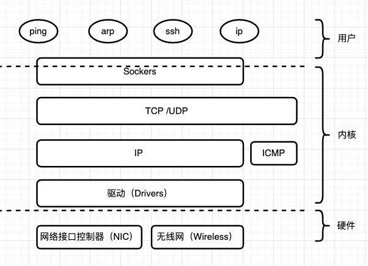

# 网络概述

在现代环境中，网络起着核心作用，网络的重要性毋庸置疑。我们在进行安装应用程序到浏览网页、发送邮件和使用社交媒体等日常任务，再到使用远程服务器等专业任务（将本地网络连接云到提供商的数据中心运行的服务器）都需要网络。

网络的组成很复杂，包含很多组件以及多种层次结构，这意味着，当网络出现问题时，很难确定问题是与硬件有关还是与软件相关。但网络又很简单，**学习网络就是学习各种网络协议**，在 Linux 的其他组件中，你需要查阅源代码或者希望了解接口和协议背后的设计思路，但在网络内，几乎每一个协议和接口都是基于公开的规范。互联网工程任务组（IETF）通过[datatracker.ietf.org](https://datatracker.ietf.org/)免费提供所有规范（通常称为RFC，即Request for Comments的缩写）。

在你开始操作之前，养成简单阅读这些 RFC 的习惯对你非常有帮助。这些 RFC 是由专业人员为相关从业者编写的，不仅有良好的实践记录还有如何实现的思路。不要害怕阅读它们，这会让你知道它为什么这样做，以及怎么做。

本章中我们将介绍的许多内容都提供高级用户界面，这会让你感觉到使用远程机器跟使用本地机器没有差别。但我们不应该忘记，所有这些都是通过网线和电磁波传输的字节。在排除故障或测试时，请记住这一点。下图展示了网络是如何在 Linux 中工作的。图中有一些网络硬件，如以太网或无线网卡，然后是一些内核级组件，如TCP/IP堆栈，最后是用户空间中的一系列工具，用于配置、查询和使用网络。

