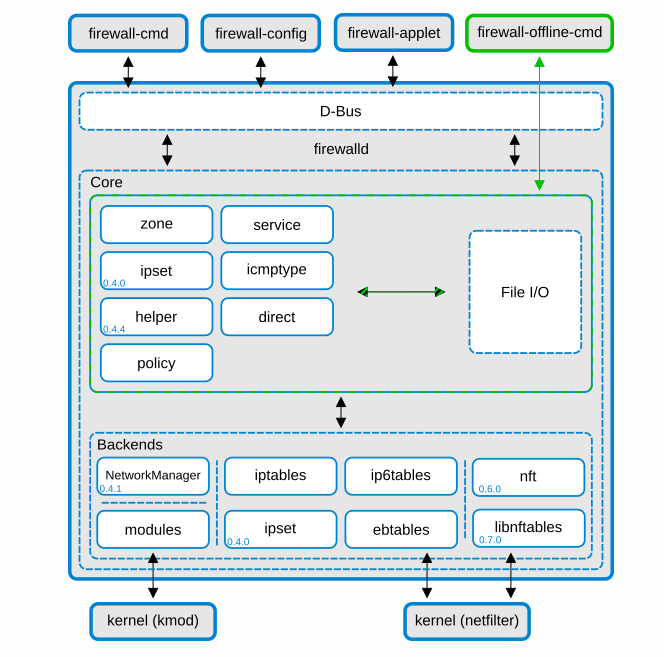

# firewalld

## 1 为什么需要防火墙

那一年，防火墙只是一堵墙。是一种防止火灾蔓延的安全设施，它建在房屋和外部空间之间。

那一年，“我们为什么需要防火墙？”这个问题还属于建筑工人和建筑师。

计算机网络中的防火墙的作用和建筑的防火墙类似。它能确保一侧发生的灾难不会影响另一侧的计算机。如果你关注网络安全，你会经常看到这些网络威胁：病毒、蠕虫、拒绝服务（DDos）攻击、黑客攻击。为了抵御这些威胁，我们需要在网络世界也建造一道防御工事，这就是计算机网络世界的防火墙。

读到这，你可能会有另外一个问题，如果防火墙隔离了外部的连接，那我是怎么上网的呢？答案很简单，在建筑上的防火墙会留一个开口，也就是防火门，以供房屋使用者在需要的时候使用，同样计算机防火墙也提供了这个功能，你可以将你信任的流量放通。比如我们可以在防火墙上设置规则，来允许访问网站，并且记录所有对外部网站的访问。

## 2 Linux 上的防火墙

- firewalld 使用 firewalld 工具来处理简单的防火墙使用情况。该工具很容易使用，自带典型用例。
- nftables。使用 nftables 工具来设置复杂的、对性能有要求的防火墙，例如为整个网络设置。
- iptables。Red Hat Enterprise Linux 上的 iptables 工具使用 nf_tables 内核 API 而不是 legacy 后端。nf_tables API 提供了向后的兼容性，因此，使用 iptables 命令的脚本仍然可以在 Red Hat Enterprise Linux 上运行。对于新的防火墙脚本，Red Hat 建议使用 nftables。

为了避免不同的防火墙服务相互影响，在RHEL主机上只运行其中一个，并禁用其他服务。

## 3 firewalld 架构

最初，大部分的 Linux 使用的防火墙工具是 iptables，随着 2011 年 Red Hat Enterprise Linux 7.0 (RHEL) 的推出，iptables 被 firewalld 被取代。

- firewalld 使用区域（zones）和服务（service）的概念，以简化流量管理。区域是预定义的规则集。网络接口和来源可以被分配到一个区域。允许的流量取决于你的计算机所连接的网络和该网络被分配的安全级别。防火墙服务是预定义的规则，包括所有必要的设置，以允许特定服务的传入流量，它们适用于一个区域内。
- 动态管理规则集，允许更新规则而不破坏现有会话和连接（不用重启服务）。

firewalld 是 Linux 操作系统中的防火墙管理工具。基于 netfilter（为Linux 内核提供数据包过滤的软件）来提供防火墙功能。




firewalld 有两层设计：

- 核心层：核心层负责处理配置和后端，如 iptables、ip6tables、ebtables、ipset 和模块加载器(kmod)。
- D-Bus层:消息总线系统的一种，是应用程序相互通信的一种方式。D-Bus 接口是更改和创建防火墙配置的主要方式。所有 firewalld 提供的在线工具都使用该接口，例如 `firewall-cmd`、`firewall-config` 和 `firewall-applet`。

firewall-offline-cmd 不与 firewalld 对话，而是直接使用带有 IO 处理程序的 firewalld 核心更改和创建 firewalld 配置文件。firewall-offline-cmd 可以在 firewalld 运行时使用，但不建议这样做，因为它只能在大约 5 秒后更改防火墙中可见的永久配置。

firewalld 不依赖 NetworkManager，但推荐使用。如果不使用 NetworkManager，有一些限制：firewalld 不会收到有关网络设备重命名的通知。

### 3.1 区域（zones）

firewalld 根据用户对网络内的接口和流量的信任程度，把网络分成不同的区域。一个连接只能是一个区的一部分，但一个区可以用于许多网络连接。

NetworkManager 会通知 Firewalld 一个接口的区域。你可以通过以下方式给接口分配区域。

- NetworkManager
- firewall-config
- firewall-cmd
- RHEL web 控制台 

后三者只能编辑相应的 NetworkManager 配置文件。如果你使用 web 控制台、firewall-cmd 或 firewall-config 改变接口的区域，该请求会被转发给 NetworkManager，而不是由 firewalld 处理。

预定义的区域存储在`/usr/lib/firewalld/zones/`目录中，可以立即应用到任何可用的网络接口。这些文件只有在被修改后才会被复制到`/etc/firewalld/zones/`目录中。预定义区域的默认设置如下(从不信任到信任进行排序):

- **drop**
  任何传入的网络数据包被丢弃，没有任何通知。只有传出的网络连接是可能的。
- **block**
  任何传入的网络连接都会被拒绝，对于IPv4来说是icmp-host-prohibited消息，对于IPv6来说是icmp6-adm-prohibited。只有从系统内部发起的网络连接是可能的。
- **public**
  用于公共区域，在那里你不信任网络上的其他计算机。只接受选定的传入连接。
- **external**
  用于启用了伪装功能的外部网络，特别是用于路由器。你不相信网络上的其他计算机不会伤害你的计算机。只接受选定的传入连接。
- **dmz**
  用于非军事区的计算机，这些计算机可以公开访问，但对你的内部网络访问有限。只接受选定的传入连接。
- **work**
  在工作场所使用，你主要信任网络上的其他计算机。只接受选定的传入连接。
- **home**
  在家里使用，当你主要信任网络上的其他计算机时。只接受选定的传入连接。
- **internal**
  在内部网络中使用，当你基本上信任网络上的其他计算机时。只接受选定的传入连接。
- **trusted**
  接受所有网络连接。

这些区中的一个被设置为默认区。当接口连接被添加到 NetworkManager 时，它们被分配到默认区域。在安装时，firewalld 中的默认区域被设置为pubilc。默认区域可以修改。

网络区域的命名很直白，可以让用户迅速做出合理的决定。为了避免出现安全问题，请审查默认的区域配置，并根据你的需要和风险评估，禁用不必要的服务。

其他资源：[firewalld.zone(5)](https://manpages.debian.org/testing/firewalld/firewalld.zone.5.en.html) 手册页


### 3.2 预定义服务（service）

服务是本地端口、协议、源端口和目的地的列表，以及在启用服务的情况下自动加载的防火墙辅助模块的列表。使用服务可以节省用户的时间，因为他们可以在一个步骤中实现多个任务，如开放端口、定义协议、启用数据包转发等，而不是一个接一个地设置所有东西。

服务配置选项和通用文件信息在 [firewalld.service(5) man page](https://manpages.debian.org/testing/firewalld/firewalld.service.5.en.html) 中描述。服务是通过单独的 XML 配置文件来指定的，其命名格式如下：service-name.xml。在 firewalld 中，协议名称比服务或应用程序名称更受欢迎。

可以使用图形化的Firewall-config工具、`firewall-cmd`和 `firewall-offline-cmd`来添加和删除服务。

另外，你也可以编辑/etc/firewalld/services/目录下的XML文件。如果一个服务没有被用户添加或改变，那么在/etc/firewalld/services/中就找不到相应的XML文件。如果你想添加或改变一个服务，/usr/lib/firewalld/services/目录下的文件可以作为模板使用。

> 简单来说，区域定义访问的级别，例如默认的区域是`public`,只允许通过指定网络流量。预定义服务，制定相应的规则，例如默认的ssh 规则`/usr/lib/firewalld/services/ssh.xml`，定义了网络传输协议为 TCP 以及端口 22，修改了服务文件，或者新添加服务文件，需要重载服务。

## 4 操作

### 4.1 启动以及关闭

```shell
# 取消注销
systemctl unmask firewalld
# 启动
systemctl start firewalld
# 开机自启
systemctl enable firewalld

# 停止
systemctl stop firewalld
# 关闭开机自启
systemctl disable firewalld
# 注销服务
systemctl mask firewalld
```

### 4.2 验证配置

```shell
firewall-cmd --check-config
#success
```

### 4.3 查看状态

```shell
firewall-cmd  --state
#running

#或者

systemctl status firewalld.service 
  ● firewalld.service - firewalld - dynamic firewall daemon
     Loaded: loaded (/usr/lib/systemd/system/firewalld.service; disabled; vendor preset: enabled)
     Active: active (running) since Fri 2022-04-29 02:09:51 CST; 1min 45s ago
       Docs: man:firewalld(1)
   Main PID: 18841 (firewalld)
```

列出默认区域的所有相关信息

```shell
firewall-cmd --list-all
  public (active)
    target: default
    icmp-block-inversion: no
    interfaces: ens192
    sources: 
    services: dhcpv6-client ssh
    ports: 
    protocols: 
    masquerade: no
    forward-ports: 
    source-ports: 
    icmp-blocks: 
    rich rules: 	
```

指定要显示其设置的区域

```shell
firewall-cmd --list-all --zone=home
  home
    target: default
    icmp-block-inversion: no
    interfaces: 
    sources: 
    services: dhcpv6-client mdns samba-client ssh
    ports: 
    protocols: 
    masquerade: no
    forward-ports: 
    source-ports: 
    icmp-blocks: 
    rich rules: 
```

当前区域中允许哪些服务

```shell
firewall-cmd --list-services
  dhcpv6-client ssh
```

 

## 参考

- [redhat 使用和配置 firewalld](https://access.redhat.com/documentation/en-us/red_hat_enterprise_linux/8/html/configuring_and_managing_networking/index)

- [firewalld github repo](https://github.com/firewalld/firewalld)

- [netfilter.org](https://www.netfilter.org/)

- [kmod 源码](https://elixir.bootlin.com/linux/v5.5-rc2/source/kernel/kmod.c)

