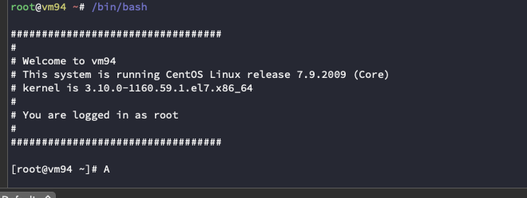

# SSH 定制提示语

## 设置 MOTD 横幅

你可以让MOTD（message of the day）显示可能是机器特有的信息。一种方法是创建一个脚本，当用户登录到系统时运行。
首先，在 /etc/profile.d 下，创建一个脚本 `touch motd.sh`
使其可执行，` chmod a+x motd.sh`（确保它的扩展名是.sh）

```shell
#!/bin/bash 
#
echo -e "
##################################
#
# Welcome to `hostname`
# This system is running `cat /etc/redhat-release`
# kernel is `uname -r`
#
# You are logged in as `whoami`
#
##################################
"
```


接下来，编辑 /etc/ssh/sshd_config 如下:

```shell
PrintMotd no
```

这将禁用 motd

现在重新启动 sshd 服务

```shell
systemctl restart sshd.service
```

效果展示：



## 设置警告横幅

这条信息是在登录时，提示的警告信息。

设置 Banner 路径 `vim /etc/ssh/sshd_config`,修改以下选项

```shell
Banner /etc/mybanner
```

创建 banner 信息，执行`vim /etc/mybanner`,加入一下信息

```shell
警告：你正在登录"蒙古海军指挥总部"，非战斗人员，请断开连接
```

重启 SSH

```shell
systemctl restart sshd.service
```

