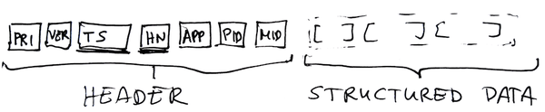
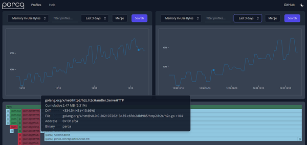

# 系统观测

你需要了解整个系统的运行情况，从内核到面向用户的部分。通常，你可以通过工具来获得这种可见性。

本章是关于收集和使用Linux及其应用程序产生的不同信号，以便你能做出明智的决定。例如：

- 弄清一个进程消耗了多少内存
- 了解你的磁盘空间多长时间会用完
- 为了安全起见，在自定义事件上得到一个警报

关于可观察性的最好的视觉概述可能来自于性能大师Brendan Gregg。下图取自他的[Linux Performance](https://www.brendangregg.com/linuxperf.html)（在CC BY-SA 4.0许可下分享），让你感受到大量的活动部件和可用的工具。


## 1 可观察性策略

在可观察性方面，一个广泛确立的策略是[OODA循环](https://en.wikipedia.org/wiki/OODA_loop)（观察-定向-决定-行动）。它提供了一种结构化的方法来测试基于观察到的数据的假设，并据此采取行动，也就是说，从信号中获得可操作的见解。

例如，我们假设一个应用程序很慢。让我们进一步假设有多种可能的原因（内存不足，CPU周期太少，网络I/O不足，等等）。首先，你希望能够测量每个资源的消耗。然后，你将单独改变每个资源分配（保持其他资源不变），并测量结果。

在你为应用程序提供了更多的内存之后，性能是否有所提高？如果是的话，你可能已经找到了原因。如果不是，你就继续用不同的资源，一直测量消耗，并试图与观察到的对情况的影响联系起来。

### 1.1 术语

可观测性空间中有一系列术语，并非所有术语都有正式定义。此外，如果你看的是一台机器，或者是一个网络化的（分布式的）设置，其含义可能会略有不同。

- 可观测性

  通过测量外部信息来评估系统（如Linux）的内部状态，通常目标是对其采取行动。例如，如果你注意到你的系统反应迟缓，并测量有多少主内存可用，你可能会发现某个特定的应用占用了所有内存，你可能会决定终止它以纠正这种情况。

- 信号类型

  表示和发出系统状态信息的不同方式，可以是通过符号方式（有效载荷是文本，例如日志），也可以是数值（如度量）或其组合。另见“信号类型”。

- 来源

  产生可能不同类型的信号。源代码可以是Linux操作系统或应用程序。

- 目的地

  用于消费、存储和进一步处理信号。我们将公开用户界面（GUI、TUI或CLI）的目的地称为前端。例如，日志查看器或绘制时间序列的仪表板是前端，而S3 bucket则不是（但仍然可以作为日志的目的地）。

- 遥测
  从信号源提取信号并将信号传输（或：路由、运输）到目的地的过程，通常使用代理收集和/或预处理信号（例如，过滤或下采样）。

### 1.2 信号类型

信号是我们传达系统状态以便进一步处理或解释的方式。总的来说，我们区分了文本有效载荷（最适合人类搜索和解释）和数字有效载荷（对机器和处理后的人类都有好处）。与本章讨论相关的三种基本和常见信号类型是：日志、度量和跟踪。

#### 日志

日志是每个系统在某种程度上产生的基本信号类型。日志是具有文本负载的离散事件，用于人类消费。通常，这些事件都有时间戳。理想情况下，日志的结构应确保日志消息的每个部分都有明确的含义。这一意义可能通过一个正式的模式来表达，以便可以自动执行验证。

有趣的是，虽然每个日志都有一些结构（即使它没有很好地定义，而且解析很困难，可能是因为分隔符或边缘情况），但您经常会听到术语“结构化日志”。当人们这么说时，他们实际上是指日志是使用JSON构建的。

尽管自动化日志内容很困难（考虑到其文本性质），但日志对人类仍然非常有用，因此它们可能会在一段时间内保持主导信号类型。我们将在“日志记录”中深入探讨如何处理日志。日志是最重要的信号类型（出于我们的考虑），这就是为什么我们将在本章中花费大部分时间来处理它们。

#### 指标

指标是（通常定期）采样的数字数据点，形成一个时间序列。单个数据点可以具有维度或标识元数据形式的附加上下文。通常，您不会直接使用原始指标；相反，您使用某种聚合或图形表示，或者在满足特定条件时收到通知。指标对于操作任务和故障排除都很有用，可以回答一些问题，比如一个应用程序完成了多少事务，或者某个操作花费了多长时间（在过去的X分钟内）。

这里推荐一个工具 [pcp](https://github.com/performancecopilot/pcp)，用于查看
我们区分不同类型的指标：

- 计数器：计数器的值只能上升（除了将计数器重置为零）。计数器度量的一个示例是服务处理的请求总数或一段时间内通过接口发送的字节数。
- 仪表：仪表值可以上升或下降。例如，您可以测量当前可用的总体主内存或正在运行的进程数。
- 直方图：建立价值分布的复杂方法。通过使用Bucket，柱状图可以评估数据的总体结构。它们还使您能够做出灵活的声明（例如，50%或90%的值属于某个范围）。

在“监控”中，我们将介绍一系列可用于简单用例的工具，在“普罗米修斯和格拉法纳”中，您将看到度量的高级示例设置。

#### 追踪

对于给定的事件或进程的动态调用，例如，对于一个进程的动态调用，使用什么信息。跟踪不仅经常用于调试，还用于性能评估。我们将在“跟踪和分析”中了解这个高级主题。

## 2 登陆

如前所述，日志是（一组）具有文本负载的离散事件，针对人类消费进行了优化。让我们对这句话进行分解，以便更好地理解它：

- 离散事件
  在代码库的上下文中考虑一个离散事件。您希望使用（原子）日志项共享有关代码中发生了什么的信息。例如，您发出一条日志行，表明数据库连接已成功建立。另一个日志项可能是标记错误，因为缺少文件。保持日志消息的范围小且具体，这样使用消息的人就更容易在代码中找到相应的位置。

- 文本有效载荷
  日志消息的有效负载具有文本性质。默认的消费者是人类。换句话说：无论您是在命令行上使用日志查看器，还是在使用具有可视化UI的奇特日志处理系统，人类都会读取和解释日志消息的内容，并根据其决定操作。

- 从结构角度来看，总体而言，一条日志包括：
  - 日志项或日志消息或日志行的集合，用于捕获离散事件的信息。
  - 元数据或上下文，可以基于每条消息以及全局范围（例如，整个日志文件）呈现。
  - 解释单个日志消息的格式，定义其部分和含义。例如面向行、空格分隔的消息或JSON模式。

一些常见的日志格式示例。有许多（更具体、范围更窄的）格式和框架，例如数据库或编程语言。

通用日志格式

- [通用事件格式]((https://kc.mcafee.com/resources/sites/MCAFEE/content/live/CORP_KNOWLEDGEBASE/78000/KB78712/en_US/CEF_White_Paper_20100722.pdf))  由ArcSight开发，用于设备、安全用例
- [通用日志格式](https://httpd.apache.org/docs/trunk/logs.html#common) 有关web服务器，请参见扩展日志格式
- [Graylog扩展日志格式](https://www.graylog.org/features/gelf)  由Graylog开发，改进了Syslog
- 系统日志(Syslog) 有关操作系统、应用程序和设备，请参阅“系统日志”
- [嵌入式公制格式](https://docs.aws.amazon.com/AmazonCloudWatch/latest/monitoring/CloudWatch_Embedded_Metric_Format_Specification.html)由亚马逊开发（包括日志和指标）

作为一种良好的实践，您希望避免日志开销（实现快速查找和较小的占用空间，即不占用太多磁盘空间）。在这种情况下，使用日志旋转，例如通过[logrotate](https://linux.die.net/man/8/logrotate)。一个名为“数据温度(data temperature)”的高级概念可能也很有用，它可以将较旧的日志文件移动到更便宜、更慢的存储器（连接磁盘、S3存储桶、冰川）。

>警告
>
>有一种情况下，在记录信息时需要小心，尤其是在生产环境中。每当你决定在应用程序中发出日志行时，问问自己是否有可能泄露敏感信息。这些敏感信息可能是密码、API密钥，甚至只是用户识别信息（电子邮件、帐户ID）。问题是日志通常以持久形式存储（比如，在本地磁盘上，甚至在S3存储桶中）。这意味着，即使在进程终止后很长时间，也有人可以访问敏感信息，并利用它进行攻击。

为了表明日志项的重要性或预期目标使用者，日志通常会定义级别（例如，开发调试、正常状态信息或可能需要人工干预的意外情况错误）。
到目前为止，这是一些理论，是时候让我们动手了：让我们从简单的事情开始，作为一个概述，让我们看看Linux的中心日志目录（为了可读性，我缩短了输出）：

```shell
$ ls -al /var/log
drwxrwxr-x   8 root      syslog               4096 Jul 13 06:16 .
drwxr-xr-x  13 root      root                 4096 Jun  3 07:52 ..
drwxr-xr-x   2 root      root                 4096 Jul 12 11:38 apt/ 
-rw-r-----   1 syslog    adm                  7319 Jul 13 07:17 auth.log 
-rw-rw----   1 root      utmp                 1536 Sep 21 14:07 btmp 
drwxr-xr-x   2 root      root                 4096 Sep 26 08:35 cups/ 
-rw-r--r--   1 root      root                28896 Sep 21 16:59 dpkg.log 
-rw-r-----   1 root      adm                 51166 Jul 13 06:16 dmesg 
drwxrwxr-x   2 root      root                 4096 Jan 24  2021 installer/ 
drwxr-sr-x+  3 root      systemd-journal      4096 Jan 24  2021 journal/ 
-rw-r-----   1 syslog    adm                  4437 Sep 26 13:30 kern.log 
-rw-rw-r--   1 root      utmp               292584 Sep 21 15:01 lastlog 
drwxr-xr-x   2 ntp       ntp                  4096 Aug 18  2020 ntpstats/ 
-rw-r-----   1 syslog    adm                549081 Jul 13 07:57 syslog 

# apt/        apt软件包管理器的日志
# auth.log    所有登录尝试（成功和失败）和认证过程的日志
# btmp        失败的登录尝试
# cups/       打印的相关日志
# dpkg.log    dpkg软件包管理器的日志
# dmesg       设备驱动程序的日志，使用dmesg来检查
# installer/  系统安装日志（当Linux发行版最初被安装时）
# journal/    journalctl的位置
# kern.log    内核日志
# lastlog     所有用户的最后一次登录，使用lastlog来检查
# ntpstats/   NTP相关的日志
# syslog      syslogd的位置

```

一种常见的实时消耗日志的模式（即，当它发生时）被调用为“跟踪日志”，也就是说，当添加新的日志行（编辑以适应）时，您会看到日志的结尾：

```shell
$ tail -f /var/log/syslog 
Sep 26 15:06:41 starlite nm-applet[31555]: ... 'GTK_IS_WIDGET (widget)' failed
Sep 26 15:06:41 starlite nm-dispatcher: ... new request (3 scripts)
Sep 26 15:06:41 starlite systemd[1]: Starting PackageKit Daemon...
Sep 26 15:06:41 starlite nm-dispatcher: ... start running ordered scripts...
Sep 26 15:06:41 starlite systemd[1]: Started Network Manager Script Dispatcher Service.
Sep 26 15:06:42 starlite PackageKit: daemon start 
^C
# 使用-f选项跟踪syslogd进程的日志。
# 关于示例日志行，请参阅“Syslog”了解格式。
```

>提示
>
>如果希望查看进程的日志输出，同时希望将其存储在文件中，则可以使用tee命令。例如：`$someprocess | tee-a some.log`。

现在你会在终端中看到某个进程的输出，同时输出会存储在某个进程中。日志请注意，我们正在使用-a选项附加到日志文件，否则它将被截断。
现在让我们来看两个最常用的Linux日志系统。

### 1.1 系统日志

Syslog是一系列源的日志标准，从内核到守护进程再到用户空间。它起源于网络环境，现在的Syslog协议包含RFC 5424中定义的文本格式，以及部署场景和安全考虑。在图8-2中，您可以看到Syslog的高级格式，但请注意，有许多可选字段很少使用。

图8-2 系统日志格式符合RFC5424


RFC 5424中定义的系统日志格式有以下字段（TS和HN是最常用的标题字段）：

头部

- PRI是消息设施/严重性。
- VER是系统日志协议号（通常省略，因为它只能是1）。
- TS包含使用ISO 8601格式生成消息的时间。
- HN来识别发送消息的机器。
- APP用于识别发送消息的应用程序（或设备）。
- PID来标识发送消息的进程。
- MID是可选的消息ID。

结构化数据：基于结构化（键/值）的列表中的有效负载，其中每个元素由[]绑定。

通常会使用syslogd二进制文件来管理日志。随着时间的推移，其他选项变得可用，你应该知道：

- 自1990年底以来，[syslog-ng](https://github.com/syslog-ng/syslog-ng)是一个增强的日志守护程序，可以作为syslogd的替代品使用，此外还支持TLS、基于内容的过滤，以及登录到PostgreSQL和MongoDB等数据库。
- [Rsyslog](https://www.rsyslog.com/)，自2004年以来，它扩展了Syslog协议，也可以与systemd一起使用。

尽管年代久远，Syslog系列协议和工具仍然存在并广泛可用。然而，随着systemd成为每个主要Linux发行版中使用的init系统的实际标准，有一种新的方式来记录日志：满足systemd日志。

### 1.2 journalctl

在“systemd”中，我们简要介绍了systemd生态系统中负责日志管理的一个组件：journalctl。与Syslog和目前使用的其他系统不同，journalctl使用二进制格式来存储日志项。这允许更快的访问和更好的存储空间。

二进制存储格式在引入时确实引起了一些批评，因为人们无法继续使用熟悉的tail、cat和grep命令来查看和搜索日志。话虽如此，尽管在使用journalctl时必须学习一种与日志交互的新方法，但学习曲线并不太糟糕。

让我们看看一些常见的任务。如果您在没有参数的情况下启动journalctl，它将显示为所有日志的交互式寻呼机（您可以使用箭头键或空格键在其中滚动并使用q退出）。
要限制时间范围，例如可以使用：

```shell
journalctl --since "3 hours ago" 
journalctl --since "2021-09-26 15:30:00" --until "2021-09-26 18:30:00" 

# 将时间范围限制为过去三小时内发生的事情。
# 另一种限制时间范围的方法是明确开始和停止时间。
```

您可以将输出限制为特定的systemd单元，例如（假设有一个名为abc.service的服务）：

```shell
journalctl -u abc.service
```

使用tail-f 时，您可以获得与跟踪日志相同的体验：

```shell
journalctl -f
```

> 提示
> journalctl工具有一种强大的方式来格式化日志项的输出。使用--output（简称-o）参数，可以针对特定用例优化输出。
> 重要的值：
>
> - cat…缩写，没有时间戳或来源。
> - short…是默认值，模拟系统日志输出。
> - json…每行一个json格式的条目（用于自动化）。
>   让我们把以上所有信息结合到一个具体的例子中。假设您想重新启动Linux发行版的一个安全组件，由systemd:[AppAmor](https://www.apparmor.net)管理。也就是说，在一个终端中，我们使用systemctl restart apparmor重新启动服务，在另一个终端中，我们执行以下命令（输出编辑；实际输出是每行一个日志项）：

```shell
$ journalctl -f -u apparmor.service 
-- Logs begin at Sun 2021-01-24 14:36:30 GMT. --
Sep 26 17:10:02 starlite apparmor[13883]: All profile caches have been cleared,
                                          but no profiles have been unloaded.
Sep 26 17:10:02 starlite apparmor[13883]: Unloading profiles will leave already
                                          running processes permanently
...
Sep 26 17:10:02 starlite systemd[1]: Stopped AppArmor initialization.
Sep 26 17:10:02 starlite systemd[1]: Starting AppArmor initialization... 
Sep 26 17:10:02 starlite apparmor[13904]:  * Starting AppArmor profiles
Sep 26 17:10:03 starlite apparmor[13904]: Skipping profile in
                                     /etc/apparmor.d/disable: usr.sbin.rsyslogd
Sep 26 17:10:09 starlite apparmor[13904]:    ...done.
Sep 26 17:10:09 starlite systemd[1]: Started AppArmor initialization.
```

这样一来，我们就到了日志部分的结尾，并进入到带有指标的数值和更广泛的监控主题。

## 3 监控

监控是出于各种原因捕获系统和应用程序度量。例如，您可能感兴趣的是某个过程需要多长时间、消耗多少资源（性能监控），或者您可能正在对不健康的系统进行故障排除。在监控环境中，您最常进行的两种活动是：

- 跟踪一个或多个指标（随时间推移）
- 在某种情况下发出警报

让我们看一个简单的示例，使用[uptime](https://www.man7.org/linux/man-pages/man1/uptime.1.html)命令，它显示了一些基本指标，例如使用正常运行时间命令运行系统的时间、内存使用情况等：

```shell
$ uptime 
08:48:29 up 21 days, 20:59,  1 user,  load average: 0.76, 0.20, 0.09 
```

使用uptime命令显示一些基本的系统指标。以逗号分隔，输出告诉我们系统运行的时间、登录的用户数，然后（在负载平均部分）显示三个仪表：1分钟、5分钟和15分钟的平均值。这些平均值是运行队列中或等待磁盘I/O的作业数，标准化后表示CPU有多忙。例如，在这里，过去5分钟的平均负载为0.2（单独来看，这并不能告诉你多少，因此你必须将其与其他值进行比较，并跟踪时间）。

接下来，让我们使用free命令来监控一些基本的内存利用率。

```shell
$ free -h 
              total    used   free  shared  buff/cache   available
Mem:           7.6G    1.3G   355M    395M        6.0G        5.6G 
Swap:          975M    1.2M   974M  

# -h 使用人性化的输出显示内存使用情况。
# 内存统计信息：总/已用/空闲/共享内存、用于缓存的缓冲区中使用的内存（如果不需要组合值，请使用-w）以及可用内存。
# 交换空间的总/已用/可用量，即移出到交换磁盘空间的物理内存。
```

查看内存使用情况的一种更复杂的方法是使用vmstat（virtualmemory stats的缩写）命令。例如，以自我更新的方式使用vmstat：

```shell
$ vmstat 1 
procs -----------memory--------- ---swap-- ----io---- -system- -----cpu-----
r  b  swpd   free   buff  cache   si   so   bi    bo   in   cs us sy id wa st 
4  0  1184 482116 682388 5447048   0    0   12   105   28  191  6  3 91  0  0
0  0  1184 483444 682388 5446600   0    0   0      0  369  522  1  0 99  0  0
0  0  1184 483696 682392 5446600   0    0   0    104  278  374  1  1 99  0  0
^C

# 显示内存统计，参数1意味着每秒打印一行新的摘要。
# 一些重要的列标题：r表示正在运行或等待CPU的进程数（应小于或等于您拥有的CPU数），空闲的是可用的主内存，单位为KB，单位为每秒中断数和每秒上下文切换的cs数，us 到 st分别表示用户空间、内核、空闲等的CPU总时间百分比。

```

要查看某个操作需要多长时间，可以使用time命令：

```shell
$ time (ls -R /etc 2&> /dev/null) 

real    0m0.022s 
user    0m0.012s 
sys     0m0.007s 
```

测量递归列出所有/etc子目录需要多长时间（我们丢弃所有输出，包括带有2&>/dev/null的错误）。
所用的总时间（除了性能之外，没有真正的用处）。
ls本身在CPU（用户空间）上花费的时间。
ls等待Linux做某事的时间（内核空间）。

在前面的例子中，如果你对一个操作花了多长时间感兴趣，取user和sys的总和是一个很好的近似值，两者的比例可以让你很好地了解它的大部分执行时间。

现在我们关注一些更具体的话题：网络接口和块设备。

### 3.1 磁盘 I/O 和 网络接口

用[iostat](https://linux.die.net/man/1/iostat)你可以监控I/O设备（输出编辑）。

```shell
$ iostat -z --human 
Linux 5.4.0-81-generic (starlite)   09/26/21     _x86_64_      (4 CPU)

avg-cpu:  %user   %nice %system %iowait  %steal   %idle
           5.8%    0.0%    2.7%    0.1%    0.0%   91.4%

Device             tps    kB_read/s    kB_wrtn/s    kB_read    kB_wrtn
loop0             0.00         0.0k         0.0k     343.0k       0.0k
loop1             0.00         0.0k         0.0k       2.8M       0.0k
...
sda               0.38         1.4k        12.4k       2.5G      22.5G 
dm-0              0.72         1.3k        12.5k       2.4G      22.7G
...
loop12            0.00         0.0k         0.0k       1.5M       0.0k

# 使用iostat显示I/O设备指标。有了-z，我们告诉它只显示有一些活动的设备，而--human使输出更好（单位是人类可读的形式）
# 示例行：tps是该设备每秒的传输（I/O请求）数，读取是数据量，wrtn是写入数据。
```

下一步：与ss命令的网络接口，该命令可以转储套接字统计信息（另请参见“Sockets”）。以下命令列出了TCP和UDP套接字以及进程ID（根据需要编辑输出）：

```shell
$ ss -atup 
Netid State   Recv-Q  Send-Q  Local Address:Port       Peer Address:Port
udp   UNCONN  0       0             0.0.0.0:60360           0.0.0.0:*
...
udp   UNCONN  0       0             0.0.0.0:ipp             0.0.0.0:*
udp   UNCONN  0       0             0.0.0.0:789             0.0.0.0:*
udp   UNCONN  0       0         224.0.0.251:mdns            0.0.0.0:*
udp   UNCONN  0       0             0.0.0.0:mdns            0.0.0.0:*
udp   ESTAB   0       0      192.168.178.40:51008    74.125.193.113:443
...
tcp   LISTEN  0       128           0.0.0.0:sunrpc          0.0.0.0:*
tcp   LISTEN  0       128     127.0.0.53%lo:domain          0.0.0.0:*
tcp   LISTEN  0       5           127.0.0.1:ipp             0.0.0.0:*
tcp   LISTEN  0       4096        127.0.0.1:45313           0.0.0.0:*
tcp   ESTAB   0       0      192.168.178.40:57628    74.125.193.188:5228 
tcp   LISTEN  0       128              [::]:sunrpc             [::]:*
tcp   LISTEN  0       5               [::1]:ipp                [::]:*

# 使用ss时有以下选项：用-a我们选择所有（即监听和非监听套接字），-t和-u分别选择TCP和UDP，而-p显示使用套接字的进程。

# 一个使用中的套接字例子：这是一个建立在本地IPv4地址192.168.178.40到远程74.125.193.188之间的TCP连接，似乎是空闲的：接收（Recv-Q）和发送（Send-Q）的数据队列都报告为零。
```

> 提示
> 收集和显示接口统计信息的一个过时的方法是使用netstat。例如，如果你想持续更新TCP和UDP的信息，包括进程ID，并使用IP地址而不是FQDN，你可以使用netstat -ctulpn。

lsof是 "list open files "的缩写，是一个有许多用途的通用工具。例如，在网络连接的情况下。

```shell
# 列出有特权的TCP端口（需要root权限）
$ sudo lsof -i TCP:1-1024 
COMMAND     PID            USER   FD   TYPE DEVICE SIZE/OFF NODE NAME
systemd-r   688 systemd-resolve   13u  IPv4  22302    0t0  TCP localhost:domain (LISTEN)
cupsd     16201            root    7u  IPv4 740092    0t0  TCP localhost:ipp (LISTEN)
rpcbind   26901            root    8u  IPv4 615970    0t0  TCP *:sunrpc (LISTEN)
rpcbind   26901            root   11u  IPv6 615973    0t0  TCP *:sunrpc (LISTEN)
```

lsof的另一个使用例子是以进程为中心的视图：如果你知道一个进程的PID（这里：Chrome），你可以用lsof来跟踪文件描述符、I/O等。(注意，输出已被编辑以适应）。

```shell
$ lsof -p 5299
COMMAND  PID USER   FD  TYPE  DEVICE  SIZE/OFF     NODE NAME
chrome  5299  mh9  cwd   DIR   253,0      4096  6291458 /home/mh9
chrome  5299  mh9  rtd   DIR   253,0      4096        2 /
chrome  5299  mh9  txt   REG   253,0 179093936  3673554 /opt/google/chrome/chrome
...
```

还有很多用于（性能）监控的工具，比如[sar](https://linux.die.net/man/1/sar)（涵盖一系列的计数器，对脚本来说很好）和[perf](https://perf.wiki.kernel.org/index.php/Main_Page)，其中一些我们将在 "高级可观察性 "中讨论。

在了解了单个工具之后，让我们来看看允许你交互式地监控Linux的集成工具。

### 3.2 集成的性能监控器

使用我们在上一节中讨论的工具，比如lsof或vmstat是一个很好的起点，在脚本中也很有用。对于更方便的监控，你可能更喜欢集成的解决方案。这些通常带有文本用户界面（TUI），有时是彩色的，并提供。

- 支持多种资源类型（CPU、RAM、I/O）。
- 交互式分类和过滤（按进程、用户、资源）。
- 实时更新和深入细节，如进程组甚至是 cgroups和命名空间。

例如，[top](https://linux.die.net/man/1/top) 命令

```shell
#  系统概要（与正常运行时间输出比较）
top - 12:52:54 up 22 days,  1:04,  1 user,  load average: 0.23, 0.26, 0.23 
#  任务统计
Tasks: 263 total,   1 running, 205 sleeping,   0 stopped,   0 zombie 
# CPU使用统计（用户、内核等，类似于vmstat输出）
%Cpu(s):  0.2 us,  0.4 sy,  0.0 ni, 99.3 id,  0.0 wa,  0.0 hi,  0.0 si,  0.0 st% 
KiB Mem :  7975928 total,   363608 free,  1360348 used,  6251972 buff/cache
KiB Swap:   999420 total,   998236 free,     1184 used.  5914992 avail Mem

# 动态进程列表，包括每个进程的细节，与ps aux的输出相类似。
PID USER      PR  NI    VIRT    RES    SHR S  %CPU %MEM     TIME+ COMMAND 
  1 root      20   0  225776   9580   6712 S   0.0  0.1   0:25.84 systemd
400 root      19  -1  128460  25048  23384 S   0.0  0.3   0:08.90  `- systemd-journal
432 root      20   0   47752   5644   3196 S   0.0  0.1   0:10.72  `- systemd-udevd
433 root      20   0  105908   1928   1700 S   0.0  0.0   0:00.05  `- lvmetad
688 systemd+  20   0   70704   6148   5372 S   0.0  0.1   0:05.08  `- systemd-resolve
775 root      20   0   36552   4240   3880 S   0.0  0.1   0:00.16  `- bluetoothd
789 syslog    20   0  263040   4384   3616 S   0.0  0.1   0:01.98  `- rsyslogd

```

> 提示
>
> 关于top交互的一些重要按键：
>
> - `?` 列出帮助信息，包括键盘交互
> - `V` 切换到进程树视图
> - `m` 按内存使用量排序.
> - `P` 按CPU消耗量排序.
> - `k` 发送一个信号 (类似 `kill`).
> - `q` 退出.

虽然top几乎在任何环境下都可以使用，但也有一些可用的替代品，包括以下几种。

- [htop](https://htop.dev/)，如图8-3所示，是top的一个增量改进，比top更快，而且有一个更好的用户界面。

- [atop](https://atoptool.nl/)（图8-4）是top的一个强大的替代品。除了CPU和内存之外，它还涵盖了I/O和网络统计等资源，非常详细。

- [below](https://github.com/facebookincubator/below)是一个相对较新的工具，特别是由于它能识别cgroups v2（"Linux cgroups"），所以值得注意。其他工具不了解cgroups，因此只提供了一个全局资源视图。

Figure 8-3. A screenshot of the htop tool


Figure 8-4. A screenshot of the atop tool


还有一些其他的综合监控工具，超越了基本的资源或专门针对某些用例。

- [glances](https://nicolargo.github.io/glances/)是一个混合工具，功能强大，除了通常的资源外，还包括设备。

- [guider](https://github.com/iipeace/guider)是一个集成的性能分析器，允许你显示和绘制一系列的指标。

- 网络流量监控的工具包括（但不限于）。
  - [neoss](https://github.com/PabloLec/neoss)是一个ss的替代品，提供一个漂亮的文本用户界面（TUI）。
  - 我们已经在 "路由 "中讨论了traceroute，而[mtr](http://www.bitwizard.nl/mtr/)是一个更强大的替代品，你可能想探索一下。

现在我们对消耗系统指标的工具有了广泛的了解，让我们看看你如何从自己的代码中暴露这些指标。

### 3.3 仪表

到目前为止，我们关注的是来自内核或现有应用程序（即，您不拥有的代码）的信号。现在，我们转到一个主题，即与日志类似，如何使代码能够发出指标。

如果您正在开发软件，插入代码以发出信号的过程，尤其是指标是主要相关的。这个过程通常被称为插装，有两种常见的插装策略：自动插装（作为开发人员，您无需额外努力）和自定义插装，在自定义插装中，您可以手动插入代码段，例如，在代码库中的某个点发出度量。

使用[StatsD](https://github.com/statsd/statsd)，客户端库可用于一些编程语言，如：

- [Ruby](https://github.com/shopify/statsd-instrument)
- [Node.js](https://github.com/msiebuhr/node-statsd-client)
- [Python](https://python-statsd.readthedocs.io/en/latest/)
- [Go](https://github.com/atlassian/gostatsd)

StatsD很不错，但它有一些局限性，尤其是在动态环境中，如Kubernetes或IoT。在这些环境中，有时称为基于拉动或刮取的不同方法通常是更好的选择。使用刮取，而不是应用程序必须配置向何处发送度量，它们只公开它们（通常通过HTTP端点），然后代理调用该端点来检索度量。我们将在《Prometheus and Grafana》中回到这个话题。

## 4 高级可观测性

现在，您已经了解了Linux可观察性的基础知识，让我们来看看本空间中的一些更高级的主题。

### 4.1 追踪和分析

术语跟踪是重载的：在Linux上下文中，在一台机器上，跟踪意味着随着时间的推移捕获进程执行（用户空间中的函数调用、系统调用等）。

> 提示
>
> 在分布式设置中，例如Kubernetes中的容器化微服务或无服务器应用程序中的一组Lambda函数，我们有时会将分布式跟踪（ [distributed tracing](https://microservices.io/patterns/observability/distributed-tracing.html)，例如使用OpenTelemetry和Jaeger）缩短为跟踪。这种类型的追踪超出了本书的范围。

在一台Linux机器的上下文中有许多数据源。您可以使用以下资源进行跟踪：

- Linux内核：跟踪可以来自内核中的函数，也可以由系统调用触发。示例包括内核探测（[kernel probes](https://www.kernel.org/doc/html/latest/trace/kprobes.html)，kprobes）或内核跟踪点（[kernel tracepoints](https://www.kernel.org/doc/html/v5.15-rc3/trace/tracepoints.html)）。
- 用户空间：应用程序函数调用，例如通过用户空间探测（ [user space probes](https://www.kernel.org/doc/html/latest/trace/uprobetracer.html),uprobes），可以作为跟踪的来源。

追踪的用例包括：

- 例如，使用 [strace](https://strace.io/)跟踪工具调试程序。
- 使用 [perf](https://www.brendangregg.com/perf.html)对前端进行性能分析。

sudo perf top的输出示例如图8-5所示，它按流程生成摘要。

Figure 8-5. A screenshot of the perf tracing tool


> 警告
> 你可能很想到处使用strace，但是你应该意识到它造成的开销。这与生产环境特别相关，请阅读Brendan Gregg写的[strace Wow Much Syscall](https://www.brendangregg.com/blog/2014-05-11/strace-wow-much-syscall.html)来了解背景。

展望未来，eBPF（"扩展内核的现代方法：eBPF"）似乎将成为实现跟踪的事实标准，特别是对于自定义的情况。它有一个丰富的生态系统和不断增长的供应商支持，所以如果你正在寻找一个面向未来的追踪方法，请确保它使用eBPF。

追踪的一个特殊用例是剖析，也就是说，识别频繁调用的代码部分。一些相关的低级别的剖析工具是：

- [pprof](https://linux.die.net/man/1/pprof)

- [Valgrind](https://www.valgrind.org/)

- [flame graph](https://www.brendangregg.com/flamegraphs.html)

有许多选项可以交互使用perf输出并可视化跟踪，请参阅[Linux perf Profiler UIs](https://www.markhansen.co.nz/profiler-uis/)。

连续评测是评测的高级变体，它可以捕获随时间变化的跟踪（内核和用户空间）。一旦收集到这些带时间戳的跟踪，就可以绘制和比较它们，并深入到有趣的片段中。一个非常有希望的例子是基于eBPF的开源项目 [parca](https://www.parca.dev/)，如图8-6所示。

Figure 8-6. A screenshot of parca, a continuous profiling tool


### 4.2 Prometheus and Grafana

如果您正在处理随时间变化的指标，即时间序列数据，那么使用[Prometheus](https://prometheus.io/) 和 [Grafana](https://grafana.com/)组合可能是您需要考虑的高级可观测性。

我将向您展示一个简单的单机设置，您可以使用它来控制仪表板，甚至提醒您的Linux机器中正在发生的事情。

我们将使用[node exporter](https://github.com/prometheus/node_exporter) 公开一系列系统指标，从CPU到内存和网络。然后我们用普罗米修斯刮节点导出器。刮取意味着普罗米修斯通过URL路径/指标调用节点导出器提供的HTTP端点，以[OpenMetrics](https://openmetrics.io/)格式返回指标）。为此，我们需要使用节点导出器的HTTP端点的URL配置Prometheus。我们设置的最后一步是使用Prometheus作为Grafana中的数据源，您可以在仪表板中看到时间序列数据（随时间变化的指标），甚至可以在某些情况下发出警报，例如磁盘空间不足或CPU过载。

因此，作为第一步，下载并解压节点导出器，让它运行二进制文件/节点导出器&在后台。您可以使用（已编辑的输出）检查它是否正常运行：

```shell
$ curl localhost:9100/metrics
# HELP go_gc_duration_seconds A summary of pause duration of garbage collection cycles.
# TYPE go_gc_duration_seconds summary
go_gc_duration_seconds{quantile="0"} 7.2575e-05
go_gc_duration_seconds{quantile="0.25"} 0.00011246
go_gc_duration_seconds{quantile="0.5"} 0.000227351
go_gc_duration_seconds{quantile="0.75"} 0.000336613
go_gc_duration_seconds{quantile="1"} 0.002659194
go_gc_duration_seconds_sum 0.126529838
go_gc_duration_seconds_count 390
...
```

现在我们已经设置了信号数据源，我们将普罗米修斯和格拉法纳作为容器运行。对于以下内容，您需要安装并配置Docker“Docker”。
创建一个名为Prometheus的配置文件`prometheus.yml` 包含以下内容：

```yaml
global:
  scrape_interval: 15s
  evaluation_interval: 15s
  external_labels:
      monitor: 'mymachine'
scrape_configs:
  - job_name: 'prometheus' 
    static_configs:
    - targets: ['localhost:9090']
  - job_name: 'machine' 
    static_configs:
    - targets: ['172.17.0.1:9100']
```

`job_name: 'prometheus'`普罗米修斯本身暴露了指标，所以我们将其包括在内（自我监控） `job_name: 'machine'`  是我们的节点导出器。因为我们在Docker中运行Prometheus，所以不能使用localhost，而是Docker默认使用的IP地址。

我们使用在上一步中创建的Prometheus配置文件，并通过卷将其装载到容器中，如下所示：

```shell
$ docker run --name prometheus \
         --rm -d -p 9090:9090 \ 
         -v /home/mh9/lml/o11y/prometheus.yml:/etc/prometheus/prometheus.yml \ 
         prom/prometheus:main
```

在你执行了前面的命令后，在浏览器中打开`localhost:9000`并点击 "状态-目标"（从顶部菜单）。几秒钟后，您应该看到如下图所示的内容
图8-7所示，确认 Prometheus 已经成功地从自己和节点导出器中抓取了指标。
节点导出器。


{width="600" height="201"}

接下来运行 grafana:

```shell
$ docker run --name grafana \
         --rm -d -p 3000:3000 \
         grafana/grafana:8.0.3
```

在你执行了前面的命令后，在你的浏览器中打开 localhost:3000，浏览器，用户名和密码都用admin。接下来我们需要
要做两件事。

- 在Grafana中添加Prometheus作为数据源，使用172.17.0.1：9100作为URL。

- 导入[Node Exporter Full dashboard](https://grafana.com/grafana/dashboards/1860)。

一旦你完成了这些，你应该看到类似于图8-8的东西

图8-8. 带有 Node Exporter Full 仪表盘的 Grafana UI 的截图

{width="600" height="285"}

## 小结

在这一章中，我们研究了当你的Linux系统遇到问题时如何确保不盲目飞行。你通常用于诊断的主要信号类型是日志（文本）和度量（数字）。对于高级案例，你可以应用剖析技术，将进程的资源使用情况与执行环境（正在执行的源文件和源代码行）一起呈现出来。

如果你想了解更多，并深入了解本章的主题，请看：

1. Basics

   - [Systems Performance: Enterprise and the Cloud, 2nd  Edition](https://www.brendangregg.com/systems-performance-2nd-edition-book.html) by Brendan Gregg (Addison-Wesley)

   - [Linux Performance Analysis in 60,000 Milliseconds](https://netflixtechblog.com/linux-performance-analysis-in-60-000-milliseconds-accc10403c55)

2. Logging

   - [Linux Logging Complete Guide](https://devconnected.com/linux-logging-complete-guide/)

   - [Unix / Linux - System  Logging](https://www.tutorialspoint.com/unix/unix-system-logging.htm)

   - [syslog-ng](https://wiki.archlinux.org/title/Syslog-ng)

   - [Fluentd](https://www.fluentd.org/)

3. Monitoring

   - [80+ Linux Monitoring Tools for SysAdmins](https://blog.stackpath.com/linux-monitoring-tools/)

   - [Monitoring StatsD: metric types, format and code  examples](https://sysdig.com/blog/monitoring-statsd-metrics/)

4. Advanced

   - [Linux Performance](https://www.brendangregg.com/linuxperf.html)

   - [Linux tracing systems & how they fit  together](https://jvns.ca/blog/2017/07/05/linux-tracing-systems/)

   - [Profilerpedia: A map of the Software Profiling  Ecosystem](https://www.markhansen.co.nz/profilerpedia/)

   - [On The State Of Continuous  Profiling](https://o11y.engineering/the-state-of-continuous-profiling-b89cdbdd47f6)

   - [eBPF](https://ebpf.io/)

   - [Monitoring Linux host metrics with the node  exporter](https://prometheus.io/docs/guides/node-exporter/)

