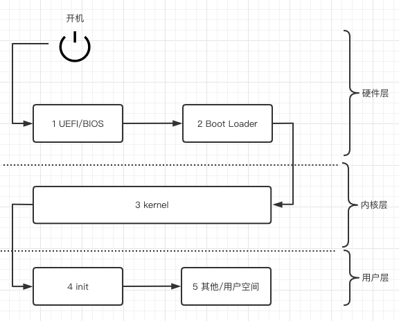

# Linux 启动过程

Linux的启动过程通常是一个多阶段的工作，是硬件和内核一起工作的结果。

在下图中，你可以看到启动过程的端到端，包括以下五个步骤。



1. 在现代环境中，[统一可扩展固件接口(the Unified Extensible Firmware Interface,UEFI)](https://uefi.org/)定义了引导配置（存储在 NVRAM 中）和引导加载程序。在较旧的系统中，在此步骤中， 在开机自检（POST）完成后， 基本 I/O 系统 （BIOS）将初始化硬件（管理 I/O 端口和中断）并将控制权移交给引导加载程序。

2. 引导加载程序（boot loader）作用是：引导内核。根据引导介质的不同，详细信息可能略有不同。有一系列引导加载程序选项：

   - 当前版本：GRUB 2, systemd-boot, SYSLINUX, rEFInd.

   - 传统: LILO, GRUB 1

3. 内核（kernel）通常以压缩形式位于 /boot 目录中。这意味着第一步是提取内核并将其加载到主内存中。初始化其子系统、文件系统和驱动程序后（如 [shell](../shell) 、 [虚拟文件系统中挂载文件系统](../filesystem/2.虚拟文件系统.md) 所述 ），内核将控制权移交给 init 系统，引导过程正式结束。

4. init 系统负责启动全系统的守护进程（服务进程）。这个 init 进程是进程层次结构的根，它的进程ID（PID）为1。换句话说，PID为1的进程一直运行到你关闭系统。除了负责启动其他守护进程外，PID 1 进程传统上还负责处理孤儿进程（不再有父进程的进程）。

5. 通常，在此之后 会进行其他一些用户空间级别初始化，具体取决于环境：

   - 通常有一个终端、环境和 shell 初始化正在进行中，如所述[shell](../shell)中所述。

   - 启动具有 GUI 的桌面环境的显示管理器、图形服务器等，同时考虑用户偏好和配置。

接下来我们把重点放在一个重要的、面向用户的部分：init 系统，对应启动过程的第 4 步和第 5 步。在 Gentoo wiki 上有一个[很好的 init 系统比较](https://wiki.gentoo.org/wiki/Comparison_of_init_systems)。我们只讨论 systemd，目前几乎所有的 Linux 发行版都在使用 systemd。

> System V init
> [System V 风格的 init](https://savannah.nongnu.org/projects/sysvinit) 程序（简称 SysV init）是 Linux 的传统 init 系统。Linux 从 Unix 继承了 SysV，它定义了所谓的运行级别（系统状态，如停止、单用户、多用户模式或GUI模式），其配置通常存储在 /etc/init.d 中。然而，启动守护程序的顺序方式和发行版对配置的特定处理使得这种方式的便携性不高。

## 1 systemd

[systemd](https://systemd.io/) 最初是 initd 的替代品，但现在已经是一个强大的管理程序，包括日志、网络配置和网络时间同步等功能。它提供了一种灵活的、可移植的方式来定义守护进程及其依赖关系，并提供了统一的界面来控制配置。

目前几乎所有的 Linux 发行版都在使用 systemd，包括 Fedora 自 2011 年 5 月起、openSUSE 自 2012 年 9 月起、CentOS 自 2014年 4 月起、RHEL 自 2014 年 6 月起、SUSE Linux 自 2014 年 10 月起、Debian 自 2015 年 4 月起和 Ubuntu 自 2015 年 4 月起。

systemd 通过以下方式解决了以往 init 系统的不足之处。

- 提供一个统一的方式来管理各发行版的启动。
- 实现更快、更容易理解的服务配置。
- 提供现代化的管理套件，包括监控、资源使用控制（通过 cgroups）和内置的审计。

此外，init 在初始化时依次启动服务（也就是按字母数字顺序），而 systemd 可以启动任何已经满足其依赖关系的服务，有可能加快启动时间。

告诉 systemd 运行什么、何时运行、如何运行的方式是通过单元（Units）来实现的。

### 1.1 单元（Units）

systemd 中的单元是一个逻辑分组，根据其功能和目标资源的不同，有不同的语义。

- 服务（service）单元描述如何管理一个服务或应用程序。

- 目标（target）单元捕获依赖关系。

- 挂载（mount）单元定义了一个挂载点。

- 计时器（timer）单元为 cron 作业等定义计时器。

- 其他不太重要的单元类型。
  - socket 描述一个网络或 IPC 套接字。
  - udev 或 sysfs 文件系统的设备。
  - automount 配置自动挂载点。
  - swap 描述交换空间。
  - path 用于基于路径的激活。
  - snapshot 允许在变化后重建系统的当前状态。
  - slice 与 cgroups相关（"Linux cgroups"）。
  - scope 用来管理外部创建的系统进程集。

为了让 systemd 知道，一个单元需要被序列化为一个文件，systemd 在多个位置寻找单元文件。三个最重要的文件路径是。

- /lib/systemd/system 打包安装的单元
- /etc/systemd/system 系统管理员配置的单元
- /run/systemd/system 非持久性运行时修改

在了解了 systemd 的基本工作单元后，让我们继续讨论如何通过命令行控制它。

### 1.2 用 systemctl 管理

用来与 systemd 交互管理服务的工具叫做 systemctl。

下表列出了常用的 systemctl 命令。

| 有用的 systemd 管理工具         |                                              |
| ------------------------------- | -------------------------------------------- |
| Command                         | Use Case                                     |
| systemctl enable XXXXX.service  | 设置服务开机自启                             |
| systemctl daemon-reload         | 重新加载所有单元文件并重新创建整个依赖关系树 |
| systemctl start XXXXX.service   | 启动该服务                                   |
| systemctl stop XXXXX.service    | 停止该服务                                   |
| systemctl restart XXXXX.service | 停止然后再启动该服务                         |
| systemctl reload XXXXX.service  | 向服务发出重载命令，回落到重启状态           |
| systemctl kill XXXXX.service    | 停止服务的执行                               |
| systemctl status XXXXX.service  | 获取服务状态的简短摘要，包括一些日志行       |

请注意，systemctl 提供的命令还有很多，从依赖性管理和查询到控制整个系统（例如重启）。

systemd 生态系统还有一些其他的命令行工具，你可能会觉得很方便，至少你应该了解一下。这些工具包括但不限于。

- [bootctl](https://man7.org/linux/man-pages/man1/bootctl.1.html) 允许你检查启动加载器的状态，并管理可用的启动加载器。

- 通过timedatectl，你可以设置和查看[时间和日期](https://opensource.com/article/20/6/time-date-systemd)相关的信息。

- 当你进行故障排除时，可以考虑使用 coredumpctl 工具，它可以让你处理保存的核心转储（core dumps）。

### 1.3 使用 journalctl 监控

journal 是 systemd 的一个组成部分，严格来说，它是一个由 systemd-journald 守护进程管理的二进制文件，为所有由 systemd 组件记录的信息提供一个集中的位置。我们将在 后面详细介绍，现在你只需要知道这是一个可以查看 systemd 管理的日志的工具。

### 1.4 例子：调度 greeter

greeter 是我们本章开篇的时候提到的[脚本](1.软件术语概述.md) 

说了这么多理论，现在让我们看看 systemd 的实际应用。作为一个简单的用例，我们假设我们想每小时启动我们的 greeter 应用（"运行实例：greeter"）。

首先，我们定义一个 systemd 单元文件，类型为 service。这将告诉 systemd 如何启动 greeter 应用；将以下内容存储在一个名为greeter.service的文件中（在任何目录下，可以是一个临时目录）。

```shell
[Unit]
Description=My Greeting Service 

[Service]
Type=oneshot
ExecStart=/home/mh9/greeter.sh 
```

Description=My Greeting Service  服务描述，在我们使用 systemctl status 时显示。


ExecStart=/home/mh9/greeter.sh  应用程序的位置。

接下来，我们定义一个定时器单元，每隔一小时启动greeter服务。将以下内容存储在文件greeter.timer中。

```shell
[Unit]
Description=Runs Greeting service at the top of the hour

[Timer]
OnCalendar=hourly 
```

OnCalendar=hourly  使用 [systemd 的时间和日期格式](https://www.freedesktop.org/software/systemd/man/systemd.time.html)定义时间表.

现在我们把这两个单元文件复制到/run/systemd/system/，这样 systemd 就能识别它们。

```shell
$ sudo ls -al /run/systemd/system/
total 8
drwxr-xr-x  2 root root  80 Sep 12 13:08 .
drwxr-xr-x 21 root root 500 Sep 12 13:09 ..
-rw-r--r--  1 root root 117 Sep 12 13:08 greeter.service
-rw-r--r--  1 root root 107 Sep 12 13:08 greeter.timer
```

现在我们可以使用 greeter 计时器了，因为 systemd 在我们把它复制到相应的目录中时，自动地把它拿了出来。

注意
基于 Debian 的系统，如 Ubuntu，默认启用并启动服务单元。如果没有明确的 systemctl start greeter.timer，Red Hat 家族的系统就不会启动该服务。在启动时启用服务也是如此，基于Debian的发行版默认启用服务，而Red Hat的发行版需要以systemctl enable的形式明确确认。

让我们检查一下greeter定时器的状态。

```shell
$ sudo systemctl status greeter.timer
● greeter.timer - Runs Greeting service at the top of the hour
   Loaded: loaded (/run/systemd/system/greeter.timer; static; vendor preset: enabled)
   Active: active (waiting) since Sun 2021-09-12 13:10:35 IST; 2s ago
  Trigger: Sun 2021-09-12 14:00:00 IST; 49min left

Sep 12 13:10:35 starlite systemd[1]: Started Runs Greeting service at the top of the hour.
```

很好，所以systemd确认它知道我们的守护者，并且它已经安排好了运行。但你怎么知道它是否运行了呢？让我们检查一下日志（注意，输出被编辑了，而且stdout输出直接进入了日志）。

```shell
# 使用 journalctl 查看并跟踪（-f）greeter.service 单元的日志（用 -u 选择）
$ journalctl -f -u greeter.service 
-- Logs begin at Sun 2021-01-24 14:36:30 GMT. --
Sep 12 14:00:01 starlite systemd[1]: Starting My Greeting Service...
Sep 12 14:00:01 starlite greeter.sh[21071]: You are awesome!
...
```