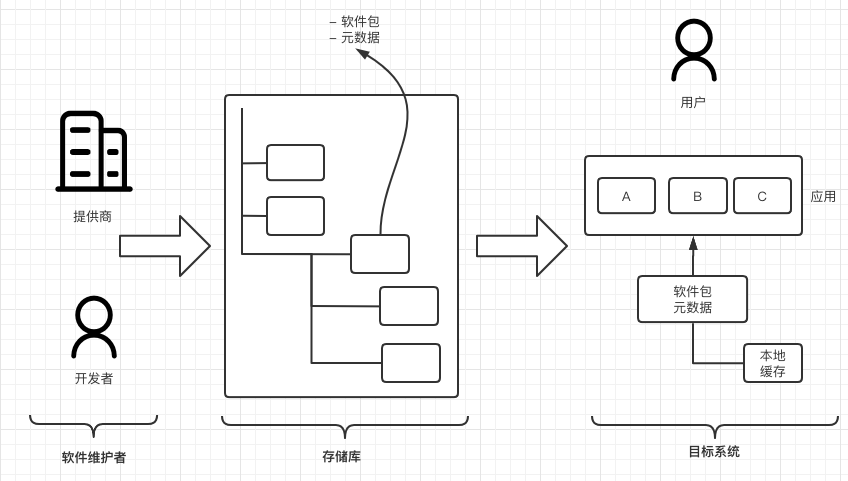
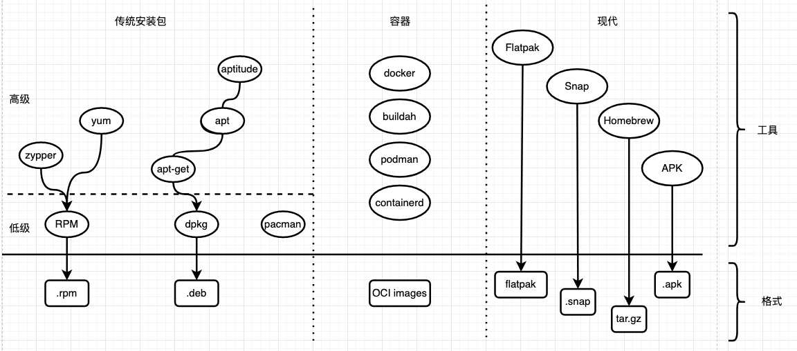

# 应用供应链

[供应链（Supply Chains）](https://en.wikipedia.org/wiki/Supply_chain)：一个向消费者供应产品的组织和个人的系统。虽然你可能不会经常想到它，但你每天都在和它打交道，从食物到衣服到汽车。现在，在我们的讨论中，产品变成了软件及相应组件，你可以把消费者看成是使用应用程序的人自己，或者是为你管理应用程序的工具。

在概念层面上，下图显示了一个典型的 Linux 应用程序供应链的主要参与者和阶段。

- 软件维护者--个人开发者、开源项目和公司，如独立软件供应商（ISV）--制作软件工件，并将其作为软件包发布到存储库（repo）。

- 存储库列出了包含全部或部分应用程序的软件包，以及元数据。包通常包含了一个应用程序的依赖性。依赖项是一个应用程序为了运行而需要的其他软件包。这可以是一个库，某种导出器或导入器，或其他服务程序。保持这些依赖关系的更新是很难的。

- 在目标系统方面，有一个工具（包管理器），它可以在存储库中查找包，并按照人类用户的指示安装、更新和删除应用程序。请注意，一个或多个包可以代表应用程序和它的依赖关系。

虽然细节可能因发行版而异，并取决于环境（服务器、桌面等），但应用供应链都有以上描述的共同要素。

对于包和依赖性管理有很多选择，比如传统的包管理器、基于容器的解决方案或更多最新的方法。

下图，是一个关于 Linux 软件包管理和应用程序依赖性管理领域的比较高级概述。

- 在传统软件包管理器的背景下，我们通常区分低级和高级工具。如果一个软件包管理器能够解决依赖关系，并提供一个高级接口（安装、更新、删除），那么我们称它为高级软件包管理器。

- 基于容器的解决方案（"容器"）最初是从服务器和云计算领域出来的。考虑到他们的能力，一个用例，但不一定是他们的主要用例，是应用管理。换句话说：作为一个开发者，你会喜欢容器，因为它们使你能够轻松地测试东西，并使你的应用程序能够直接运送到生产环境中。

- 现代软件包管理器（"Modern Package Managers"）起源于桌面环境，其主要目标是使终端用户尽可能容易地消费应用程序。