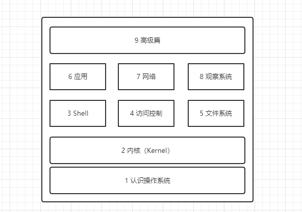

# Learning Linux -- 从零开始学习 Linux

Linux是一个开源的操作系统，我们通常所说的Linux系统，是指以Linux内核为基础系统发行版。

## 1. 关于本书

本书的系统环境基于 CentOS 7 版本，新版本操作系统基于 Rocky Linux。

### 1.1 章节说明

本书包含以下九个大的章节，分别创建一级目录存放章节内容，没有二级目录。所有的图片都放在最顶层的 `images` 目录下，原则上文章中用到的图片都保存在本地。

## 2. 如何使用本书

### 2.1 在线使用

访问 

### 2.2 本地使用

