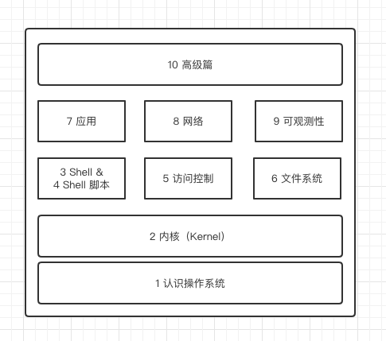

# Learning Linux -- 从零开始学习 Linux

Linux是一个开源的操作系统，我们通常所说的Linux系统，是指以Linux内核为基础系统发行版。

## 1. 关于本书

本书的系统环境基于 CentOS 7 版本，新版本操作系统基于 Rocky Linux。

### 1.1 章节说明

本书包含以下 10 个大的章节，分别创建一级目录存放章节内容，没有二级目录。所有的图片都放在最顶层的 `images` 目录下，原则上文章中用到的图片都保存在本地。

### 1.2 开始之前

在阅读本书之前希望您准备以下环境：

- 一台可以上网电脑，CPU 4 核、内存 8G 以上、空闲存储空间 60 G，并且 CPU 支持虚拟化（[intel](https://www.intel.cn/content/www/cn/zh/support/articles/000005486/processors.html)）。
- 按照[环境准备](./1_system/3.环境准备.md)中的教程配置相应的实验环境。

### 1.3 本书知识点速查

