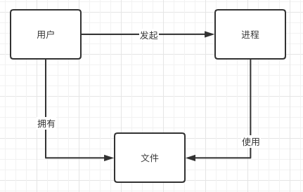

# 访问控制概述

## 1 资源和所有权

Linux 是一个多用户操作系统，继承了 UNIX 用户的概念。每个用户帐户都与一个用户ID相关联，该ID可以被授予对可执行文件、文件、设备和其他 Linux 资产的访问权限。人类使用帐户登录后，启动用户进程作为帐户运行。然后，还有资源(我们将简称为文件)，它们是用户可用的任何硬件或软件组件。在一般情况下，我们将资源称为文件，除非我们另作说明，例如，syscall 。在下图中，你可以看到 Linux 中用户、进程和文件之间的高级关系。

- 用户启动进程并拥有自己的文件。进程是内核已加载到内存中并运行的程序（可执行文件）。

- 文件具有所有者，默认情况下，创建文件的用户拥有该文件。

- 进程使用文件进行通信和持久化。当然，用户也会间接使用文件，但他们需要通过流程来执行此操作。

这只是对用户、进程和文件之间关系的一个简单的表述，但它使我们能够理解参与者及其关系，当我们在这里更详细地讨论不同参与者之间的交互时，它将派上用场。

## 2 沙盒（sandboxing）

沙盒是一个定义模糊的术语，可以指一系列不同的方法，从监狱（jails）到容器（container）再到可以在内核或用户领域管理的虚拟机。，沙箱中运行通常是一些应用程序--监督机制在沙箱进程和宿主环境之间强制实施一定程度的隔离。我们将在本章后面的“Seccomp配置文件”中看到沙箱的作用，我们会在后面再次介绍有关虚拟机和容器的内容。
## 3 访问控制的类型

一个用户或进程是否直接访问一个资源，或许是以一种不受限制的方式，或者是有一套明确的规则，规定一个进程在什么情况下可以访问什么样的资源（文件或系统调用）。或者，访问本身甚至被记录下来。

从概念上讲，有不同的访问控制类型。在 Linux 中，最重要的是自由裁量和强制访问控制。

### 自由裁量（Discretionary Access Control，DAC）

DAC 的想法是根据用户的身份来限制对资源的访问。在这个意义上，它是自由裁量的，一个拥有某些权限的用户可以把它们传递给其他用户。

### 强制 (Mandatory，MAC)

MAC 是基于一个代表安全级别的分层模型。用户得到一个分配的许可级别，资源被分配一个安全标签。用户只能访问与他们自己的许可级别相同（或更低）的资源。在一个 MAC 模型中，管理员严格地、专门地控制访问，设置所有的权限。换句话说，用户不能自己设置权限，即使在他们拥有资源的情况下。

此外，Linux 保持一种全有或全无的态度，也就是说，你要么是一个有权改变一切的超级用户，要么是一个拥有有限权限的普通用户。最初，并没有简单而灵活的方法来给用户或进程分配某些权限。例如，在一般情况下，为了使 "进程 X 被允许改变网络设置"，你必须给它root权限。这自然会产生具体的影响：攻击者可以轻易地滥用这些广泛的权限。 

请注意，要稍微限定 Linux 中的“全有或全无态度”：大多数Linux系统的默认设置允许“其他人”（即系统上的所有用户）对几乎所有文件和可执行文件进行读取访问。对于MAC，例如启用了[SELinux](https://selinuxproject.org/page/Main_Page)，它只限制明确获得访问权限的资产。例如，Web 服务器只能使用端口 80 和 443，只能共享特定目录中的文件和脚本，只能将日志写入特定位置等等。

我们将在“高级权限管理”中重新讨论这个主题，并了解现代 Linux 功能如何帮助克服这种二进制世界观，从而实现更细粒度的权限管理。
MAC for Linux 最著名的实现可能是 SELinux。它是为了满足政府机构的高安全性要求而开发的。MAC 的另一个选项是 [AppArmor](https://www.apparmor.net/)，它自2.6.36版起就包含在Linux内核中，在 Ubuntu 中非常流行。