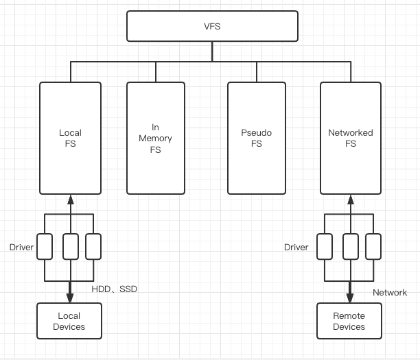
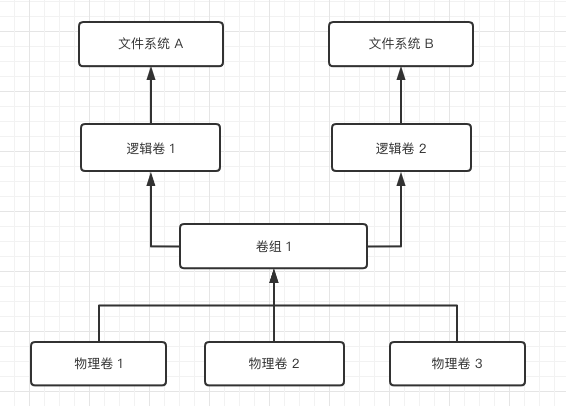

# 虚拟文件系统 （VFS）

Linux 通过一个被称为[虚拟文件系统（VFS）](https://elixir.bootlin.com/linux/latest/source/Documentation/filesystems/vfs.rst)的抽象，设法为许多种类的资源（内存、本地连接或网络存储）提供类似文件的访问。其基本思想是在终端（系统调用）和实现具体设备或其他类型资源操作的单个文件系统之间引入一层中介。这意味着，VFS将通用操作（打开、读取、寻找）与实际的实现细节分开。

VFS是内核中的一个抽象层，基于文件范式，为客户提供访问资源的通用方式。在Linux中，一个文件没有任何规定的结构，它只是一个字节流。由客户端来决定这些字节的含义。如图5-1所示，VFS抽象了对不同类型文件系统的访问。   

- 本地文件系统，如 ext3、XFS、FAT 或 NTFS。这些文件系统使用驱动程序来访问本地块设备，如 HDD 或 SSD。

- 内存中文件系统，如 tmpfs，它们不受长期存储设备支持，而是位于主内存 （RAM） 中。我们将在"常规文件"中介绍此类别和上一个类别。

- 伪文件系统，如 "伪文件系统"中讨论的 procfs。这些文件系统本质上也是内存中的，它们用于内核接口和设备抽象。

- 网络文件系统，如 NFS、Samba、Netware （nee Novell） 等。这种文件系统也使用驱动程序，但是，实际数据所在的存储设备不是本地连接的，而是远程的。这意味着驱动程序涉及网络操作，这就是我们将在第7章中介绍它的原因。



VFS的组成是一个很复杂的问题。有 100 多个与文件相关的系统调用，然而，在其核心中，操作可以分为表5-2中列出的几个类别。。

| 组成 VFS 接口的系统调用 |                                              |
| ----------------------- | -------------------------------------------- |
| 类别                    | 示例系统调用                                 |
| inodes                  | chmod， chown， stat                         |
| 文件                    | open, close, seek, truncate, read, write     |
| 目录                    | chdir, getcwd, link, unlink, rename, symlink |
| 文件系统                | mount, flush, chroot                         |
| 其他                    | mmap, poll, sync, flock                      |

许多 VFS 系统调用会分派到特定于文件系统的实现中。对于其他系统调用，有 VFS 默认实现。此外，Linux 内核定义了相关的VFS数据结构（参见 [include/linux/fs.h](https://elixir.bootlin.com/linux/latest/source/include/linux/fs.h)），例如：

- inode，核心文件系统对象，捕获类型，所有权，权限，链接，指向包含文件数据的块的指针，有关创建和访问的统计信息等。

- 文件，表示打开的文件（包括路径、当前位置、inode）。

- dentry（目录条目），用于存储其父项和子项。

- super_block，表示包含挂载信息的文件系统。

- 其他如vfsmount或file_system_type。

完成 VFS 概述后，让我们仔细看看详细信息，包括卷管理、文件系统操作和常见文件系统布局。

## 1 逻辑卷管理器 （LVM）

我们之前讨论过使用分区划分驱动器。虽然这样做是可能的，但分区很难使用，特别是当需要调整大小（更改存储空间量）时。

逻辑卷管理器 （LVM） 使用物理实体（如驱动器或分区）和文件系统之间的间接层。这产生了一种设置，允许通过资源池进行无风险的零停机时间扩展和自动存储扩展。LVM 的工作方式如下图所示：



- 物理卷 （PV） 可以是磁盘分区、整个磁盘驱动器和其他设备。

- 逻辑卷 （LV） 是从 VG 创建的块储存设备。这些在概念上与分区相当。你必须先在 LV 上创建文件系统，然后才能使用它。你可以在使用中轻松调整LV的大小。

- 卷组 （VG） 是一组 PV 和 LV 之间的中间人。可以将其视为共同提供资源的 PV 池。

要使用 LVM 管理卷，需要许多工具，但它们的名称一致且相对易于使用：

- PV 管理：`lvmdiskscan`， `pvdisplay`， `pvcreate`， `pvscan`，

- VG 管理：`vgs`， `vgdisplay`， `vgcreate`， `vgextend`

- LV 管理：`lvs`，`lvscan`， `lvcreate`

让我们看看一些 LVM 命令的实际操作，使用具体设置：

```shell
# 列出逻辑卷，我们这里有两个（根和swap_1）使用卷组 elementary-vg。
$ sudo lvscan 
  ACTIVE            '/dev/elementary-vg/root' [<222.10 GiB] inherit
  ACTIVE            '/dev/elementary-vg/swap_1' [976.00 MiB] inherit
# 显示音量组，我们这里有一个称为 elementary-vg 的组。
$ sudo vgs 
  VG            #PV #LV #SN Attr   VSize    VFree
  elementary-vg   1   2   0 wz--n- <223.07g 16.00m
# 显示物理卷，我们这里有一个 （/dev/sda2） 分配给 volumne 组 elementary-vg。
$ sudo pvdisplay 
  --- Physical volume ---
  PV Name               /dev/sda2
  VG Name               elementary-vg
  PV Size               <223.07 GiB / not usable 3.00 MiB
  Allocatable           yes
  PE Size               4.00 MiB
  Total PE              57105
  Free PE               4
  Allocated PE          57101
  PV UUID               2OrEfB-77zU-jun3-a0XC-QiJH-erDP-1ujfAM
```

无论你使用的是分区还是 LV，使用文件系统都需要另外两个步骤（我们接下来将介绍）。

## 2 文件系统操作

在给定分区或逻辑卷（使用 LVM 创建）的情况下创建文件系统。涉及两个步骤：创建文件系统（在 Windos 操作系统中，此步骤称为格式化），然后挂载它，即将其插入文件系统树中。

### 2.1 创建文件系统

设置构成文件系统管理部分，并将分区或卷作为输入。 使用 [mkfs](https://www.man7.org/linux/man-pages/man8/mkfs.8.html) 创建文件系统。 

`mkfs` 需要两个主要输入：要创建的文件系统类型，以及要在其上创建文件系统的设备，例如一个逻辑卷：

```shell
# 创建 ext4 的类型
mkfs -t ext4 \ 
# 在 `/dev/some_vg/some_lv ` 上创建文件系统
    /dev/some_vg/some_lv 
```

从前面的命令中可以看出，创建文件系统的命令并不复杂，你的主要工作是确定要使用的文件系统类型。

使用 mkfs 创建文件系统后，可以在文件系统树中挂载它。

### 2.2 挂载文件系统

挂载文件系统意味着将其附加到文件系统树（从 /开始）。使用 [挂载](https://man7.org/linux/man-pages/man8/mount.8.html) 来附加文件系统。挂载需要两个主要输入：要附加的设备和文件系统树中的位置。此外，你可以提供的其他输入包括：

- 挂载选项（通过 -o），如只读

- 指定一个 [绑定挂载](https://lwn.net/Articles/281157/) （--bind） 以将目录挂载到文件系统树中，我们将在容器的上下文中重新访问这一点。 

你也可以单独使用挂载。下面介绍了如何列出现有装载：

```shell
$ mount -t ext4,tmpfs 
tmpfs on /run type tmpfs (rw,nosuid,noexec,relatime,size=797596k,mode=755)
/dev/mapper/elementary--vg-root on / type ext4 (rw,relatime,errors=remount-ro) 
tmpfs on /dev/shm type tmpfs (rw,nosuid,nodev)
tmpfs on /run/lock type tmpfs (rw,nosuid,nodev,noexec,relatime,size=5120k)
tmpfs on /sys/fs/cgroup type tmpfs (ro,nosuid,nodev,noexec,mode=755)
```

列出挂载，但仅显示某些文件系统类型（此处为 ext4 和 tmpfs）。

一个挂载示例：ext4 类型的 LVM VG /dev/mapper/elementary--vg-root 挂载在根目录下。

你必须确保使用创建文件系统时使用的类型挂载文件系统。例如，如果你尝试使用 mount -t vfat /dev/sdX2 /media 来安装 SD 卡，则必须知道 SD 卡是使用 vfat 格式化的。你可以让挂载尝试所有文件系统，直到其中一个使用 -a 选项工作正常。

此外，只要系统正在运行，安装就有效，因此为了使其成为永久性的，你需要使用 [fstab](https://wiki.archlinux.org/title/Fstabp) （/etc/fstab）。例如，这是我的（输出稍微编辑以适应）：

$ cat /etc/fstab

\# /etc/fstab：静态文件系统信息。

\#

\# 使用"blkid"打印一个通用的唯一标识符

\# 设备;这可以与UUID=一起使用，作为命名设备的更可靠的方式

\# 即使添加和删除磁盘也有效。参见 fstab（5）。

\#

\# <文件系统> <挂载点> <类型> <选项> <转储> <传递>

/dev/mapper/elementary--vg-root / ext4 errors=remount-ro 0 1

\# /boot/efi 在安装过程中处于 /dev/sda1 上

UUID=2A11-27C0 /boot/efi vfat umask=0077 0 1

/dev/mapper/elementary--vg-swap_1 none swap sw 0 0

现在你知道了如何管理分区、卷和文件系统。接下来，我们将回顾一下组织文件系统的常用方法。

### **常见文件系统布局**

一旦你有了一个文件系统，一个明显的挑战是想出一种方法来组织它的内容。你可能希望组织程序的存储位置、配置数据、系统数据和用户数据等内容。我们将这种目录组织及其内容称为文件系统布局。正式地说，该布局称为 [文件系统层次结构标准](https://refspecs.linuxfoundation.org/FHS_3.0/fhs/index.html) （FHS）。它定义目录，包括其结构和推荐的内容。Linux基金会维护FHS，这是Linux发行版遵循的良好起点。 

FHS背后的想法值得称赞。但是，在实践中，你会发现文件系统布局在很大程度上取决于你正在使用的Linux发行版。因此，我强烈建议你使用man hier命令来了解你的具体设置。

为了向你简要介绍在看到某些顶级目录时可以期待什么，我在表 5-3 中编制了一个常见目录列表。

 表 5-3.常见顶级目录  目录 含义 bin， sbin  系统程序和命令（通常链接到 /usr/bin 和 /usr/sbin） boot 内核映像和相关组件 dev 设备（终端、驱动器等） etc 系统配置文件 home 用户主目录 lib 共享系统库 mnt, media 可移动媒体（例如 U 盘）的安装点 opt 特定于发行版，可以托管包管理器文件  proc， sys  内核接口，另请参见 "伪文件系统" tmp 对于临时文件 usr 用户程序（通常为只读） var 用户程序（日志、备份、网络缓存等） 

有了这个，让我们继续讨论一些特殊类型的文件系统。

## **伪文件系统**

文件系统是构建和访问信息的好方法。到目前为止，你可能已经内化了Linux的座右铭"一切都是文件"。我们在"虚拟文件系统（VFS）"中研究了Linux如何通过VFS提供统一的接口。现在，让我们仔细看看在VFS实现器不是块设备（例如SD卡或SSD驱动器）的情况下如何提供接口。

遇到伪文件系统：它们只是假装是文件系统，以便我们可以以通常的方式（ls，cd，cat）与它们进行交互，但实际上它们正在包装一些内核接口。界面可以是一系列的东西，包括：

- 有关进程的信息，

- 与键盘等设备的交互，或

- 实用程序，例如可用作数据源或接收器的特殊设备。

让我们仔细看看Linux拥有的三个主要伪文件系统，从最古老的文件系统开始。

### **Procfs**

Linux 从 UNIX 继承了 [/proc](https://www.kernel.org/doc/html/latest/filesystems/proc.html) 文件系统 （procfs）。其初衷是为了从内核中发布与进程有关的信息，使其可被系统命令（如ps或free）所读取。它的结构规则非常少，允许读写、访问，而且随着时间的推移，许多东西都进入了它的范围。一般来说，你可以在这里找到两种类型的信息。

- 在/proc/PID/中的每个进程信息。这是内核通过以PID为目录名的目录所公开的与进程有关的信息。表5-4中列出了有关这些信息的细节。
- 其他信息，如挂载、网络相关信息、TTY驱动、内存信息、系统版本、正常运行时间等。

你可以通过使用以下命令来收集表5-4中列出的每个进程的信息，如

cat。注意，大多数信息是只读的，写的语义取决于底层资源。

 表 5-4.procfs 中的每个进程信息（最显著）  进入  类型  信息  attr  directory  安全属性    cgroup  file  控制组    cmdline  file  命令行    cwd  link  当前工作目录    environ  file  环境变量    exe  link  进程的可执行文件    fd  directory  文件描述符    io  file  存储I/O（字节/字符的读和写）。   limits  file  资源限制    mem  file  使用的内存    mounts  file  使用的挂载    net  directory  网络统计   stat  file  进程状态    syscall  file  系统调用使用情况    task  directory  每个任务（线程）信息    timers  file  计时器信息 

让我们看看它的实际效果，例如，让我们检查进程状态。我们在这里使用状态，而不是统计数据，它没有人为的可读标签：

```Shell
$ cat /proc/self/status | head -10 
Name:   cat

Umask:  0002

State:  R (running) 

Tgid:   12011

Ngid:   0

Pid:    12011 

PPid:   3421 

TracerPid:      0

Uid:    1000    1000    1000    1000

Gid:    1000    1000    1000    1000
```

获取有关当前正在运行的命令的进程状态，仅显示前十行。

当前状态（正在运行，在 CPU 上）。

当前进程的 PID。

命令的父进程的进程 ID;在这种情况下，它是我运行cat命令的shell。


下面是使用 procfs 收集信息的另一个示例，这次是从网络空间收集的：

```Shell
$ cat /proc/self/net/arp

IP address       HW type     Flags       HW address            Mask     Device

192.168.178.1    0x1         0x2         3c:a6:2f:8e:66:b3     *        wlp1s0

192.168.178.37   0x1         0x2         dc:54:d7:ef:90:9e     *        wlp1s0
```

如前面的命令所示，我们可以从这个特殊的/proc/self/net/arp收集有关当前进程的ARP信息。

如果你正在 [进行低级调试](https://tanelpoder.com/2013/02/21/peeking-into-linux-kernel-land-using-proc-filesystem-for-quickndirty-troubleshooting/) 或开发系统工具，则 procfs 非常有用。它相对混乱，因此你将需要内核文档，甚至更好的内核源代码来了解每个文件所代表的内容以及如何解释其中的信息。

让我们继续讨论内核公开信息的更新、更有序的方式。

### **Sysfs**

procfs 是相当狂野的，而  [/sys](https://man7.org/linux/man-pages/man5/sysfs.5.html) 文件系统（sysfs）是一种Linux特定的、结构化的方式，用于内核使用标准化的布局暴露选择信息（比如关于设备）。

下面是sysfs中的目录。

- block/目录包含对已发现的块设备的符号链接。
- 在bus/目录中，你可以为内核中支持的每种物理总线类型找到一个子目录。
- class/目录包含设备类别。
- dev/目录包含两个子目录：block/用于块设备，char/用于系统中的字符设备，结构为major-ID:minor-ID。
- 在devices/目录中，内核提供了一个设备树的表示。
- 通过firmware/目录，你可以管理固件的特定属性。
- fs/目录包含一些文件系统的子目录。
- 在module/目录中，你可以为内核中加载的每个模块找到子目录。

在sysfs中还有更多的子目录，但有些是新的和/或将受益于更好的文档。你会发现某些在sysfs中重复的信息在procfs中也是可用的，但其他信息（如内存信息）只在procfs中可用。


让我们看看sysfs的运行情况（输出已被编辑以适应）。

$ ls -al /sys/block/sda/ |头 -7 


共 0 条

drwxr-xr-x 11 根根 0 九月 7 11：49 .

drwxr-xr-x 3 根根 0 九月 7 11：49 ..

-r--r--r-- 1 根根 4096 九月 8 16：22 alignment_offset

lrwxrwxrwx 1 根根 0 Sep 7 11：51 bdi -> ../../../虚拟/bdi/8：0 


-r--r--r-- 1 根根 4096 九月 8 16：22 容量 


-r--r--r-- 1 根根 4096 Sep 7 11：49 dev 


列出有关块设备 sda 的信息，但仅显示前七行。


backing_dev_info使用 MAJOR：MINOR 格式的链接。


捕获设备 [功能，](https://www.kernel.org/doc/html/latest/block/capability.html) 例如它是否可移动。


包含设备主编号和次要编号 （8：0），另请参阅 [块设备驱动程序](https://linux-kernel-labs.github.io/refs/heads/master/labs/block_device_drivers.html) 参考，了解这些数字的含义。

在我们的小伪文件系统审查中，接下来是设备。

**Devfs**

[/dev](https://tldp.org/LDP/Linux-Filesystem-Hierarchy/html/dev.html) 文件系统 （devfs） 承载设备特殊文件，表示从物理设备到随机数生成器或只写数据接收器等设备。

通过 devfs 提供和管理的设备包括：

- 块处理块中数据的设备，例如，存储设备（驱动器）。

- 逐个字符处理事物的字符设备，如终端、键盘或鼠标。

- 生成数据或允许你操作数据的特殊设备，包括著名的 /dev/null 或 /dev/random。

现在让我们看看 devfs 的实际应用。例如，假设你要获取一个随机字符串。你可以执行如下操作：

tr -dc A-Za-z0-9 < /dev/urandom |头 -c 42

前面的命令生成一个 42 个字符长的随机序列，其中包含大写和小写以及数字字符。虽然 /dev/urandom 看起来像一个文件，可以像文件一样使用，但它确实是一个特殊的文件，它使用多个源生成（或多或少）随机输出。

你如何看待以下命令：

回显 "something" > /dev/tty

没错！字符串"something"出现在你的显示器上，这是设计使然。因为 /dev/tty 代表终端，并且使用该命令，我们向它发送了一些东西（确切地说）。

在充分了解了文件系统及其功能之后，现在让我们将注意力转向要用于管理常规文件（如文档和数据文件）的文件系统。

## **常规文件**

在本节中，我们将重点介绍此类 [文件类型的常规文件和文件系统](https://www.man7.org/linux/man-pages/man5/filesystems.5.html) 。我们在工作时处理的大多数日常文件都属于这一类：办公文档，YAML和JSON配置文件，图像（PNG，JPEG等），源代码，纯文本文件。

Linux提供了丰富的选择。我们将重点介绍本地文件系统，包括 Linux 的本机文件系统，以及 Linux 允许你使用的其他操作系统（如 Windows/DOS）中的文件系统。首先，让我们看一下一些常见的文件系统。

**通用文件系统**

术语"通用文件系统"没有正式的定义。它只是文件系统的总称，它们要么是Linux发行版中使用的默认值，要么是广泛用于存储设备（如可移动设备（USB记忆棒，SD卡））或只读的CD或DVD。

在 表 5-5 中，我提供了一些享受内核内支持的常见文件系统的快速概述和比较。在本节的后面部分，我们将更详细地回顾一些流行的。

 表 5-5.常规文件的常见文件系统  文件系统  Linux 支持，因为  文件大小  卷大小  文件数量  文件名长度  [ext 2](https://en.wikipedia.org/wiki/Ext2) 1993 2 TB  32 TB 10^18 255 个字符  [ext 3](https://en.wikipedia.org/wiki/Ext3) 2001 2 TB  32 TB  变量  255 个字符  [ext 4](https://en.wikipedia.org/wiki/Ext4) 2008 16 TB  1 EB  40亿  255 个字符 [btrfs](https://en.wikipedia.org/wiki/Btrfs)2009 16 EB  16 EB 2^18 255 个字符 [XFS](https://en.wikipedia.org/wiki/XFS)2001 8 EB  8 EB 2^64 255 个字符 [ZFS](https://en.wikipedia.org/wiki/ZFS) 2006 16 EB  2128 字节  每个目录10^14个文件  255 个字符 NTFS1997 16 TB  256 TB 2^32 255 个字符 vfat1995 2 千兆字节  不适用   每个目录 2^16个 255 个字符 

**注意**

表 5-5 中提供的信息旨在让你大致了解文件系统。有时很难确定文件系统被正式视为Linux的一部分的确切时间，有时这些数字只有在应用相关上下文时才有意义。例如，理论极限和实现之间存在差异。

现在，让我们仔细看看一些广泛使用的文件系统用于常规文件。

**分机4**

[ext4](https://wiki.archlinux.org/title/Ext4) 是一个广泛使用的文件系统，在当今的许多发行版中默认使用。它是 ext3 的向后兼容演进。与ext3一样，它提供日记功能，也就是说，更改记录在日志中，以便在最坏的情况下（例如：停电），恢复速度很快。这是一个很好的通用选择，另请参阅 [手册](https://www.man7.org/linux/man-pages/man5/ext4.5.html) 。

**断续器**

[XFS](https://wiki.archlinux.org/title/XFS) 是一个日志文件系统，最初是由 Silicon Graphics （SGI） 在 20 世纪 90 年代初为其工作站设计的。它支持大型文件和高速 I/O，现在被用于例如 Red Hat 发行版系列。

**断续器**

[ZFS ](https://en.wikipedia.org/wiki/ZFS)最初由 Sun Microsystems 于 2001 年开发，结合了文件系统和卷管理器功能。虽然现在有[OpenZFS](https://openzfs.github.io/openzfs-docs/)项目，在开源环境中提供了前进的道路，但人们对[ZFS与Linux的集成](https://www.linuxjournal.com/content/zfs-linux)存在一些担忧。

**脂肪**

这实际上是一个用于Linux的[FAT文件系统](https://en.wikipedia.org/wiki/FAT_filesystem_and_Linux)家族，现在主要使用vfat。主要用例是与Windows系统以及使用FAT的可移动媒体的互操作性。有关卷的许多本机注意事项都不适用。

驱动器不是唯一可以存储数据的地方，因此让我们看一下内存选项。

**内存文件系统**

有许多可用的内存文件系统，有些是通用的，有些则有非常具体的用例。在下文中，我们列出了一些广泛使用的内存文件系统（按字母顺序排列）：

- [debugfs](https://www.kernel.org/doc/html/latest/filesystems/debugfs.html) 是一个用于调试的特殊用途文件系统，通常使用 mount -t debugfs none /sys/kernel/debug 挂载。

- [loopfs](https://man7.org/linux/man-pages/man4/loop.4.html) 允许将文件系统映射到块而不是设备（另请参阅 后台的[邮件线程](https://lkml.org/lkml/2020/4/8/506)）。

- pipefs 是一个特殊的（伪）文件系统，挂载在 pipe： 上，支持管道。

- [tmpfs](https://www.kernel.org/doc/html/latest/filesystems/tmpfs.html) 是一个通用文件系统，用于将文件数据保存在内核缓存中。它速度快，但非持久性（断电意味着数据丢失）。

- sockfs 是另一个特殊的（伪）文件系统，它使网络套接字看起来像文件，位于系统调用和[套接字](https://linux.die.net/man/3/socket)之间。

- [swapfs](https://linux.die.net/EVMSUG/x3863.html) 用于实现交换（不可挂载）。

让我们转到一类特殊的文件系统，特别与"容器"的上下文相关。

**写入时拷贝文件系统**

写入时复制 （CoW） 是一个漂亮的概念，可提高 I/O 速度，同时占用更少的空间。在 图 5-3 中，我们描述了它的工作原理：


**图 5-3。CoW 原则在起作用**

1. 由块 A、B 和 C 组成的原始文件 FILE 1 被复制到名为 FILE 2 的文件中。不是复制实际的块，而是只复制元数据（指向块的指针）。这很快，并且不会占用太多空间，因为只创建元数据。
2. 当文件2被修改时（假设块C中的某些内容被更改），只有这样才能复制块C：创建一个名为C'的新块，而FILE 2仍然指向（使用）未修改的块A和B，它现在使用新块（C'）捕获新数据。

在我们开始实现之前，我们需要了解与此上下文相关的第二个概念：[联合安装](https://en.wikipedia.org/wiki/Union_mount)。这个想法是，你可以将多个目录组合（挂载）到一个位置，以便向结果目录的用户显示该目录包含所有参与目录的组合内容（或：并集）。使用联合挂载时，你经常会遇到术语"上层"或"下层文件系统"，暗示挂载的分层顺序，请阅读["统一文件系统与联合挂载](https://lwn.net/Articles/312641/)"中的详细信息。

有了联合坐骑，魔鬼就在细节中。人们必须提出规则，当文件存在于多个地方时会发生什么，或者写入或删除文件意味着什么。

让我们快速浏览一下 CoW 在 Linux 文件系统上下文中的实现。我们将在第6章的上下文中仔细研究其中一些，当我们讨论它们作为容器映像的构建块的用法时。

**尤恩夫斯**

[Unionfs ](https://unionfs.filesystems.org/)最初由 Stony Brook University 开发，为 CoW 文件系统实现了联合挂载。Unionfs 允许你在挂载时使用优先级透明地覆盖来自不同文件系统的文件和目录。它广受欢迎，并用于CD-ROM和DVD的上下文。

**叠加FS**

[OverlayFS](https://www.kernel.org/doc/html/latest/filesystems/overlayfs.html)是2009年推出的Linux联合挂载文件系统实现，并于2014年添加到内核中。使用OverlayFS，一旦打开文件，所有操作都由底层（下层或上层）文件系统直接处理。

**澳大利亚联邦理工学院**

实现内核内联合挂载的另一次尝试是[AUFS](https://en.wikipedia.org/wiki/Aufs)（高级多层统一文件系统，最初是AnotherUnionFS），但它尚未合并到内核中。它用于在 Docker "Docker" 中默认（现在 Docker 默认为 OverlayFS 和存储驱动程序 overlay2）。

**断续器**

[btrfs](https://btrfs.wiki.kernel.org/index.php/Main_Page)是b-tree文件系统的缩写（发音为butterFS或betterFS）是最初由Oracle公司设计的CoW。如今，许多公司都为btrfs的开发做出了贡献，包括Facebook，Intel，SUSE和Red Hat。

它具有许多功能，例如快照（用于基于软件的RAID）和自动检测静默数据损坏。这使得 btrfs 非常适合专业环境，例如在服务器上。