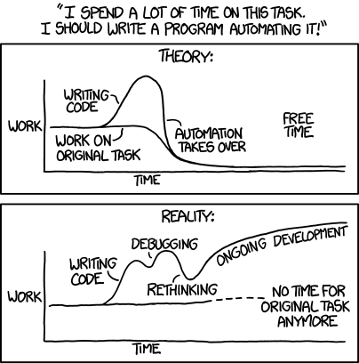

# Shell 基础知识

在这一章中，我们将重点讨论在终端上与 Linux 进行交互：通过 Shell 暴露出一个命令行界面（CLI）。

能够有效地使用 Shell 来完成日常任务是非常重要的，为此，我们在这里重点讨论 Shell 的使用。从 命令行（CLI） 的角度来看，与 Linux 交互有两种主要方式。

- 第一种方式是手动的，即人类用户坐在终端前面，以交互方式键入命令并使用输出。这些操作包括：

  - 列出目录、查找文件或查找文件中的内容。

  - 在目录之间或将文件复制到远程计算机。

  - 从终端阅读电子邮件，新闻等等。
  - 此外，我们还将学习如何方便高效地同时处理多个 Shell 会话。

- 另一种操作模式是自动处理特殊类型文件中的一系列命令，Shell 会为你解释该文件，然后执行该文件。此模式通常称为 Shell 脚本或称为脚本。脚本是许多配置和安装引用的基础。

  在学习完本章内容后，你可能希望使用脚本，而不是手动重复某些任务。脚本确实非常方便。但是，如果不采取预防措施，它们也可能构成危险。因此，每当你考虑编写脚本时，请牢记图中所示的 XKCD 关于[自动化](https://xkcd.com/1319)的漫画，向作者Randall Munroe致敬（CC BY-NC 2.5下提供）。

  ---



翻译：

*我花费太多时间在这项任务上了，我应该写一个自动化程序。*

*理想：我成功写出了程序并解决了这项工作*

*现实：我写了一堆bug，我需要调试且不间断的维护它，但我实际的工作还是像之前一样继续*

---

在我们进入不同的选项和配置之前，让我们关注一些基本术语，如 终端 和 shell。在本节中，我将定义这些术语，并向你展示如何在shell中完成日常任务。我们还将回顾现代的命令，并看看它们的运行情况。

## 1 终端

终端，或终端仿真器，或软终端，所有这些都是在说同一个东西：终端是一个提供文本用户界面的程序。也就是说，终端支持从键盘读取字符并将其显示在屏幕上。许多年前，终端指的是集成设备（键盘和屏幕在一起），但现在终端只是应用程序。

除了基本的面向字符的输入和输出外，终端还支持所谓的 [转义序列或转义码](https://en.wikipedia.org/wiki/ANSI_escape_code)，用于控制光标位置、颜色、字体样式和其他选项。例如，按 `Ctrl+H` 退格，即删除光标左侧的字符。

环境变量 TERM 正在使用终端仿真器，其配置可通过`infocmp` 获得，如下所示（请注意，输出已缩短）：

```shell
$ infocmp 
#       Reconstructed via infocmp from file: /lib/terminfo/s/screen-256color
screen-256color|GNU Screen with 256 colors,
        am, km, mir, msgr, xenl,
        colors#0x100, cols#80, it#8, lines#24, pairs#0x10000,
        acsc=++\,\,--..00``aaffgghhiijjkkllmmnnooppqqrrssttuuvvwwxxyyzz{{||}}~~,
        bel=^G, blink=\E[5m, bold=\E[1m, cbt=\E[Z, civis=\E[?25l,
        clear=\E[H\E[J, cnorm=\E[34h\E[?25h, cr=\r,
        ...
```

`infocmp` 的输出不能很直观的看明白。如果要详细了解这些功能，请参阅 [terminfo](https://www.man7.org/linux/man-pages/man5/terminfo.5.html) 数据库。例如，在我的具体输出中，终端支持显示 80 列 （cols#80） 和 24 行 （ lines #24） 内容，以及 256 种颜色（colors #0x100，以十六进制表示法）。

终端的示例不仅包括 xterm，rxvt 和 Gnome terminator，还包括使用GPU的新一代终端，如 [Alakrity](https://github.com/alacritty/alacritty)， [kitty](https://sw.kovidgoyal.net/kitty/) 或 [warp](https://www.warp.dev/)。

在 "终端多路复用器" 中，我们将回到终端的主题。

## 2 Shell

接下来是 Shell，一个在终端内部运行并充当命令解释器的程序。Shell 通过流提供输入和输出处理，支持变量，具有一些可以使用的内置命令，处理命令执行和状态，并且通常支持交互式用法以及脚本用法。

Shell 是在 [sh](https://www.man7.org/linux/man-pages/man1/sh.1p.html) 中正式定义的，我们经常会遇到术语 [POSIX Shell](https://drewdevault.com/2018/02/05/Introduction-to-POSIX-shell.html)，它在脚本和可移植性方面将变得更加重要。

最初，我们有 Bourne Shell sh，以作者的名字命名，但现在你会发现它被 [bash](https://en.wikipedia.org/wiki/Bash_(Unix_shell)) Shell 取代 - 原始版本上的文字游戏，"Bourne Again Shell"的缩写 - 被广泛用作默认 Shell。

如果你很好奇你正在使用什么，请使用 `file -h /bin/sh` 命令来找出答案，或者如果失败，请尝试回显`echo $0`或回显`$SHELL`。

> 注意:默认使用的是 Bash shell（bash），除非另做说明。

还有很多 sh 的实现，以及其他的变种，如 Korn shell （ksh）和 C Shell (csh) ，但现在都没有被广泛使用。不过，我们将在 "人性化的 Shell "中说到现代 bash 的替代品。

让我们从两个基本特征开始我们的 Shell基础知识：流和变量。

## 3 流（Streams）

让我们从输入（流）和输出（流）或简称为I/O的话题开始。你如何给一个程序提供一些输入？你如何控制一个程序的输出，比如说，在终端或文件中？

首先，shell为每个进程配备了三个默认的文件描述符（FD）用于输入和输出。

- stdin (FD 0)

- stdout (FD 1)

- stderr (FD 2)）

如图 3-2 所示，这些文件描述符默认分别连接到屏幕和键盘。换句话说，除非你指定其他内容，否则你在Shell中输入的命令将从键盘获取其输入（stdin），并将其输出（stdout）传递到你的屏幕。

以下 Shell 交互演示了此默认行为：

```shell
$ cat
This is some input I type on the keyboard and read on the screen^C
```

在上面，以 cat 为例，你可以看到正在运行的默认值，并且还注意到我使用 CTRL+c（显示为 ^C）来终止命令。


图 3-2 Shell I/O 默认流

如果你不想使用Shell为你提供的默认值，例如，你不希望在屏幕上输出stderr，但希望将其保存在文件中，则可以 [重定向](https://doc.m24y.com/docs/linux/unix-shell-io-redirection) 流。

你可以使用 `$FD>` 和 `<$FD` 重定向进程的输出流，`$FD`是文件描述符，例如`2>`表示重定向 stderr 流。请注意，`1>`和`>`是相同的，因为 stdout 是默认的， 如果你想同时重定向stdout和stderr，使用`&>`，当你想丢弃一个流时，你可以使用`/dev/null`。

让我们看看在一个具体示例的上下文中是如何工作的，通过curl下载一些HTML内容：

```shell
# 通过将 stdout 和 stderr 重定向到 /dev/null 来丢弃所有输出。
$ curl https://example.com &> /dev/null 
# 将输出和状态重定向到不同的文件。
$ curl https://example.com > /tmp/content.txt 2> /tmp/curl-status 
$ head -3 /tmp/content.txt
<!doctype html>
<html>
<head>

# 以交互方式输入并保存到文件，使用 Ctrl+D 停止捕获和存储内容。
$ cat /tmp/curl-status
  % Total    % Received % Xferd  Average Speed   Time    Time     Time  Current
                                 Dload  Upload   Total   Spent    Left  Speed
100  1256  100  1256    0     0   3187      0 --:--:-- --:--:-- --:--:--  3195

$ cat > /tmp/interactive-input.txt 

# 所有单词都小写，使用从 stdin 读取的 tr 命令。
$ tr < /tmp/curl-status [A-Z] [a-z] 
  % total    % received % xferd  average speed   time    time     time  current
                                 dload  upload   total   spent    left  speed
100  1256  100  1256    0     0   3187      0 --:--:-- --:--:-- --:--:--  3195
```

Shell 通常可以理解许多特殊字符，例如：

- `&` 在命令的末尾，在后台执行它，另请参阅 "作业控制"。

- `\` 在下一行继续执行命令，使用此选项可提高长命令的可读性。

- `|` [管道符](http://web.cse.ohio-state.edu/~mamrak.1/CIS762/pipes_lab_notes.html)，将一个进程的 stdout 与下一个进程的 stdin 连接起来，允许你传递数据，而不必将其作为临时位置存储在文件中。

> 管道和 UNIX 理念:[关于重新审视Unix哲学](https://opensource.com/article/18/11/revisiting-unix-philosophy-2018)

同样，让我们看看一些理论内容的实际应用。让我们尝试通过使用 curl 下载 HTML 文件来计算出该文件包含多少行，然后将内容通过管道传输到 wc 工具：

```shell
$ curl https://example.com 2> /dev/null | \ 
  wc -l 
46
```

使用 curl 从 URL 下载内容，并丢弃它在 stderr 上输出的状态（注意：在实践中，你会使用 curl 的 -s 选项，但我们想学习如何应用我们来之不易的知识，对吧？）。

curl 的 stdout 被传输到 wc 的 stdin，后者使用 -l 选项计算行数。

现在，你已经对命令、流和重定向有了基本的了解，接下来让我们转到另一个核心 Shell 功能，即变量的处理。

## 4 变量 (Variables)

在 Shell 的背景下，你经常会遇到的一个术语--**变量**。当你不想或不能硬编码一个值时，你可以使用一个变量来存储和更改一个值。用例包括：

- Linux 公开的配置项，例如shell查找 $PATH 变量中捕获的可执行文件的位置。这是一种可以读取和写入变量的接口。

- 你希望以交互方式向用户查询一个值，例如，在脚本的上下文中。

- 当你想通过定义一个长值来缩短输入时。例如，HTTP API的URL。这个用例大致相当于程序语言中的 const 值，因为在声明变量后不会更改该值。

我们区分两种变量：

1. 环境变量是 Shell 内置的;用 `env` 列出它们。

2. Shell 变量在当前执行的脚本中有效;在Bash中列出与设置。Shell 变量不被子进程所继承。

在 Bash 中，你可以使用导出来创建环境变量。当你想要访问变量的值时，则需要在它前面放置一个$，当你想要摆脱它时，请使用 unset。

好吧，这是很多信息，让我们看看在实践中看起来如何（Bash）：

```shell
# 创建一个名为 MY_VAR 的 Shell 变量，并赋值 42。
$ set MY_VAR=42 

# 列出 Shell 变量并筛选出MY_VAR，请注意 _= 指示它未被导出。
$ set | grep MY_VAR 
_=MY_VAR=42

# 创建一个名为 MY_GLOBAL_VAR 的新环境变量。
$ export MY_GLOBAL_VAR="fun with vars" 

# 列出 Shell 变量并筛选出所有以 MY_开头的变量，我们将按预期看到在前面的步骤中创建的两个变量。
$ set | grep 'MY_*' 
MY_GLOBAL_VAR='fun with vars'
_=MY_VAR=42

# 列出环境变量，我们看到MY_GLOBAL_VAR，正如我们所希望的那样。
$ env | grep 'MY_*' 
MY_GLOBAL_VAR=fun with vars

#创建新的 Shell 会话，即当前 Shell 会话的子进程，它不会继承MY_VAR。
$ bash 
# 访问环境变量MY_GLOBAL_VAR。
$ echo $MY_GLOBAL_VAR 
fun with vars

# 列出 Shell 变量，这只能给我们MY_GLOBAL_VAR，因为我们处于子进程中。
$ set | grep 'MY_*' 
MY_GLOBAL_VAR='fun with vars'

退出子进程，删除MY_VAR Shell 变量并列出我们的 Shell 变量;正如预期的那样，MY_VAR消失了。
$ exit 
$ unset $MY_VAR
$ set | grep 'MY_*'
MY_GLOBAL_VAR='fun with vars'
```

在表 3-1 中，我将常见的 Shell 和环境变量放在一起。你几乎可以在任何地方找到这些变量，它们对于理解和使用非常重要。对于任何变量，你可以使用 echo $XXX查看相应的值，其中 XXX 是变量名称。

无法复制加载中的内容

此外，请查看 [Bash 特定变量](https://www.gnu.org/software/bash/manual/html_node/Bash-Variables.html)的完整列表，并注意表 3-1 中的变量将在下面介绍的脚本中再次派上用场。

## 5 退出状态（Exit Status）

Shell 使用所谓的存在状态将命令执行的完成传达给调用方。通常，Linux 命令在终止时应返回状态。这可以是正常终止（快乐之路）或异常终止（出现问题）。0 退出状态表示命令已成功运行，没有任何错误，而介于 1 到 255 之间的非零值表示失败。要查询退出状态，请使用 `echo $？`。

在管道中处理退出状态时要小心，因为某些 Shell 只会使最后一个状态可用。但是，你可以通过[使用$PIPESTATUS](https://www.shellscript.sh/tips/pipestatus/) 来解决该限制。

## 6 内置命令

Shell附带了许多内置命令。一些有用的例子有 yes、echo、cat 或 read（根据Linux发行版的不同，其中一些命令可能不是内置的，而是位于/usr/bin）。可以使用 help 命令列出内置项。但是，请记住，其他所有内容都是一个 shell 外部程序，通常可以在/usr/bin（用户命令目录）或 /usr/sbin（管理命令目录）中找到。

你如何知道在哪里可以找到可执行文件？以下是一些方法：

```shell
$ which ls
/usr/bin/ls

$ type ls
ls is aliased to `ls --color=auto'
```

>注意：which 是一个非POSIX的外部程序，可能总是可用的。另外，建议使用命令`commond -v` 来获取程序路径和或 shell 别名/函数，而不是which。关于这个问题的更多细节，也请看shellcheck的文档。有关此事的更多详细信息，[Shellcheck](https://github.com/koalaman/shellcheck/wiki/SC2230)。

## 7 作业控制

大多数 Shell 支持的一项功能称为 [作业控制](https://www.digitalocean.com/community/tutorials/how-to-use-bash-s-job-control-to-manage-foreground-and-background-processes)。默认情况下，当你输入命令时，它会控制屏幕和键盘，我们通常称之为在前台运行。但是，如果你不想以交互方式运行某些内容，或者，如果服务器根本没有来自stdin的输入怎么办？输入作业控制和后台作业：。要在后台启动进程，请在末尾放置一个 &，或者将前台进程发送到后台，请按 Ctrl+Z。

下面的示例在操作中演示了这一点，为你提供了一个粗略的想法：

```shell
# 通过将 & 放在末尾，我们在后台启动命令
$ watch -n 5 "ls" & 

# 列出所有作业
$ jobs 
Job     Group   CPU     State   Command
1       3021    0%      stopped watch -n 5 "ls" &

# 使用 fg 命令，我们可以将进程置于前台。如果要退出监视命令，请使用 Ctrl+C。
$ fg 
Every 5.0s: ls                                         Sat Aug 28 11:34:32 2021

Dockerfile
app.yaml
example.json
main.go
script.sh
test     
```

如果你想让一个后台进程继续运行，甚至在你关闭shell之后，你可以预加nohup命令。此外，对于一个已经运行的进程，如果没有预加nohup，你可以在事后使用disown来达到同样的效果。最后，如果你想摆脱一个正在运行的进程，你可以使用不同程度的kill命令，详见 "信号 "一节。

我建议使用"终端多路复用器"中讨论的终端多路复用器，而不是作业控制。这些程序处理最常见的用例（Shell 关闭、多个进程正在运行和需要协调等），并且还支持使用远程系统。

让我们继续讨论一下常用核心命令的现代替代品，这些命令已经存在了很长时间。

## 8 现代命令

你会发现自己每天都会一遍又一遍地使用一些命令。这包括目录导航 （cd）、列出目录的内容 （ls）、查找文件（find）或显示文件的内容（cat，less）。鉴于你经常使用这些命令，你要尽可能的高效，每一个按键都很重要。

现在，对于其中一些常用的命令，存在着现代的变体。其中一些是直接替代品，另一些则扩展了功能。所有这些都为常见的操作提供了一些合理的默认值，丰富的输出通常更容易理解，并且它们通常会使你在完成相同任务时键入的内容更少。这减少了使用Shell时的阻力，使其更有趣，并改善了流程。如果你想了解更多关于现代工具的信息，请查看附录B。在这方面，有一点需要注意，尤其是对于那些在企业环境中应用这些知识的人：这些工具对我来说没有任何利害关系，只推荐它们，因为我发现它们很有用。安装和使用这些工具的一个好方法是使用经过你选择的Linux发行版审核的工具版本。

##### 使用 exa 列出目录内容

每当你想知道目录包含什么时，都可以使用 ls 或其带有参数的变体之一。例如，在 Bash 中，我曾经将 l 别名为 ls -GAhltr。但是有一个更好的方法： [exa](https://the.exa.website/)，一个用Rust编写的ls的现代替代品，内置了对Git和树渲染的支持。在这种情况下，在列出目录内容后，你猜想最常用的命令是什么？根据我的经验，这是为了清除屏幕，人们经常使用清除。这是键入五个字符，然后按 Enter 键。你可以更快地获得相同的效果，只需使用CTRL + L即可。

##### 使用 bat 查看文件内容

假设你列出了一个目录内容，并找到了要检查的文件。你可能会用猫，也许？我建议你看看更好的东西：[bat](https://github.com/sharkdp/bat)。bat 命令带有语法突出显示功能，显示不可打印的字符，支持 Git，并且集成了寻呼机（按页面查看文件的时间比屏幕上显示的时间长）。

##### 使用 rg 在文件中查找内容

传统上，你将使用 grep 在文件中查找某些内容。但是，有一个现代命令 [rg](https://github.com/BurntSushi/ripgrep)，它快速而强大。

我们将在此示例中将 rg 与 find 和 grep 组合进行比较，我们希望在其中查找包含字符串"sample"的 YAML 文件：

```shell
# 将 find 和 grep 一起使用以在 YAML 文件中查找字符串。
$ find . -type f -name "*.yaml" -exec grep "sample" '{}' \; -print 
      app: sample
        app: sample
./app.yaml

# 对同一任务使用 rg。
$ rg -t "yaml" sample 
app.yaml
9:      app: sample
14:        app: sample
```

如果比较上一示例中的命令和结果，你会发现 rg 不仅更易于使用，而且结果也更具信息性（提供上下文，在本例中为行号）。

##### 使用 jq 进行 JSON 数据处理

jq不是一个实际的替代品，而更像是JSON的专用工具，一种流行的文本数据格式。你可以在HTTP API和配置文件中找到JSON，同样。

因此，使用 [jq](https://stedolan.github.io/jq/) 而不是 awk 或 sed 来挑选某些值。例如，通过使用 [JSON生成器](https://www.json-generator.com/) 生成一些随机数据，我有一个2.4 kB的大JSON文件example.json，看起来像这样（仅在此处显示第一条记录）：

```json
[
  {
    "_id": "612297a64a057a3fa3a56fcf",
    "latitude": -25.750679,
    "longitude": 130.044327,
    "friends": [
      {
        "id": 0,
        "name": "Tara Holland"
      },
      {
        "id": 1,
        "name": "Giles Glover"
      },
      {
        "id": 2,
        "name": "Pennington Shannon"
      }
    ],
    "favoriteFruit": "strawberry"
  },
...
```

假设我们对所有"first"朋友感兴趣，即朋友数组中的第0条，即最喜欢的水果是 "草莓 "的人。使用jq，你可以做以下工作。

```shell
$ jq 'select(.[].favoriteFruit=="strawberry") | .[].friends[0].name' example.json
"Tara Holland"
"Christy Mullins"
"Snider Thornton"
"Jana Clay"
"Wilma King"
```

这有点CLI的乐趣，对吧？如果你有兴趣了解有关现代命令主题的更多信息以及你可能要替换的其他候选命令，请查看 [mondern-unix](https://github.com/ibraheemdev/modern-unix) 存储库，其中列出了建议。现在，让我们将重点转移到目录导航和文件内容查看之外的一些常见任务上，以及如何执行这些任务。

## 9 常见任务

你发现自己经常做很多事情，此外，还有一些技巧可以用来加快你在Shell中的任务。让我们回顾一下这些常见任务，看看如何提高效率。

##### 缩短常用命令

，你经常使用的命令应该花费最少的精力，应该快速输入。现在将这个想法应用于 Shell 中：不输入`git diff --color-moved`而是输入d（一个字符），因为我每天都要查看我的仓库中的变化几百次。根据不同的shell，有不同的方法来实现这一点：这称为[别名](https://ss64.com/bash/alias.html)，而在 Fish（"Fish Shell"）中，你可以使用[缩写](https://fishshell.com/docs/current/cmds/abbr.html)。

##### 终端光标快捷键

在 Shell 提示符上输入命令时，可能需要执行许多操作，例如导航（例如，将光标移动到行的开头）或操作行（删除光标上剩余的所有内容。在 表 3-2 中，你会看到列出的常见 Shell 快捷方式。

|                                 |        |                  |
| ------------------------------- | ------ | ---------------- |
| 表 3-2.Shell 导航和编辑快捷方式 |        |                  |
| 操作                            | 快捷键 | 注意             |
| 将光标移动到行首                | CTRL+a | -                |
| 将光标移动到行尾                | CTRL+e | -                |
| 将光标向前移动一个字符          | CTRL+f | -                |
| 将光标向后移动一个字符          | CTRL+b | -                |
| 将光标向前移动一个单词          | ALT+f  | 仅适用于左侧 ALT |
| 将光标向后移动一个单词          | ALT+b  | -                |
| 删除当前字符                    | CTRL+d | -                |
| 删除光标左侧的字符              | CTRL+h | -                |
| 删除光标左侧的单词              | CTRL+w | -                |
| 删除光标右侧的所有内容          | CTRL+k | -                |
| 删除光标剩余的所有内容          | CTRL+u | -                |
| 清除屏幕                        | CTRL+l | -                |
| 取消命令                        | CTRL+c | -                |
| 撤消                            | CTRL+_ | 仅支持 Bash      |
| 检索历史                        | CTRL+r | 某些Shell        |
| 取消搜索                        | CTRL+g | 某些Shell        |

请注意，并非所有 Shell 都支持所有快捷方式，并且某些操作（如历史记录管理）在某些 Shell 中的实现方式可能不同。此外，你可能想知道这些快捷方式是基于Emacs编辑按键的。如果你更喜欢 vi，则可以在 .bashrc 文件中使用 set -o vi，例如，根据 vi 击键执行命令行编辑。最后，请以 表 3-2 为起点，尝试 Shell 支持的内容以及如何对其进行配置以满足你的需求。

##### 文件内容管理

你并不总是想启动一个编辑器，如vi来添加一行文字。而且，有时你不能这样做，例如，当你在写一个shell脚本。
那么，如何操纵文本内容呢？让我们看几个例子：

```shell
# 通过重定向 echo 输出来创建文件。
$ echo "First line" > /tmp/something 

# 查看文件
$ cat /tmp/something 
First line

# 使用>>运算符将行追加到文件中，然后查看内容。
$ echo "Second line" >> /tmp/something && \ 
  cat /tmp/something
First line
Second line

# 使用 sed 替换文件中的内容，并将输出替换为 stdout。
$ sed 's/line/LINE/' /tmp/something 
First LINE
Second LINE

# 使用here Document创建文件。
$ cat << 'EOF' > /tmp/another 
First line
Second line
Third line
EOF

# 显示我们上面创建的文件之间的差异。
$ diff -y /tmp/something /tmp/another 
First line                                                      First line
Second line                                                     Second line
                                                              > Third line
```

现在你已经了解了基本的文件内容操作技术，让我们看一下文件内容的高级查看。

##### 查看长文件

对于长文件，也就是行数超过shell在屏幕上所能显示的文件，你可以使用像less或bat这样的分页器（它有一个内置的分页）。使用分页器，程序将输出分成若干页，每页都适合于屏幕所能显示的内容，并使用一些命令来导航这些页（查看下一页，上一页，等等）。
另一种处理长文件的方法是只显示文件的一个选定区域，如前几行。这方面有两个方便的命令：`head`和`tail`。

例如，要显示一个文件的开头。

```shell
# 创建一个长文件（此处为 100 行）
$ for i in {1..100} ; do echo $i >> /tmp/longfile ; done 

# 显示长文件的前五行。
$ head -5 /tmp/longfile 
1
2
3
4
5
```

或者，要获取不断增长的文件的实时更新，我们可以使用：

```shell
$ sudo tail -f /var/log/Xorg.0.log 
[ 36065.898] (II) event14 - ALPS01:00 0911:5288 Mouse: is tagged by udev as: Mouse
[ 36065.898] (II) event14 - ALPS01:00 0911:5288 Mouse: device is a pointer
[ 36065.900] (II) event15 - ALPS01:00 0911:5288 Touchpad: is tagged by udev as: Touchpad
[ 36065.900] (II) event15 - ALPS01:00 0911:5288 Touchpad: device is a touchpad
[ 36065.901] (II) event4  - Intel HID events: is tagged by udev as: Keyboard
[ 36065.901] (II) event4  - Intel HID events: device is a keyboard
...
```

使用tail显示日志文件的结尾，其-f选项意味着跟随，即自动更新。

在这一节中，我们最后看一下处理日期和时间的问题。

##### 日期和时间处理

date 命令是生成唯一文件名的有用方法。它允许你以各种格式生成日期，包括 [Unix时间戳](https://en.wikipedia.org/wiki/Unix_time) ，以及在不同的日期和时间格式之间进行转换。

```shell
$ date +%s 
1629582883

# 将 UNIX 时间戳转换为人类可读的日期。
$ date -d @1629742883 '+%m/%d/%Y:%H:%M:%S' 
08/21/2021:21:54:43
```

关于 UNIX 纪元时间

UNIX 纪元时间（或简称 UNIX 时间）是自 1970-01-01T00：00：00Z 以来经过的秒数。UNIX 时间将每天视为正好 86，400 秒。

如果你正在处理将 UNIX 时间存储为有符号 32 位整数的软件，则可能需要注意，因为这将导致在 2038-01-19 上出现问题，因为计数器将溢出，这也称为 [2038 年问题](https://en.wikipedia.org/wiki/Year_2038_problem)。

你可以使用 [在线转换器](https://www.epochconverter.com/) 进行更高级的操作，支持微秒和毫秒。

至此，我们结束了shell基础知识部分的学习。现在你应该已经很好地理解了什么是终端和shell，以及如何使用它们来完成基本任务，如浏览文件系统、查找文件等等。我们继续讨论对人类友好的shell的话题。