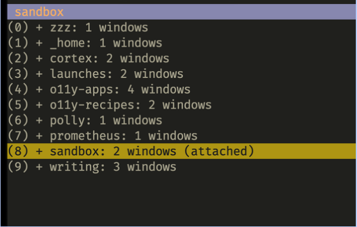

# 终端多路复用器

> 每个工具都有学习曲线，读者可自行判断

终端我们在 Shell 基础知识中就已经解释过，是一个提供文本用户界面的程序，现在我们来了解一下它的另外一个概念——多路复用。简而言之，我要在一个窗口中打开多个子窗口，用于处理不同的任务。

- 你正在使用 watch 命令定期执行目录列表，同时编辑文件。

- 你启动了一个服务器进程（Web 服务器或应用程序服务器），并希望让它在前台运行（另请参阅 "作业控制"），以便密切关注日志。

- 你希望使用 vi 编辑文件，同时使用 git 查询状态并提交更改。

- 你有一个在公共云中运行的 VM，并希望在可以在本地管理文件的同时将其插入其中。

将上述所有示例视为逻辑上属于一起的事情，就持续时间而言，持续时间可以从短期（几分钟）到长期（几天和几周）不等。这些任务的分组通常称为会话。

现在，如果你想实现上述目标，则存在许多挑战：

- 你需要多个窗口，因此一种解决方案是启动多个终端，或者如果 UI 支持，则启动多个实例（选项卡）。

- 你希望周围有所有的窗户和路径，即使你关闭终端或远程侧关闭。

- 你希望展开或放大和缩小以专注于某些任务，同时保持所有会话的概述，能够在它们之间导航。

为了启用这些任务，人们提出了将终端与多个窗口（和会话，分组窗口）叠加的想法。换句话说：多路复用终端I/O。

让我们简单看一下终端多路复用的原始实现，称为screen。然后，我们将重点放在一种广泛使用的称为tmux的实现上，并总结了该领域的其他选项。

## 1 GNU Screen

[GNU Screen](https://www.gnu.org/software/screen/) 是原始终端多路复用器，仍在使用。除非你处于没有其他可用或无法安装其他多路复用器的远程环境中，否则你现在可能不应该使用屏幕。一个原因是它不再主动维护，另一个原因是它不是很灵活，缺乏现代终端多路复用器具有的许多功能。

## 2 Tmux

[tmux](https://github.com/tmux/tmux)是一款灵活而丰富的终端多路复用器，你可以根据需要弯曲。如图 3-8 所示，在 tmux 中，你正在与三个核心元素进行交互，从粗粒度到细粒度单位：

- 会话：一个逻辑单元，你可以将其视为专用于特定任务的工作环境，例如"处理项目X"或"撰写博客文章Y"。它是所有其他单元的容器。

- 窗口：你可以将窗口视为浏览器中的选项卡，属于会话。它是可选的，通常每个会话只有一个窗口。

- 窗格：这些是你的主力，实际上是正在运行的单个 Shell 实例。窗格是窗口的一部分，你可以轻松地垂直或水平拆分它，以及根据需要展开/折叠窗格（想想：缩放）和关闭窗格。

就像屏幕一样，你有附加和分离会话的概念，在tmux中。假设我们从头开始，让我们使用一个名为 test 的会话启动它：

```shell
tmux new -s test
```

使用上述命令，tmux 作为服务器运行，并且你发现自己在 tmux中 配置的 Shell 中，作为客户端运行。此客户端/服务器模型允许你创建、进入、离开、销毁会话并使用在其中运行的 Shell，而不必考虑在其中运行（或失败）的进程。

tmux 使用 `CTRL+b` 作为默认键盘快捷键，也称为前缀或触发器。因此，例如，要列出所有窗口，请按 `Ctrl+b`，然后按 `w`，或者展开当前（活动）窗格，请使用 `Ctrl+b`，然后使用 `z`。

**提示**

在 tmux 中，默认触发器为 CTRL+b。为了改进流程，我将触发器映射到未使用的键，因此一次击键就足够了。我这样做的方式如下：我将触发器映射到tmux中的 Home 键，并通过将其在/usr/share/X11/xkb/symbols/pc中的映射更改为键<CAPS>{[主页]};，进一步将Home键映射到CAPS LOCK键。

此处描述的双重映射是我需要执行的解决方法。因此，根据你的目标键或终端，你可能不必这样做，但我强烈建议你将CTRL + b映射到可以轻松到达的未使用的键，因为你每天将按多次。

现在，你可以使用 Table 3-4 中列出的任何命令来管理其他会话、窗口、窗格，还可以在按 Ctrl+b + d 时分离会话。这意味着你有效地将tmux放入后台。

然后，当你启动一个新的终端实例，或者说，从远程位置 ssh 到你的计算机时，你可以附加到现有会话，因此让我们使用我们之前创建的测试会话来执行此操作：

```
tmux attach -t test 
```

附加到称为测试的现有会话。请注意，如果要将会话与其以前的终端分离，则还需要提供 -d 参数。

下表列出了按我们上面讨论的单元分组的常见 tmux 命令，从最宽的范围（会话）到最窄的一个（窗格）。

| 表 3-4.tmux 参考 |                  |                 |
| ---------------- | ---------------- | --------------- |
| Target           | Task             | Command         |
| Session          | create new       | :new -s NAME    |
| Session          | rename           | trigger + $     |
| Session          | list all         | trigger + s     |
| Session          | close            | trigger         |
| Window           | create new       | trigger + c     |
| Window           | rename           | trigger + ,     |
| Window           | switch to        | trigger + 1 … 9 |
| Window           | list all         | trigger + w     |
| Window           | close            | trigger + &     |
| Pane             | split horizontal | trigger + "     |
| Pane             | split vertical   | trigger + %     |
| Pane             | toggle           | trigger + z     |
| Pane             | close            | trigger + x     |

现在你已经对如何使用tmux有了一个baisc的想法，让我们将注意力转向如何配置和自定义它。我的 .tmux.conf 如下所示：

```shell
unbind C-b
set -g prefix Home
bind Home send-prefix
bind r source-file ~/.tmux.conf \; display "tmux config reloaded
:)"
bind \\ split-window -h -c "#{pane_current_path}"
bind - split-window -v -c "#{pane_current_path}"
bind X confirm-before kill-session
set -s escape-time 1
set-option -g mouse on
set -g default-terminal "screen-256color"
set-option -g status-position top
set -g status-bg colour103
set -g status-fg colour215
set -g status-right-length 120
set -g status-left-length 50
set -g window-status-style fg=colour215
set -g pane-active-border-style fg=colour215
set -g @plugin 'tmux-plugins/tmux-resurrect'
set -g @plugin 'tmux-plugins/tmux-continuum'
set -g @continuum-restore 'on'
run '~/.tmux/plugins/tpm/tpm'
```

此行和接下来的两行将触发器更改为"主页"。

通过触发器 + r 重新加载配置

这条线和下一行重新定义了窗格分割;保留现有窗格的当前目录。

为新会话和终止会话添加快捷方式。

无延迟。

启用鼠标选择。

将默认终端模式设置为 256 色模式

主题设置（接下来的六行）。

从这里到结束：插件管理。

首先安装 [tpm](https://github.com/tmux-plugins/tpm)，tmux 插件管理器，然后为插件安装 TRIGGER + I。此处使用的插件包括：

- [tmux-resurrect](https://github.com/tmux-plugins/tmux-resurrect)，允许使用 Ctrl-s（安全）和 Ctrl-r（恢复）恢复会话。

- [tmux-continuum](https://github.com/tmux-plugins/tmux-continuum)，自动保存/恢复会话（间隔 15 分钟）

下图显示了运行 tmux 的 Alacritty 终端，你可以看到快捷方式为 0 到 9 的会话，位于左上角。



虽然tmux肯定是一个很好的选择，但除了tmux之外，还有其他选择，所以让我们来看看。

### 3 其他多路复用器

你可以查看并尝试的其他终端多路复用器包括：

- [tmuxinator](https://github.com/tmuxinator/tmuxinator) 是一个元工具，允许你管理tmux会话。

- [Byobu](https://www.byobu.org/) 是围绕屏幕或tmux的包装器，如果你使用的是Ubuntu或基于Debian的Linux发行版，对你来说尤其有趣。

- [Zellij](https://zellij.dev/about/) 称自己为终端工作区，用 Rust 编写，超越了 tmux 提供的功能，包括布局引擎和强大的插件系统。

- [dvtm](https://github.com/martanne/dvtm) 将平铺窗口管理的概念带到了终端;功能强大，但也有像 tmux 这样的学习曲线。

- [3mux](https://github.com/aaronjanse/3mux) 是一个简单的终端多工器，用Go编写，易于使用，但不如tmux强大。

通过对多工器选项的快速回顾，让我们谈谈选择一个。

## 4 我应该使用哪种多路复用器

与人类用户的 Shell 不同，在终端多重器的上下文中，我确实有一个具体的偏好：使用tmux。原因是多方面的：它成熟，稳定，丰富（许多插件）和灵活性。许多人都在使用它，所以有很多材料可供阅读，也有很多可用的帮助。其他的令人兴奋，但相对较新，或者像屏幕一样，它们的黄金时间已经是一段时间前了。

有了这个，我希望我能够说服你考虑使用终端多路复用器来改善你的终端和 Shell 体验，加快你的任务，并使整体流程更顺畅。

**将所有内容整合在一起：终端、多路复用器、Shell**

我使用 Alacrety 作为我的终端。它速度快，最重要的是：要配置它，我正在使用一个可以在Git中版本的YAML配置文件，允许我在几秒钟内在任何目标系统上使用它。这个名为 `alacritty.yml` 的配置文件定义了终端的所有设置，从颜色到键绑定再到字体大小。

大多数设置会立即应用（热重新加载），其他设置会在我保存文件时应用。一个称为Shell的设置定义了我使用的终端多路复用器（tmux）和我使用的Shell（fish）之间的集成，如下所示：

```yaml
...
shell:
  program: /usr/local/bin/fish
  args:
  - -l
  - -i
  - -c
  - "tmux new-session -A -s zzz"
...

```


在上面的代码片段中，我将 Alacrety 配置为使用 fish 作为默认Shell，但是，当我启动终端时，它会自动附加到特定会话。与tmux-continuum插件一起，这让我很不高兴。即使我关闭计算机，一旦我重新启动，我发现我的终端及其所有会话，窗口和窗格（几乎）都处于崩溃之前的状态，模Shell变量。

## 参考

终端多路复用器：

- [tmux 速成课程](https://thoughtbot.com/blog/a-tmux-crash-course)

- [快速简便的 tmux 指南](https://www.hamvocke.com/blog/a-quick-and-easy-guide-to-tmux/)

- [如何在Linux上使用tmux（以及为什么它比屏幕更好）](https://www.howtogeek.com/671422/how-to-use-tmux-on-linux-and-why-its-better-than-screen/)

- [tmux的道](https://leanpub.com/the-tao-of-tmux/read)

- [tmux 2 高效无鼠开发](https://pragprog.com/titles/bhtmux2/tmux-2/)

- [Tmux备忘单和快速参考](https://tmuxcheatsheet.com/)

